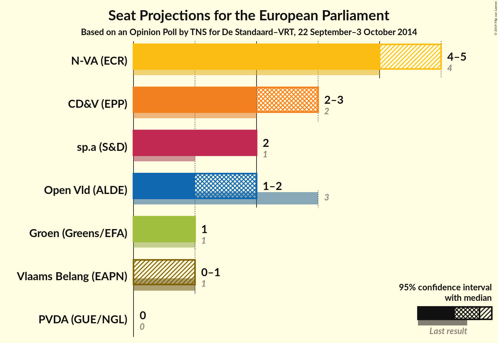
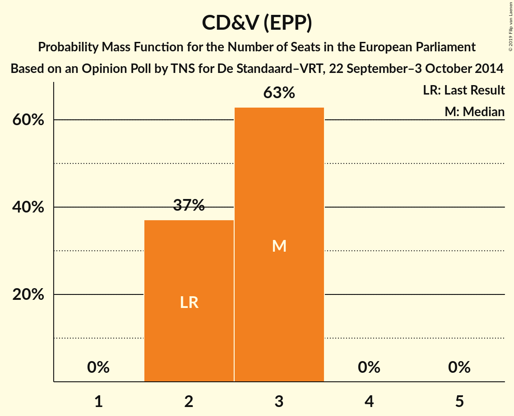
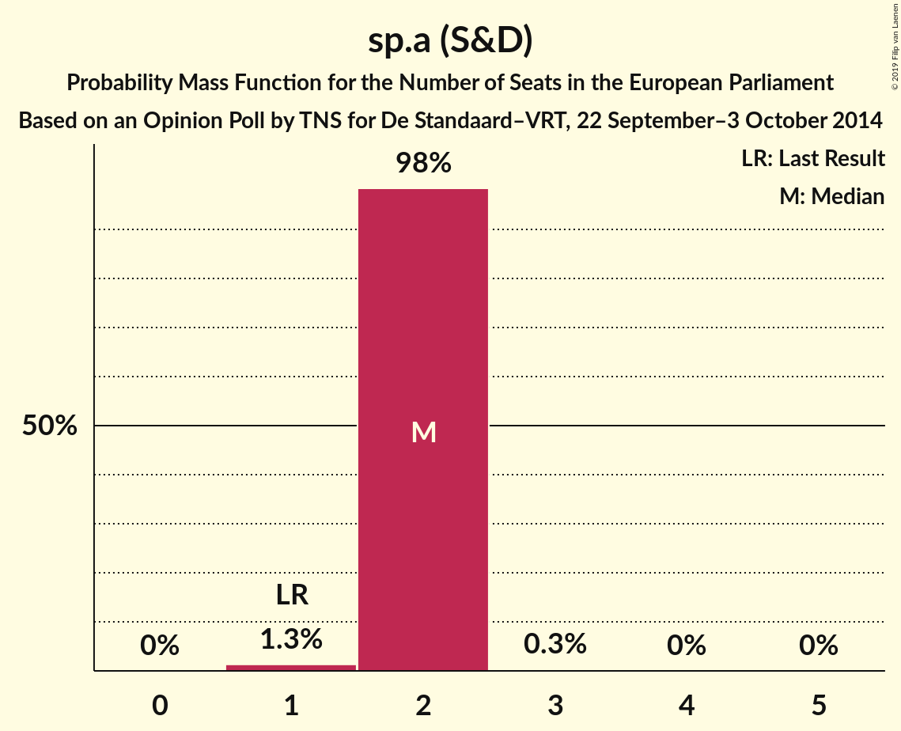
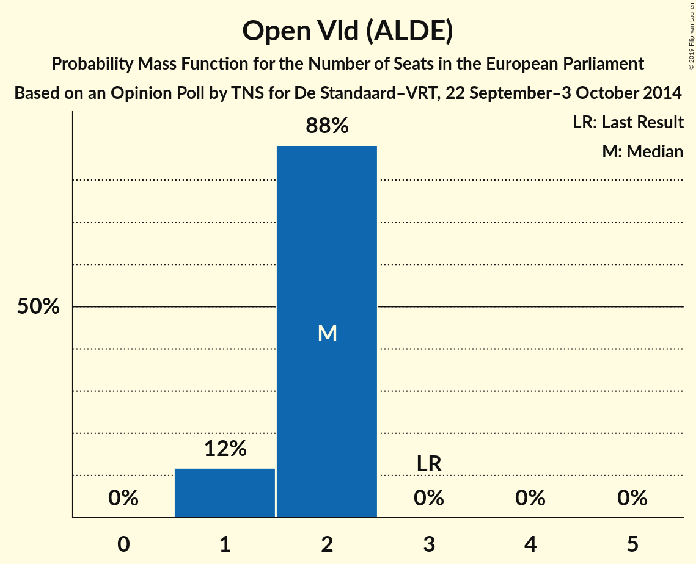
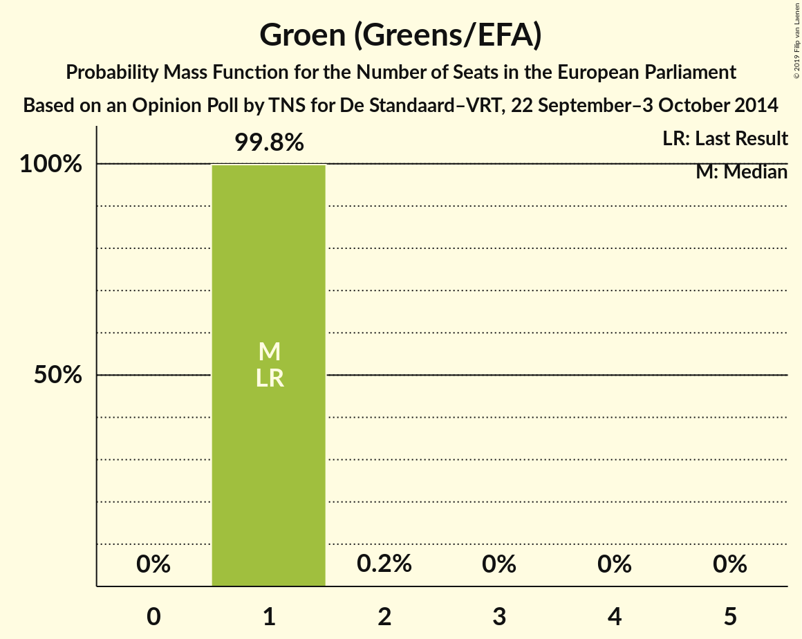
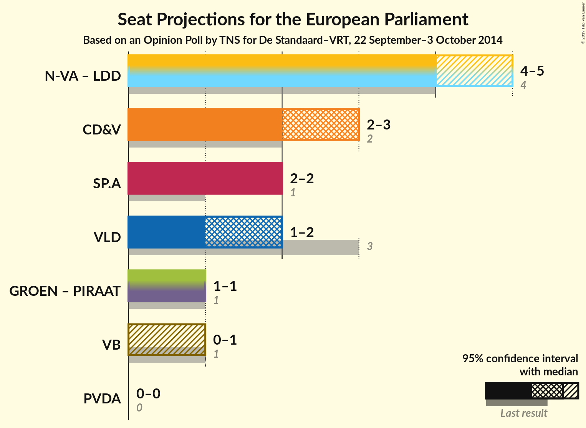

# Opinion Poll by TNS for De Standaard–VRT, 22 September–3 October 2014

<a href="#voting-intentions">Voting Intentions</a> | <a href="#seats">Seats</a> | <a href="#coalitions">Coalitions</a> | <a href="#technical-information">Technical Information</a>

## Voting Intentions

### Confidence Intervals

| Party | Last Result | Poll Result | 80% Confidence Interval | 90% Confidence Interval | 95% Confidence Interval | 99% Confidence Interval |
|:-----:|:-----------:|:-----------:|:-----------------------:|:-----------------------:|:-----------------------:|:-----------------------:|
| N-VA (ECR) | 26.7% | 29.9% | 28.1–31.8% |27.6–32.3% |27.2–32.8% |26.3–33.7% |
| CD&V (EPP) | 20.0% | 20.0% | 18.5–21.7% |18.1–22.2% |17.7–22.6% |17.0–23.4% |
| sp.a (S&D) | 13.2% | 15.7% | 14.4–17.3% |14.0–17.7% |13.6–18.1% |13.0–18.9% |
| Open Vld (ALDE) | 20.4% | 14.4% | 13.0–15.9% |12.7–16.3% |12.3–16.7% |11.7–17.4% |
| Groen (Greens/EFA) | 10.6% | 9.8% | 8.7–11.1% |8.4–11.4% |8.1–11.8% |7.6–12.4% |
| Vlaams Belang (ENF) | 6.8% | 6.5% | 5.6–7.5% |5.3–7.9% |5.1–8.1% |4.7–8.7% |
| PVDA (GUE/NGL) | 2.4% | 3.2% | 2.6–4.1% |2.4–4.3% |2.3–4.5% |2.0–4.9% |

*Note:* The poll result column reflects the actual value used in the calculations. Published results may vary slightly, and in addition be rounded to fewer digits.

## Seats

### Confidence Intervals

| Party | Last Result | Median | 80% Confidence Interval | 90% Confidence Interval | 95% Confidence Interval | 99% Confidence Interval |
|:-----:|:-----------:|:------:|:-----------------------:|:-----------------------:|:-----------------------:|:-----------------------:|
| <a href="#n-va-(ecr)">N-VA (ECR)</a> | 4 | 4 | 4 |4–5 |4–5 |4–5 |
| <a href="#cd&v-(epp)">CD&V (EPP)</a> | 2 | 3 | 2–3 |2–3 |2–3 |2–3 |
| <a href="#sp.a-(s&d)">sp.a (S&D)</a> | 1 | 2 | 2 |1–2 |1–2 |1–3 |
| <a href="#open-vld-(alde)">Open Vld (ALDE)</a> | 3 | 2 | 2 |1–2 |1–2 |1–2 |
| <a href="#groen-(greens/efa)">Groen (Greens/EFA)</a> | 1 | 1 | 1 |1 |1 |1 |
| <a href="#vlaams-belang-(enf)">Vlaams Belang (ENF)</a> | 1 | 0 | 0–1 |0–1 |0–1 |0–1 |
| <a href="#pvda-(gue/ngl)">PVDA (GUE/NGL)</a> | 0 | 0 | 0 |0 |0 |0 |

### N-VA (ECR)

*For a full overview of the results for this party, see the [N-VA (ECR)](party-n-vaecr.html) page.*

| Number of Seats | Probability | Accumulated | Special Marks |
|:---------------:|:-----------:|:-----------:|:-------------:|
| 4 | 92% | 100% | Last Result, Median |
| 5 | 8% | 8% |  |
| 6 | 0% | 0% |  |

### CD&V (EPP)

*For a full overview of the results for this party, see the [CD&V (EPP)](party-cdvepp.html) page.*

| Number of Seats | Probability | Accumulated | Special Marks |
|:---------------:|:-----------:|:-----------:|:-------------:|
| 2 | 36% | 100% | Last Result |
| 3 | 64% | 64% | Median |
| 4 | 0% | 0% |  |

### sp.a (S&D)

*For a full overview of the results for this party, see the [sp.a (S&D)](party-spasd.html) page.*

| Number of Seats | Probability | Accumulated | Special Marks |
|:---------------:|:-----------:|:-----------:|:-------------:|
| 1 | 9% | 100% | Last Result |
| 2 | 90% | 91% | Median |
| 3 | 0.8% | 0.8% |  |
| 4 | 0% | 0% |  |

### Open Vld (ALDE)

*For a full overview of the results for this party, see the [Open Vld (ALDE)](party-openvldalde.html) page.*

| Number of Seats | Probability | Accumulated | Special Marks |
|:---------------:|:-----------:|:-----------:|:-------------:|
| 1 | 7% | 100% |  |
| 2 | 93% | 93% | Median |
| 3 | 0% | 0% | Last Result |

### Groen (Greens/EFA)

*For a full overview of the results for this party, see the [Groen (Greens/EFA)](party-groengreensefa.html) page.*

| Number of Seats | Probability | Accumulated | Special Marks |
|:---------------:|:-----------:|:-----------:|:-------------:|
| 1 | 100% | 100% | Last Result, Median |

### Vlaams Belang (ENF)

*For a full overview of the results for this party, see the [Vlaams Belang (ENF)](party-vlaamsbelangenf.html) page.*

| Number of Seats | Probability | Accumulated | Special Marks |
|:---------------:|:-----------:|:-----------:|:-------------:|
| 0 | 58% | 100% | Median |
| 1 | 42% | 42% | Last Result |
| 2 | 0% | 0% |  |

### PVDA (GUE/NGL)

*For a full overview of the results for this party, see the [PVDA (GUE/NGL)](party-pvdaguengl.html) page.*

| Number of Seats | Probability | Accumulated | Special Marks |
|:---------------:|:-----------:|:-----------:|:-------------:|
| 0 | 100% | 100% | Last Result, Median |

## Coalitions

### Confidence Intervals

| Coalition | Last Result | Median | Majority? | 80% Confidence Interval | 90% Confidence Interval | 95% Confidence Interval | 99% Confidence Interval |
|:---------:|:-----------:|:------:|:---------:|:-----------------------:|:-----------------------:|:-----------------------:|:-----------------------:|
| CD&V (EPP) | 2 | 3 | 0% | 2–3 | 2–3 | 2–3 | 2–3 |
| Open Vld (ALDE) | 3 | 2 | 0% | 2 | 1–2 | 1–2 | 1–2 |
| sp.a (S&D) | 1 | 2 | 0% | 2 | 1–2 | 1–2 | 1–3 |
| Vlaams Belang (ENF) | 1 | 0 | 0% | 0–1 | 0–1 | 0–1 | 0–1 |
| PVDA (GUE/NGL) | 0 | 0 | 0% | 0 | 0 | 0 | 0 |

### CD&V (EPP)

| Number of Seats | Probability | Accumulated | Special Marks |
|:---------------:|:-----------:|:-----------:|:-------------:|
| 2 | 36% | 100% | Last Result |
| 3 | 64% | 64% | Median |
| 4 | 0% | 0% |  |

### Open Vld (ALDE)

| Number of Seats | Probability | Accumulated | Special Marks |
|:---------------:|:-----------:|:-----------:|:-------------:|
| 1 | 7% | 100% |  |
| 2 | 93% | 93% | Median |
| 3 | 0% | 0% | Last Result |

### sp.a (S&D)

| Number of Seats | Probability | Accumulated | Special Marks |
|:---------------:|:-----------:|:-----------:|:-------------:|
| 1 | 9% | 100% | Last Result |
| 2 | 90% | 91% | Median |
| 3 | 0.8% | 0.8% |  |
| 4 | 0% | 0% |  |

### Vlaams Belang (ENF)

| Number of Seats | Probability | Accumulated | Special Marks |
|:---------------:|:-----------:|:-----------:|:-------------:|
| 0 | 58% | 100% | Median |
| 1 | 42% | 42% | Last Result |
| 2 | 0% | 0% |  |

### PVDA (GUE/NGL)

| Number of Seats | Probability | Accumulated | Special Marks |
|:---------------:|:-----------:|:-----------:|:-------------:|
| 0 | 100% | 100% | Last Result, Median |

## Technical Information

### Opinion Poll

+ **Polling firm:** TNS
+ **Commissioner(s):** De Standaard–VRT
+ **Fieldwork period:** 22 September–3 October 2014

### Calculations

+ **Sample size:** 1023
+ **Simulations done:** 1,024
+ **Error estimate:** 3.08%

