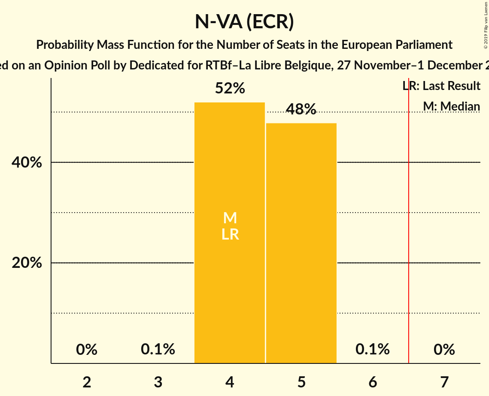
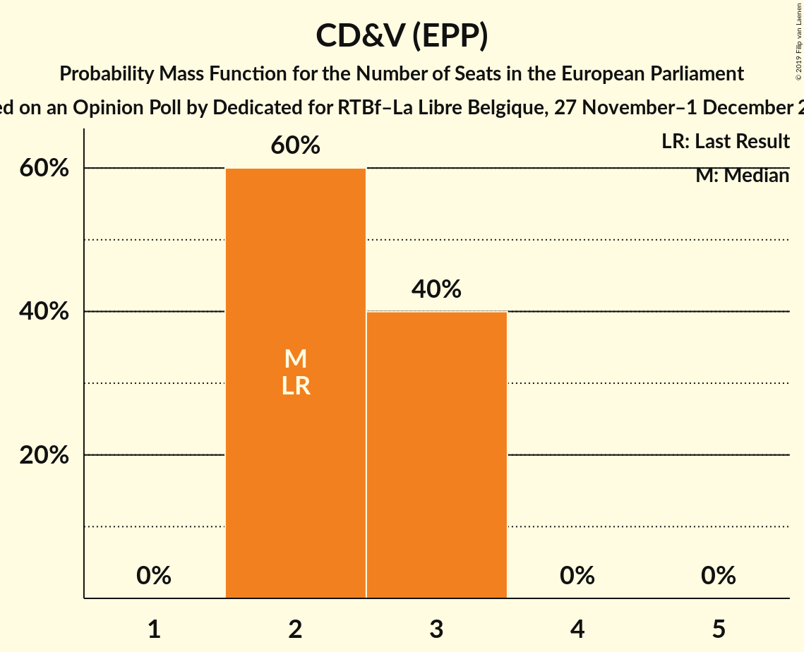
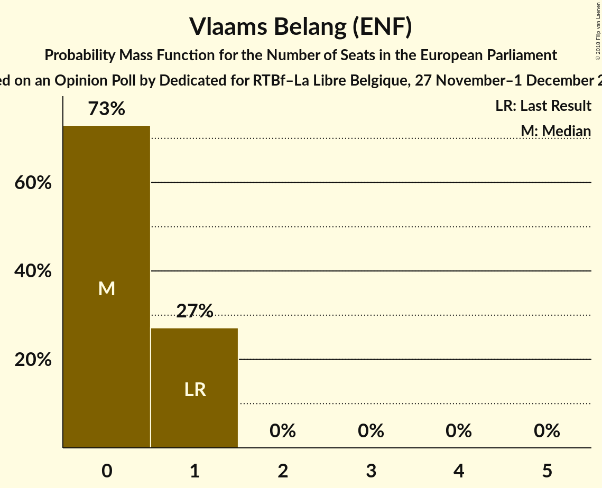
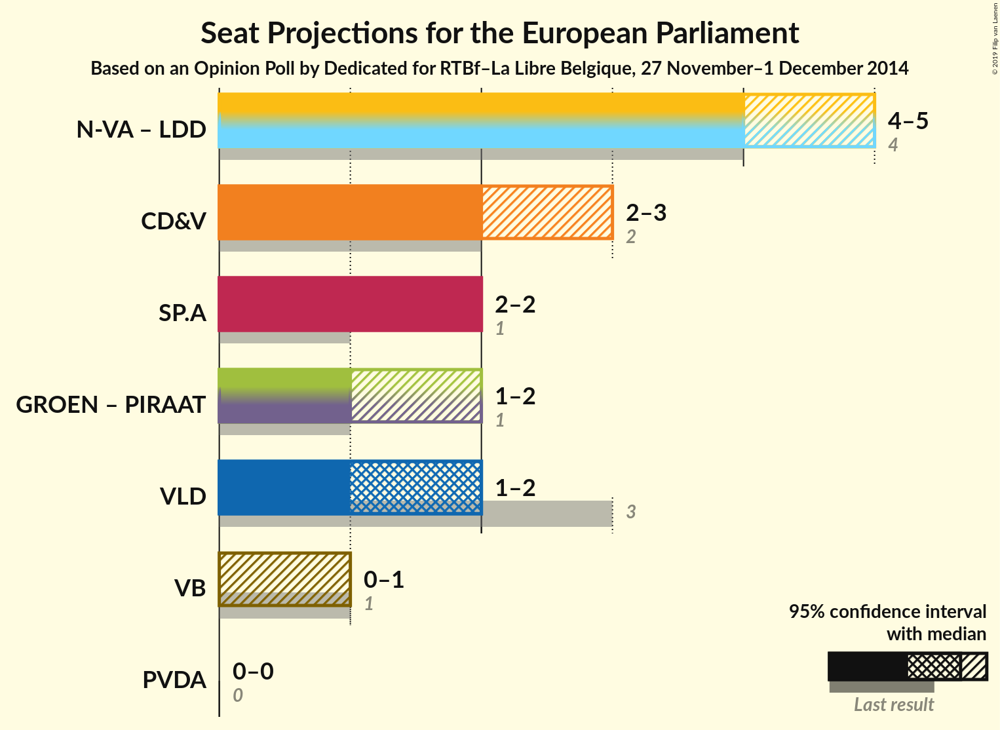

# Opinion Poll by Dedicated for RTBf–La Libre Belgique, 27 November–1 December 2014

<a href="#voting-intentions">Voting Intentions</a> | <a href="#seats">Seats</a> | <a href="#coalitions">Coalitions</a> | <a href="#technical-information">Technical Information</a>

## Voting Intentions

### Confidence Intervals

| Party | Last Result | Poll Result | 80% Confidence Interval | 90% Confidence Interval | 95% Confidence Interval | 99% Confidence Interval |
|:-----:|:-----------:|:-----------:|:-----------------------:|:-----------------------:|:-----------------------:|:-----------------------:|
| N-VA (ECR) | 26.7% | 30.9% | 28.8–33.1% |28.3–33.7% |27.8–34.3% |26.8–35.3% |
| CD&V (EPP) | 20.0% | 18.2% | 16.6–20.1% |16.1–20.7% |15.7–21.1% |14.9–22.1% |
| sp.a (S&D) | 13.2% | 15.1% | 13.6–16.9% |13.2–17.4% |12.8–17.8% |12.1–18.7% |
| Open Vld (ALDE) | 20.4% | 13.3% | 11.9–15.0% |11.5–15.5% |11.1–15.9% |10.4–16.8% |
| Groen (Greens/EFA) | 10.6% | 10.2% | 8.9–11.8% |8.6–12.2% |8.3–12.6% |7.7–13.3% |
| Vlaams Belang (ENF) | 6.8% | 5.7% | 4.8–6.9% |4.5–7.3% |4.3–7.6% |3.9–8.2% |
| PVDA (GUE/NGL) | 2.4% | 4.0% | 3.2–5.1% |3.0–5.4% |2.8–5.6% |2.5–6.2% |
| Lijst Dedecker (ECR) | 0.0% | 0.9% | 0.6–1.5% |0.5–1.7% |0.4–1.9% |0.3–2.2% |
| Piratenpartij (Greens/EFA) | 0.0% | 0.6% | 0.4–1.2% |0.3–1.4% |0.3–1.5% |0.2–1.8% |

*Note:* The poll result column reflects the actual value used in the calculations. Published results may vary slightly, and in addition be rounded to fewer digits.

## Seats

### Confidence Intervals

| Party | Last Result | Median | 80% Confidence Interval | 90% Confidence Interval | 95% Confidence Interval | 99% Confidence Interval |
|:-----:|:-----------:|:------:|:-----------------------:|:-----------------------:|:-----------------------:|:-----------------------:|
| <a href="#n-va-(ecr)">N-VA (ECR)</a> | 4 | 4 | 4 |4–5 |4–5 |4–5 |
| <a href="#cd&v-(epp)">CD&V (EPP)</a> | 2 | 3 | 2–3 |2–3 |2–3 |2–3 |
| <a href="#sp.a-(s&d)">sp.a (S&D)</a> | 1 | 2 | 1–2 |1–2 |1–2 |1–2 |
| <a href="#open-vld-(alde)">Open Vld (ALDE)</a> | 3 | 2 | 1–2 |1–2 |1–2 |1–2 |
| <a href="#groen-(greens/efa)">Groen (Greens/EFA)</a> | 1 | 1 | 1–2 |1–2 |1–2 |1–2 |
| <a href="#vlaams-belang-(enf)">Vlaams Belang (ENF)</a> | 1 | 0 | 0–1 |0–1 |0–1 |0–1 |
| <a href="#pvda-(gue/ngl)">PVDA (GUE/NGL)</a> | 0 | 0 | 0 |0–1 |0–1 |0–1 |
| <a href="#lijst-dedecker-(ecr)">Lijst Dedecker (ECR)</a> | 0 | 0 | 0 |0 |0 |0 |
| <a href="#piratenpartij-(greens/efa)">Piratenpartij (Greens/EFA)</a> | 0 | 0 | 0 |0 |0 |0 |

### N-VA (ECR)

*For a full overview of the results for this party, see the [N-VA (ECR)](party-n-vaecr.html) page.*

| Number of Seats | Probability | Accumulated | Special Marks |
|:---------------:|:-----------:|:-----------:|:-------------:|
| 3 | 0.4% | 100% |  |
| 4 | 94% | 99.6% | Last Result, Median |
| 5 | 5% | 5% |  |
| 6 | 0.4% | 0.4% |  |
| 7 | 0% | 0% | Majority |

### CD&V (EPP)

*For a full overview of the results for this party, see the [CD&V (EPP)](party-cdvepp.html) page.*

| Number of Seats | Probability | Accumulated | Special Marks |
|:---------------:|:-----------:|:-----------:|:-------------:|
| 2 | 41% | 100% | Last Result |
| 3 | 59% | 59% | Median |
| 4 | 0% | 0% |  |

### sp.a (S&D)

*For a full overview of the results for this party, see the [sp.a (S&D)](party-spasd.html) page.*

| Number of Seats | Probability | Accumulated | Special Marks |
|:---------------:|:-----------:|:-----------:|:-------------:|
| 1 | 21% | 100% | Last Result |
| 2 | 79% | 79% | Median |
| 3 | 0% | 0% |  |

### Open Vld (ALDE)

*For a full overview of the results for this party, see the [Open Vld (ALDE)](party-openvldalde.html) page.*

| Number of Seats | Probability | Accumulated | Special Marks |
|:---------------:|:-----------:|:-----------:|:-------------:|
| 1 | 11% | 100% |  |
| 2 | 89% | 89% | Median |
| 3 | 0% | 0% | Last Result |

### Groen (Greens/EFA)

*For a full overview of the results for this party, see the [Groen (Greens/EFA)](party-groengreensefa.html) page.*

| Number of Seats | Probability | Accumulated | Special Marks |
|:---------------:|:-----------:|:-----------:|:-------------:|
| 1 | 75% | 100% | Last Result, Median |
| 2 | 25% | 25% |  |
| 3 | 0% | 0% |  |

### Vlaams Belang (ENF)

*For a full overview of the results for this party, see the [Vlaams Belang (ENF)](party-vlaamsbelangenf.html) page.*

| Number of Seats | Probability | Accumulated | Special Marks |
|:---------------:|:-----------:|:-----------:|:-------------:|
| 0 | 64% | 100% | Median |
| 1 | 36% | 36% | Last Result |
| 2 | 0% | 0% |  |

### PVDA (GUE/NGL)

*For a full overview of the results for this party, see the [PVDA (GUE/NGL)](party-pvdaguengl.html) page.*

| Number of Seats | Probability | Accumulated | Special Marks |
|:---------------:|:-----------:|:-----------:|:-------------:|
| 0 | 93% | 100% | Last Result, Median |
| 1 | 7% | 7% |  |
| 2 | 0% | 0% |  |

### Lijst Dedecker (ECR)

*For a full overview of the results for this party, see the [Lijst Dedecker (ECR)](party-lijstdedeckerecr.html) page.*

| Number of Seats | Probability | Accumulated | Special Marks |
|:---------------:|:-----------:|:-----------:|:-------------:|
| 0 | 100% | 100% | Last Result, Median |

### Piratenpartij (Greens/EFA)

*For a full overview of the results for this party, see the [Piratenpartij (Greens/EFA)](party-piratenpartijgreensefa.html) page.*

| Number of Seats | Probability | Accumulated | Special Marks |
|:---------------:|:-----------:|:-----------:|:-------------:|
| 0 | 100% | 100% | Last Result, Median |

## Coalitions

### Confidence Intervals

| Coalition | Last Result | Median | Majority? | 80% Confidence Interval | 90% Confidence Interval | 95% Confidence Interval | 99% Confidence Interval |
|:---------:|:-----------:|:------:|:---------:|:-----------------------:|:-----------------------:|:-----------------------:|:-----------------------:|
| N-VA (ECR) – Lijst Dedecker (ECR) | 4 | 4 | 0% | 4 | 4–5 | 4–5 | 4–5 |
| CD&V (EPP) | 2 | 3 | 0% | 2–3 | 2–3 | 2–3 | 2–3 |
| Groen (Greens/EFA) – Piratenpartij (Greens/EFA) | 1 | 1 | 0% | 1–2 | 1–2 | 1–2 | 1–2 |
| Open Vld (ALDE) | 3 | 2 | 0% | 1–2 | 1–2 | 1–2 | 1–2 |
| sp.a (S&D) | 1 | 2 | 0% | 1–2 | 1–2 | 1–2 | 1–2 |
| PVDA (GUE/NGL) | 0 | 0 | 0% | 0 | 0–1 | 0–1 | 0–1 |
| Vlaams Belang (ENF) | 1 | 0 | 0% | 0–1 | 0–1 | 0–1 | 0–1 |

### N-VA (ECR) – Lijst Dedecker (ECR)

| Number of Seats | Probability | Accumulated | Special Marks |
|:---------------:|:-----------:|:-----------:|:-------------:|
| 3 | 0.4% | 100% |  |
| 4 | 94% | 99.6% | Last Result, Median |
| 5 | 5% | 5% |  |
| 6 | 0.4% | 0.4% |  |
| 7 | 0% | 0% | Majority |

### CD&V (EPP)

| Number of Seats | Probability | Accumulated | Special Marks |
|:---------------:|:-----------:|:-----------:|:-------------:|
| 2 | 41% | 100% | Last Result |
| 3 | 59% | 59% | Median |
| 4 | 0% | 0% |  |

### Groen (Greens/EFA) – Piratenpartij (Greens/EFA)

| Number of Seats | Probability | Accumulated | Special Marks |
|:---------------:|:-----------:|:-----------:|:-------------:|
| 1 | 75% | 100% | Last Result, Median |
| 2 | 25% | 25% |  |
| 3 | 0% | 0% |  |

### Open Vld (ALDE)

| Number of Seats | Probability | Accumulated | Special Marks |
|:---------------:|:-----------:|:-----------:|:-------------:|
| 1 | 11% | 100% |  |
| 2 | 89% | 89% | Median |
| 3 | 0% | 0% | Last Result |

### sp.a (S&D)

| Number of Seats | Probability | Accumulated | Special Marks |
|:---------------:|:-----------:|:-----------:|:-------------:|
| 1 | 21% | 100% | Last Result |
| 2 | 79% | 79% | Median |
| 3 | 0% | 0% |  |

### PVDA (GUE/NGL)

| Number of Seats | Probability | Accumulated | Special Marks |
|:---------------:|:-----------:|:-----------:|:-------------:|
| 0 | 93% | 100% | Last Result, Median |
| 1 | 7% | 7% |  |
| 2 | 0% | 0% |  |

### Vlaams Belang (ENF)

| Number of Seats | Probability | Accumulated | Special Marks |
|:---------------:|:-----------:|:-----------:|:-------------:|
| 0 | 64% | 100% | Median |
| 1 | 36% | 36% | Last Result |
| 2 | 0% | 0% |  |

## Technical Information

### Opinion Poll

+ **Polling firm:** Dedicated
+ **Commissioner(s):** RTBf–La Libre Belgique
+ **Fieldwork period:** 27 November–1 December 2014

### Calculations

+ **Sample size:** 773
+ **Simulations done:** 1,024
+ **Error estimate:** 2.19%

