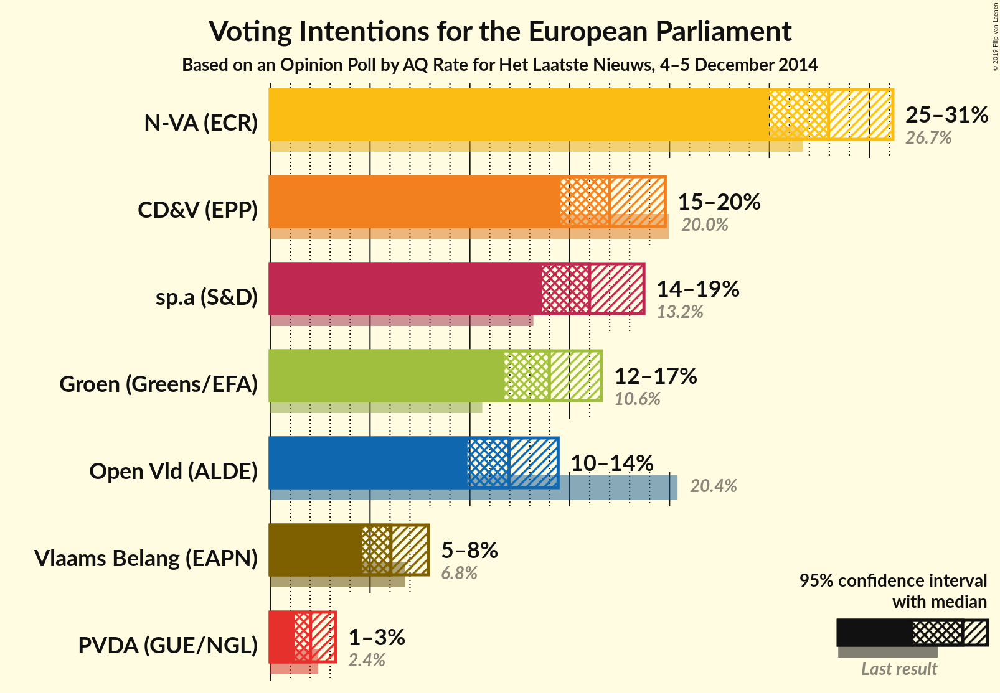
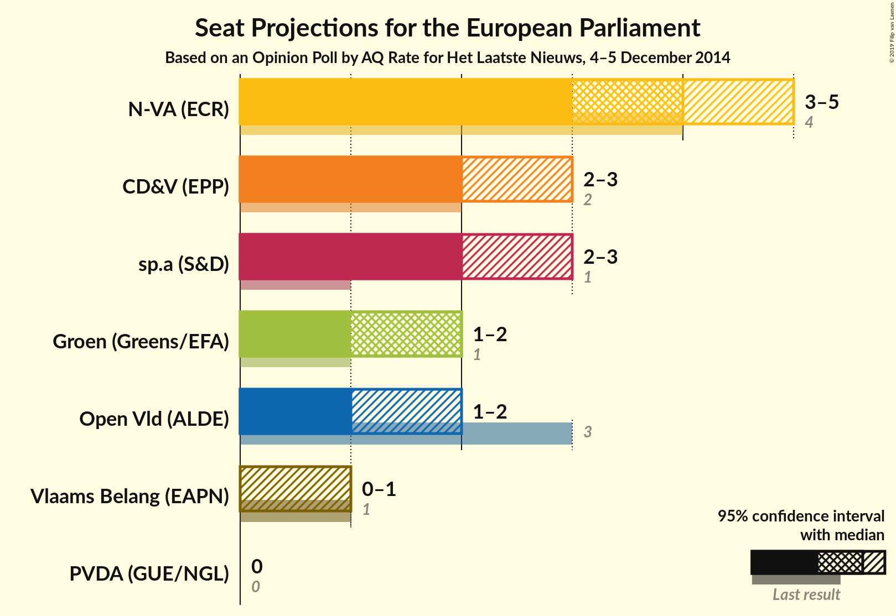
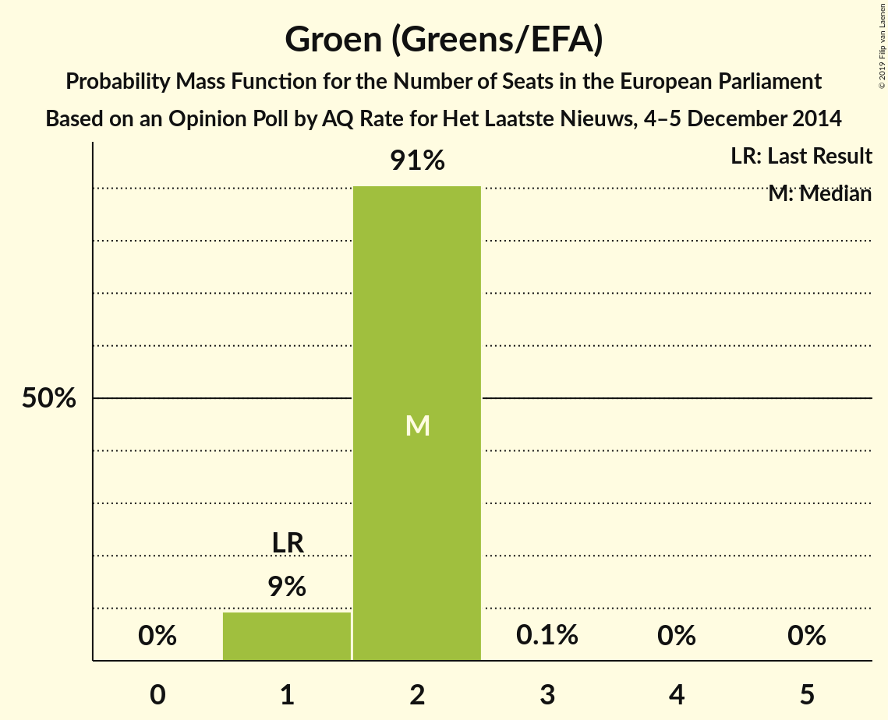
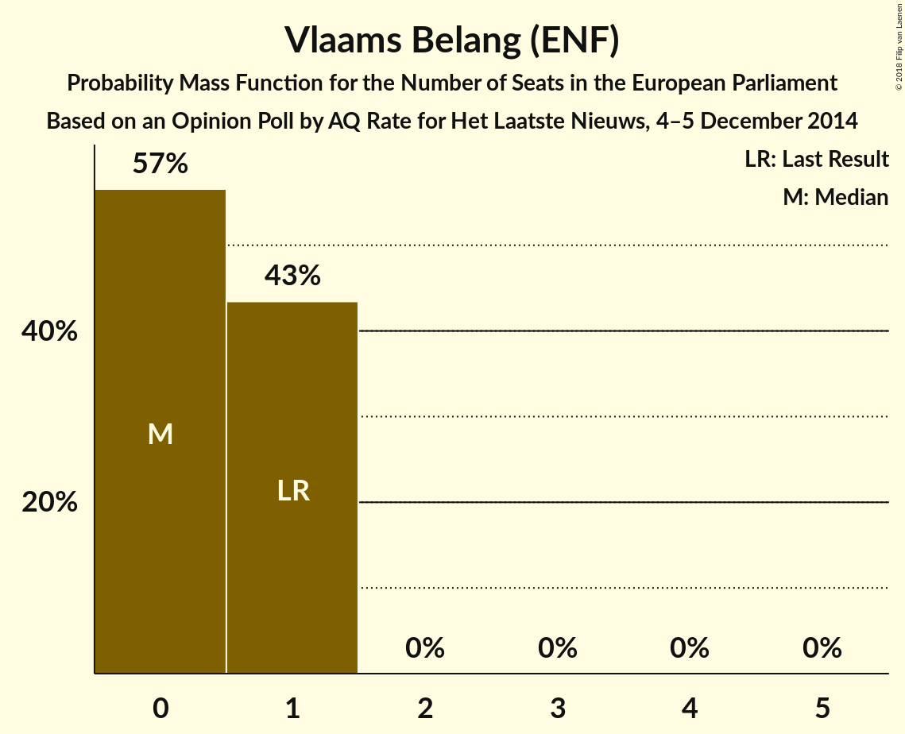
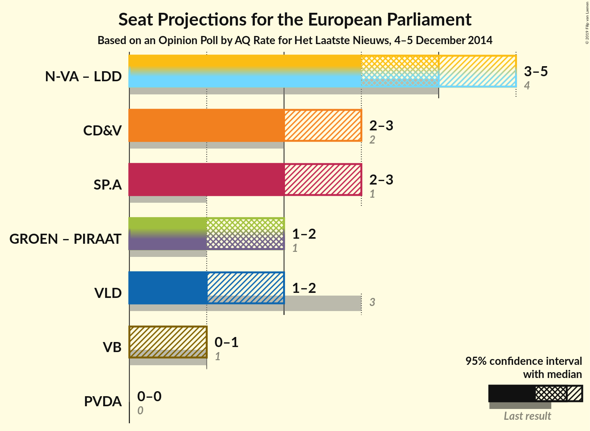

# Opinion Poll by AQ Rate for Het Laatste Nieuws, 4–5 December 2014

<a href="#voting-intentions">Voting Intentions</a> | <a href="#seats">Seats</a> | <a href="#coalitions">Coalitions</a> | <a href="#technical-information">Technical Information</a>

## Voting Intentions

### Confidence Intervals

| Party | Last Result | Poll Result | 80% Confidence Interval | 90% Confidence Interval | 95% Confidence Interval | 99% Confidence Interval |
|:-----:|:-----------:|:-----------:|:-----------------------:|:-----------------------:|:-----------------------:|:-----------------------:|
| N-VA (ECR) | 26.7% | 28.0% | 26.0–30.1% |25.4–30.7% |25.0–31.2% |24.0–32.2% |
| CD&V (EPP) | 20.0% | 17.0% | 15.4–18.8% |14.9–19.3% |14.5–19.8% |13.8–20.7% |
| sp.a (S&D) | 13.2% | 16.0% | 14.4–17.8% |14.0–18.3% |13.6–18.7% |12.9–19.6% |
| Groen (Greens/EFA) | 10.6% | 14.0% | 12.5–15.7% |12.1–16.2% |11.7–16.6% |11.1–17.4% |
| Open Vld (ALDE) | 20.4% | 12.0% | 10.6–13.6% |10.2–14.0% |9.9–14.4% |9.3–15.2% |
| Vlaams Belang (ENF) | 6.8% | 6.0% | 5.1–7.3% |4.8–7.6% |4.6–7.9% |4.2–8.6% |
| PVDA (GUE/NGL) | 2.4% | 2.0% | 1.5–2.8% |1.4–3.0% |1.2–3.3% |1.0–3.7% |

*Note:* The poll result column reflects the actual value used in the calculations. Published results may vary slightly, and in addition be rounded to fewer digits.

## Seats

### Confidence Intervals

| Party | Last Result | Median | 80% Confidence Interval | 90% Confidence Interval | 95% Confidence Interval | 99% Confidence Interval |
|:-----:|:-----------:|:------:|:-----------------------:|:-----------------------:|:-----------------------:|:-----------------------:|
| <a href="#n-va-(ecr)">N-VA (ECR)</a> | 4 | 4 | 4 |3–5 |3–5 |3–5 |
| <a href="#cd&v-(epp)">CD&V (EPP)</a> | 2 | 2 | 2–3 |2–3 |2–3 |2–3 |
| <a href="#sp.a-(s&d)">sp.a (S&D)</a> | 1 | 2 | 2 |2–3 |2–3 |2–3 |
| <a href="#groen-(greens/efa)">Groen (Greens/EFA)</a> | 1 | 2 | 2 |1–2 |1–2 |1–2 |
| <a href="#open-vld-(alde)">Open Vld (ALDE)</a> | 3 | 1 | 1–2 |1–2 |1–2 |1–2 |
| <a href="#vlaams-belang-(enf)">Vlaams Belang (ENF)</a> | 1 | 0 | 0–1 |0–1 |0–1 |0–1 |
| <a href="#pvda-(gue/ngl)">PVDA (GUE/NGL)</a> | 0 | 0 | 0 |0 |0 |0 |

### N-VA (ECR)

*For a full overview of the results for this party, see the [N-VA (ECR)](party-n-vaecr.html) page.*

| Number of Seats | Probability | Accumulated | Special Marks |
|:---------------:|:-----------:|:-----------:|:-------------:|
| 3 | 5% | 100% |  |
| 4 | 87% | 95% | Last Result, Median |
| 5 | 7% | 7% |  |
| 6 | 0% | 0% |  |

### CD&V (EPP)

*For a full overview of the results for this party, see the [CD&V (EPP)](party-cdvepp.html) page.*

| Number of Seats | Probability | Accumulated | Special Marks |
|:---------------:|:-----------:|:-----------:|:-------------:|
| 2 | 86% | 100% | Last Result, Median |
| 3 | 14% | 14% |  |
| 4 | 0% | 0% |  |

### sp.a (S&D)

*For a full overview of the results for this party, see the [sp.a (S&D)](party-spasd.html) page.*

| Number of Seats | Probability | Accumulated | Special Marks |
|:---------------:|:-----------:|:-----------:|:-------------:|
| 1 | 0.4% | 100% | Last Result |
| 2 | 95% | 99.6% | Median |
| 3 | 5% | 5% |  |
| 4 | 0% | 0% |  |

### Groen (Greens/EFA)

*For a full overview of the results for this party, see the [Groen (Greens/EFA)](party-groengreensefa.html) page.*

| Number of Seats | Probability | Accumulated | Special Marks |
|:---------------:|:-----------:|:-----------:|:-------------:|
| 1 | 9% | 100% | Last Result |
| 2 | 91% | 91% | Median |
| 3 | 0.1% | 0.1% |  |
| 4 | 0% | 0% |  |

### Open Vld (ALDE)

*For a full overview of the results for this party, see the [Open Vld (ALDE)](party-openvldalde.html) page.*

| Number of Seats | Probability | Accumulated | Special Marks |
|:---------------:|:-----------:|:-----------:|:-------------:|
| 1 | 63% | 100% | Median |
| 2 | 37% | 37% |  |
| 3 | 0% | 0% | Last Result |

### Vlaams Belang (ENF)

*For a full overview of the results for this party, see the [Vlaams Belang (ENF)](party-vlaamsbelangenf.html) page.*

| Number of Seats | Probability | Accumulated | Special Marks |
|:---------------:|:-----------:|:-----------:|:-------------:|
| 0 | 57% | 100% | Median |
| 1 | 43% | 43% | Last Result |
| 2 | 0% | 0% |  |

### PVDA (GUE/NGL)

*For a full overview of the results for this party, see the [PVDA (GUE/NGL)](party-pvdaguengl.html) page.*

| Number of Seats | Probability | Accumulated | Special Marks |
|:---------------:|:-----------:|:-----------:|:-------------:|
| 0 | 100% | 100% | Last Result, Median |

## Coalitions

### Confidence Intervals

| Coalition | Last Result | Median | Majority? | 80% Confidence Interval | 90% Confidence Interval | 95% Confidence Interval | 99% Confidence Interval |
|:---------:|:-----------:|:------:|:---------:|:-----------------------:|:-----------------------:|:-----------------------:|:-----------------------:|
| CD&V (EPP) | 2 | 2 | 0% | 2–3 | 2–3 | 2–3 | 2–3 |
| sp.a (S&D) | 1 | 2 | 0% | 2 | 2–3 | 2–3 | 2–3 |
| Open Vld (ALDE) | 3 | 1 | 0% | 1–2 | 1–2 | 1–2 | 1–2 |
| Vlaams Belang (ENF) | 1 | 0 | 0% | 0–1 | 0–1 | 0–1 | 0–1 |
| PVDA (GUE/NGL) | 0 | 0 | 0% | 0 | 0 | 0 | 0 |

### CD&V (EPP)

| Number of Seats | Probability | Accumulated | Special Marks |
|:---------------:|:-----------:|:-----------:|:-------------:|
| 2 | 86% | 100% | Last Result, Median |
| 3 | 14% | 14% |  |
| 4 | 0% | 0% |  |

### sp.a (S&D)

| Number of Seats | Probability | Accumulated | Special Marks |
|:---------------:|:-----------:|:-----------:|:-------------:|
| 1 | 0.4% | 100% | Last Result |
| 2 | 95% | 99.6% | Median |
| 3 | 5% | 5% |  |
| 4 | 0% | 0% |  |

### Open Vld (ALDE)

| Number of Seats | Probability | Accumulated | Special Marks |
|:---------------:|:-----------:|:-----------:|:-------------:|
| 1 | 63% | 100% | Median |
| 2 | 37% | 37% |  |
| 3 | 0% | 0% | Last Result |

### Vlaams Belang (ENF)

| Number of Seats | Probability | Accumulated | Special Marks |
|:---------------:|:-----------:|:-----------:|:-------------:|
| 0 | 57% | 100% | Median |
| 1 | 43% | 43% | Last Result |
| 2 | 0% | 0% |  |

### PVDA (GUE/NGL)

| Number of Seats | Probability | Accumulated | Special Marks |
|:---------------:|:-----------:|:-----------:|:-------------:|
| 0 | 100% | 100% | Last Result, Median |

## Technical Information

### Opinion Poll

+ **Polling firm:** AQ Rate
+ **Commissioner(s):** Het Laatste Nieuws
+ **Fieldwork period:** 4–5 December 2014

### Calculations

+ **Sample size:** 794
+ **Simulations done:** 1,048,576
+ **Error estimate:** 0.43%

