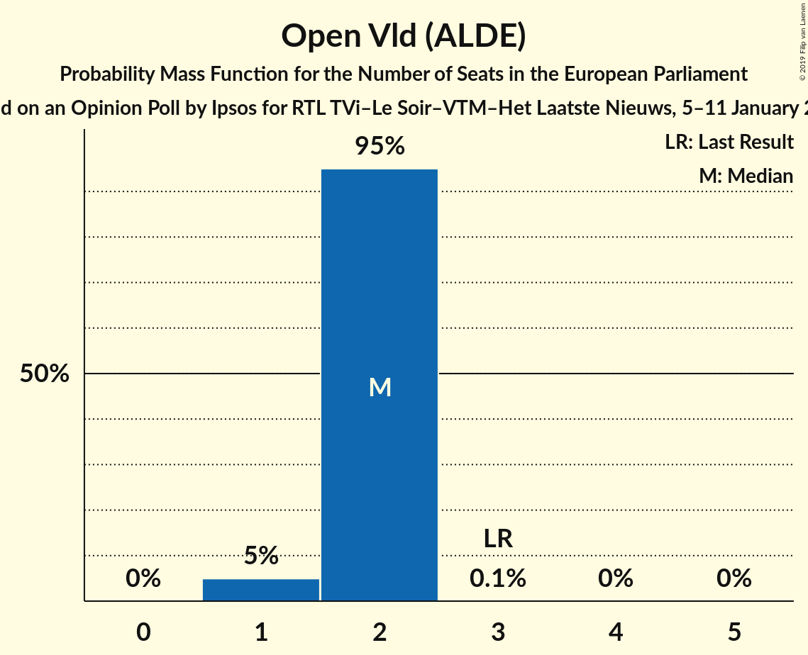
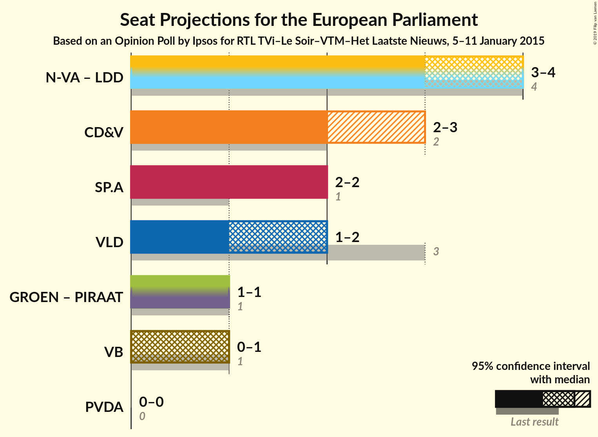

# Opinion Poll by Ipsos for RTL TVi–Le Soir–VTM–Het Laatste Nieuws, 5–11 January 2015

<a href="#voting-intentions">Voting Intentions</a> | <a href="#seats">Seats</a> | <a href="#coalitions">Coalitions</a> | <a href="#technical-information">Technical Information</a>

## Voting Intentions

### Confidence Intervals

| Party | Last Result | Poll Result | 80% Confidence Interval | 90% Confidence Interval | 95% Confidence Interval | 99% Confidence Interval |
|:-----:|:-----------:|:-----------:|:-----------------------:|:-----------------------:|:-----------------------:|:-----------------------:|
| N-VA (ECR) | 26.7% | 27.8% | 26.1–29.6% |25.6–30.2% |25.2–30.6% |24.4–31.5% |
| CD&V (EPP) | 20.0% | 18.3% | 16.8–19.9% |16.4–20.4% |16.1–20.8% |15.4–21.6% |
| sp.a (S&D) | 13.2% | 15.7% | 14.4–17.3% |14.0–17.7% |13.6–18.1% |13.0–18.8% |
| Open Vld (ALDE) | 20.4% | 14.3% | 13.0–15.8% |12.6–16.2% |12.3–16.6% |11.7–17.3% |
| Groen (Greens/EFA) | 10.6% | 10.4% | 9.2–11.7% |8.9–12.0% |8.6–12.4% |8.1–13.0% |
| Vlaams Belang (ENF) | 6.8% | 6.8% | 5.9–7.9% |5.6–8.2% |5.4–8.5% |5.0–9.1% |
| PVDA (GUE/NGL) | 2.4% | 3.8% | 3.2–4.7% |3.0–5.0% |2.8–5.2% |2.5–5.6% |

*Note:* The poll result column reflects the actual value used in the calculations. Published results may vary slightly, and in addition be rounded to fewer digits.

## Seats

### Confidence Intervals

| Party | Last Result | Median | 80% Confidence Interval | 90% Confidence Interval | 95% Confidence Interval | 99% Confidence Interval |
|:-----:|:-----------:|:------:|:-----------------------:|:-----------------------:|:-----------------------:|:-----------------------:|
| <a href="#n-va-(ecr)">N-VA (ECR)</a> | 4 | 4 | 4 |4 |3–4 |3–5 |
| <a href="#cd&v-(epp)">CD&V (EPP)</a> | 2 | 2 | 2–3 |2–3 |2–3 |2–3 |
| <a href="#sp.a-(s&d)">sp.a (S&D)</a> | 1 | 2 | 2 |2 |2 |2–3 |
| <a href="#open-vld-(alde)">Open Vld (ALDE)</a> | 3 | 2 | 2 |2 |1–2 |1–2 |
| <a href="#groen-(greens/efa)">Groen (Greens/EFA)</a> | 1 | 1 | 1 |1 |1 |1–2 |
| <a href="#vlaams-belang-(enf)">Vlaams Belang (ENF)</a> | 1 | 1 | 0–1 |0–1 |0–1 |0–1 |
| <a href="#pvda-(gue/ngl)">PVDA (GUE/NGL)</a> | 0 | 0 | 0 |0 |0 |0 |

### N-VA (ECR)

*For a full overview of the results for this party, see the [N-VA (ECR)](party-n-vaecr.html) page.*

| Number of Seats | Probability | Accumulated | Special Marks |
|:---------------:|:-----------:|:-----------:|:-------------:|
| 3 | 5% | 100% |  |
| 4 | 93% | 95% | Last Result, Median |
| 5 | 2% | 2% |  |
| 6 | 0% | 0% |  |

### CD&V (EPP)

*For a full overview of the results for this party, see the [CD&V (EPP)](party-cdvepp.html) page.*

| Number of Seats | Probability | Accumulated | Special Marks |
|:---------------:|:-----------:|:-----------:|:-------------:|
| 2 | 74% | 100% | Last Result, Median |
| 3 | 26% | 26% |  |
| 4 | 0% | 0% |  |

### sp.a (S&D)

*For a full overview of the results for this party, see the [sp.a (S&D)](party-spasd.html) page.*

| Number of Seats | Probability | Accumulated | Special Marks |
|:---------------:|:-----------:|:-----------:|:-------------:|
| 1 | 0.3% | 100% | Last Result |
| 2 | 98.8% | 99.7% | Median |
| 3 | 0.9% | 0.9% |  |
| 4 | 0% | 0% |  |

### Open Vld (ALDE)

*For a full overview of the results for this party, see the [Open Vld (ALDE)](party-openvldalde.html) page.*

| Number of Seats | Probability | Accumulated | Special Marks |
|:---------------:|:-----------:|:-----------:|:-------------:|
| 1 | 5% | 100% |  |
| 2 | 95% | 95% | Median |
| 3 | 0.1% | 0.1% | Last Result |
| 4 | 0% | 0% |  |

### Groen (Greens/EFA)

*For a full overview of the results for this party, see the [Groen (Greens/EFA)](party-groengreensefa.html) page.*

| Number of Seats | Probability | Accumulated | Special Marks |
|:---------------:|:-----------:|:-----------:|:-------------:|
| 1 | 98% | 100% | Last Result, Median |
| 2 | 2% | 2% |  |
| 3 | 0% | 0% |  |

### Vlaams Belang (ENF)

*For a full overview of the results for this party, see the [Vlaams Belang (ENF)](party-vlaamsbelangenf.html) page.*

| Number of Seats | Probability | Accumulated | Special Marks |
|:---------------:|:-----------:|:-----------:|:-------------:|
| 0 | 20% | 100% |  |
| 1 | 80% | 80% | Last Result, Median |
| 2 | 0% | 0% |  |

### PVDA (GUE/NGL)

*For a full overview of the results for this party, see the [PVDA (GUE/NGL)](party-pvdaguengl.html) page.*

| Number of Seats | Probability | Accumulated | Special Marks |
|:---------------:|:-----------:|:-----------:|:-------------:|
| 0 | 100% | 100% | Last Result, Median |

## Coalitions

### Confidence Intervals

| Coalition | Last Result | Median | Majority? | 80% Confidence Interval | 90% Confidence Interval | 95% Confidence Interval | 99% Confidence Interval |
|:---------:|:-----------:|:------:|:---------:|:-----------------------:|:-----------------------:|:-----------------------:|:-----------------------:|
| CD&V (EPP) | 2 | 2 | 0% | 2–3 | 2–3 | 2–3 | 2–3 |
| sp.a (S&D) | 1 | 2 | 0% | 2 | 2 | 2 | 2–3 |
| Open Vld (ALDE) | 3 | 2 | 0% | 2 | 2 | 1–2 | 1–2 |
| Vlaams Belang (ENF) | 1 | 1 | 0% | 0–1 | 0–1 | 0–1 | 0–1 |
| PVDA (GUE/NGL) | 0 | 0 | 0% | 0 | 0 | 0 | 0 |

### CD&V (EPP)

| Number of Seats | Probability | Accumulated | Special Marks |
|:---------------:|:-----------:|:-----------:|:-------------:|
| 2 | 74% | 100% | Last Result, Median |
| 3 | 26% | 26% |  |
| 4 | 0% | 0% |  |

### sp.a (S&D)

| Number of Seats | Probability | Accumulated | Special Marks |
|:---------------:|:-----------:|:-----------:|:-------------:|
| 1 | 0.3% | 100% | Last Result |
| 2 | 98.8% | 99.7% | Median |
| 3 | 0.9% | 0.9% |  |
| 4 | 0% | 0% |  |

### Open Vld (ALDE)

| Number of Seats | Probability | Accumulated | Special Marks |
|:---------------:|:-----------:|:-----------:|:-------------:|
| 1 | 5% | 100% |  |
| 2 | 95% | 95% | Median |
| 3 | 0.1% | 0.1% | Last Result |
| 4 | 0% | 0% |  |

### Vlaams Belang (ENF)

| Number of Seats | Probability | Accumulated | Special Marks |
|:---------------:|:-----------:|:-----------:|:-------------:|
| 0 | 20% | 100% |  |
| 1 | 80% | 80% | Last Result, Median |
| 2 | 0% | 0% |  |

### PVDA (GUE/NGL)

| Number of Seats | Probability | Accumulated | Special Marks |
|:---------------:|:-----------:|:-----------:|:-------------:|
| 0 | 100% | 100% | Last Result, Median |

## Technical Information

### Opinion Poll

+ **Polling firm:** Ipsos
+ **Commissioner(s):** RTL TVi–Le Soir–VTM–Het Laatste Nieuws
+ **Fieldwork period:** 5–11 January 2015

### Calculations

+ **Sample size:** 1043
+ **Simulations done:** 2,097,152
+ **Error estimate:** 0.66%

