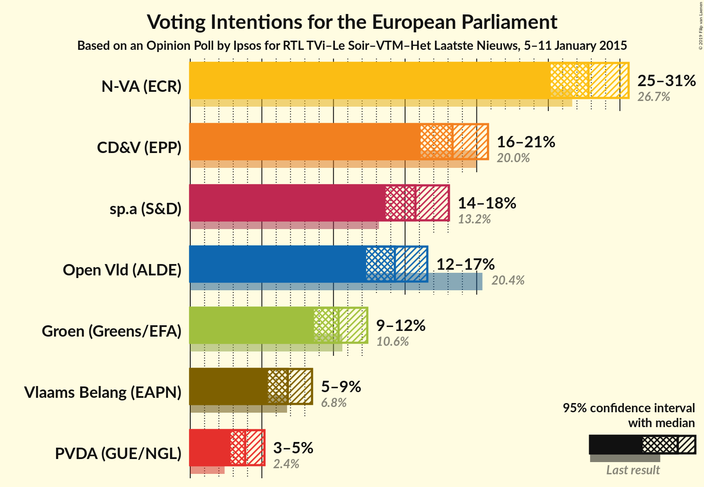
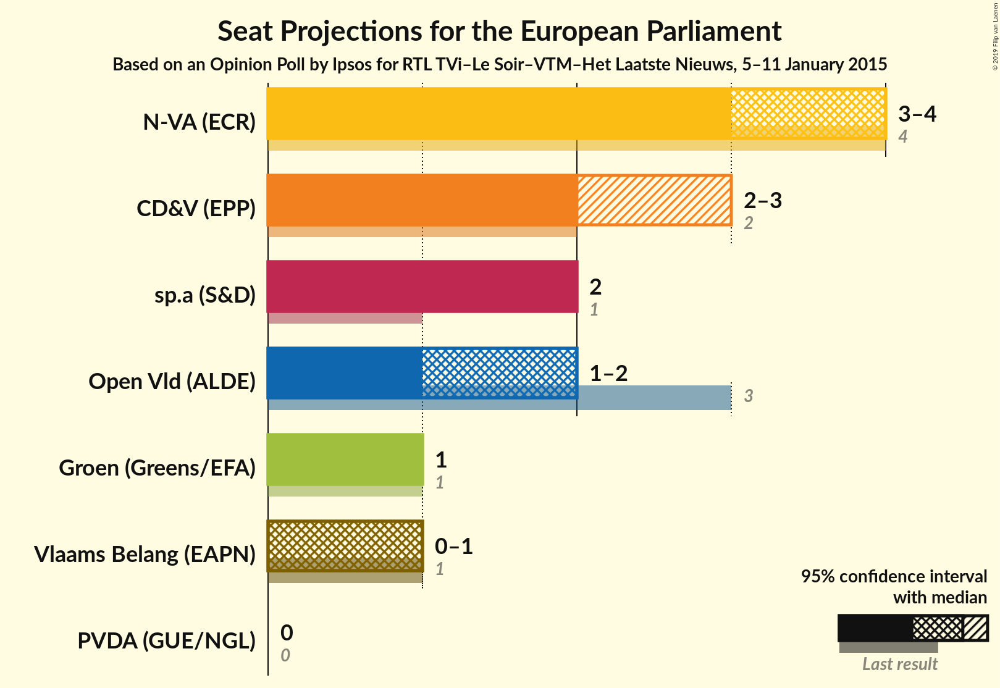

# Opinion Poll by Ipsos for RTL TVi–Le Soir–VTM–Het Laatste Nieuws, 5–11 January 2015

<a href="#voting-intentions">Voting Intentions</a> | <a href="#seats">Seats</a> | <a href="#coalitions">Coalitions</a> | <a href="#technical-information">Technical Information</a>

## Voting Intentions

### Confidence Intervals

| Party | Last Result | Poll Result | 80% Confidence Interval | 90% Confidence Interval | 95% Confidence Interval | 99% Confidence Interval |
|:-----:|:-----------:|:-----------:|:-----------------------:|:-----------------------:|:-----------------------:|:-----------------------:|
| N-VA (ECR) | 26.7% | 27.8% | N/A |N/A |N/A |N/A |
| CD&V (EPP) | 20.0% | 18.3% | N/A |N/A |N/A |N/A |
| sp.a (S&D) | 13.2% | 15.7% | N/A |N/A |N/A |N/A |
| Open Vld (ALDE) | 20.4% | 14.3% | N/A |N/A |N/A |N/A |
| Groen (Greens/EFA) | 10.6% | 10.4% | N/A |N/A |N/A |N/A |
| Vlaams Belang (ENF) | 6.8% | 6.8% | N/A |N/A |N/A |N/A |
| PVDA (GUE/NGL) | 2.4% | 3.8% | N/A |N/A |N/A |N/A |

*Note:* The poll result column reflects the actual value used in the calculations. Published results may vary slightly, and in addition be rounded to fewer digits.

## Seats

### Confidence Intervals

| Party | Last Result | Median | 80% Confidence Interval | 90% Confidence Interval | 95% Confidence Interval | 99% Confidence Interval |
|:-----:|:-----------:|:------:|:-----------------------:|:-----------------------:|:-----------------------:|:-----------------------:|
| <a href="#n-va-(ecr)">N-VA (ECR)</a> | 4 | N/A | N/A |N/A |N/A |N/A |
| <a href="#cd&v-(epp)">CD&V (EPP)</a> | 2 | N/A | N/A |N/A |N/A |N/A |
| <a href="#sp.a-(s&d)">sp.a (S&D)</a> | 1 | N/A | N/A |N/A |N/A |N/A |
| <a href="#open-vld-(alde)">Open Vld (ALDE)</a> | 3 | N/A | N/A |N/A |N/A |N/A |
| <a href="#groen-(greens/efa)">Groen (Greens/EFA)</a> | 1 | N/A | N/A |N/A |N/A |N/A |
| <a href="#vlaams-belang-(enf)">Vlaams Belang (ENF)</a> | 1 | N/A | N/A |N/A |N/A |N/A |
| <a href="#pvda-(gue/ngl)">PVDA (GUE/NGL)</a> | 0 | N/A | N/A |N/A |N/A |N/A |

## Coalitions

## Technical Information

### Opinion Poll

+ **Polling firm:** Ipsos
+ **Commissioner(s):** RTL TVi–Le Soir–VTM–Het Laatste Nieuws
+ **Fieldwork period:** 5–11 January 2015

### Calculations

+ **Sample size:** 1043
+ **Simulations done:** 0
+ **Error estimate:** 100.00%

