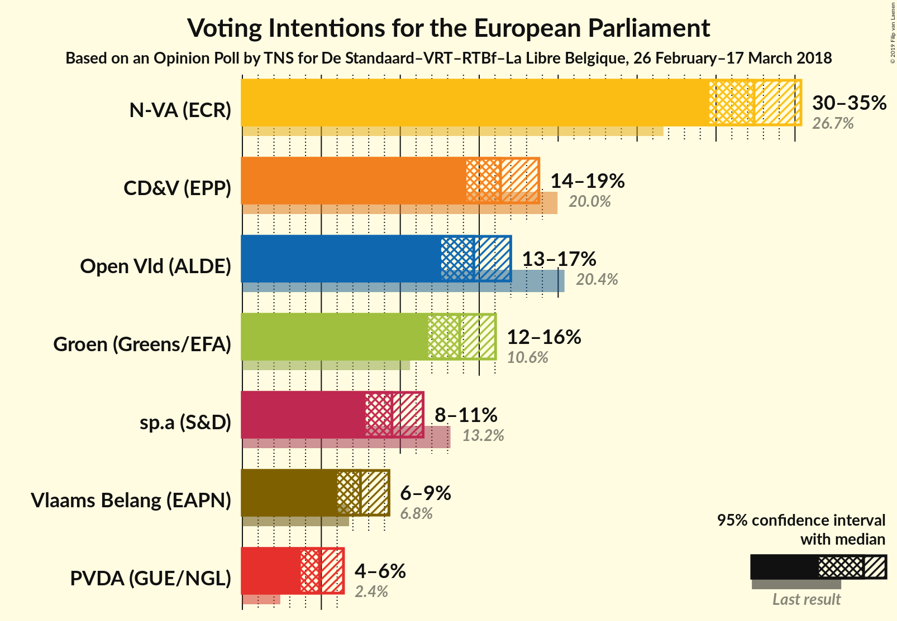

# Opinion Poll by TNS for De Standaard–VRT–RTBf–La Libre Belgique, 26 February–17 March 2018

<a href="#voting-intentions">Voting Intentions</a> | <a href="#seats">Seats</a> | <a href="#coalitions">Coalitions</a> | <a href="#technical-information">Technical Information</a>

## Voting Intentions

### Confidence Intervals

| Party | Last Result | Poll Result | 80% Confidence Interval | 90% Confidence Interval | 95% Confidence Interval | 99% Confidence Interval |
|:-----:|:-----------:|:-----------:|:-----------------------:|:-----------------------:|:-----------------------:|:-----------------------:|
| N-VA | N/A | 32.4% | 30.5–34.3% |30.0–34.9% |29.6–35.4% |28.7–36.3% |
| CD&V | N/A | 16.4% | 14.9–17.9% |14.5–18.4% |14.2–18.8% |13.5–19.6% |
| Open Vld | N/A | 14.7% | 13.3–16.2% |12.9–16.6% |12.6–17.0% |12.0–17.7% |
| Groen | N/A | 13.8% | 12.4–15.2% |12.1–15.7% |11.8–16.0% |11.2–16.8% |
| sp.a | N/A | 9.5% | 8.4–10.8% |8.1–11.1% |7.8–11.4% |7.3–12.1% |
| Vlaams Belang | N/A | 7.5% | 6.5–8.7% |6.2–9.0% |6.0–9.3% |5.6–9.9% |
| PVDA | N/A | 4.9% | 4.1–5.9% |3.9–6.2% |3.7–6.4% |3.4–6.9% |

*Note:* The poll result column reflects the actual value used in the calculations. Published results may vary slightly, and in addition be rounded to fewer digits.

## Seats

### Confidence Intervals

| Party | Last Result | Median | 80% Confidence Interval | 90% Confidence Interval | 95% Confidence Interval | 99% Confidence Interval |
|:-----:|:-----------:|:------:|:-----------------------:|:-----------------------:|:-----------------------:|:-----------------------:|
| <a href="#n-va">N-VA</a> | N/A | 5 | 4–5 |4–5 |4–5 |4–6 |
| <a href="#cd&v">CD&V</a> | N/A | 2 | 2 |2 |2 |1–3 |
| <a href="#open-vld">Open Vld</a> | N/A | 2 | 1–2 |1–2 |1–2 |1–3 |
| <a href="#groen">Groen</a> | N/A | 1 | 1–2 |1–2 |1–2 |1–2 |
| <a href="#sp.a">sp.a</a> | N/A | 1 | 1 |1 |1 |1–2 |
| <a href="#vlaams-belang">Vlaams Belang</a> | N/A | 1 | 1 |1 |0–1 |0–1 |
| <a href="#pvda">PVDA</a> | N/A | 0 | 0 |0 |0 |0–1 |

