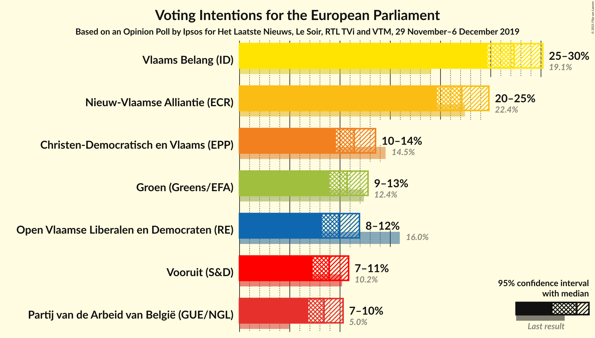
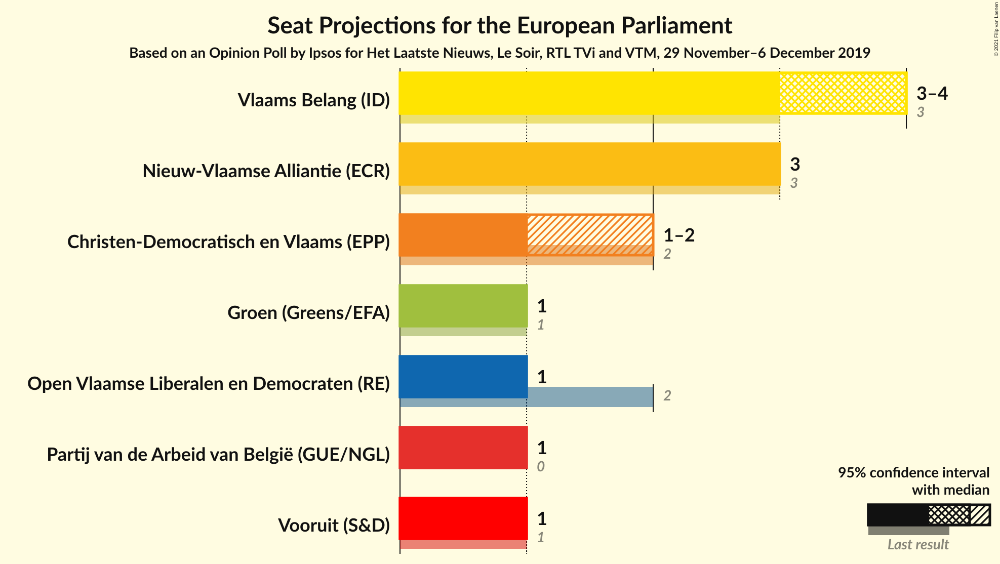
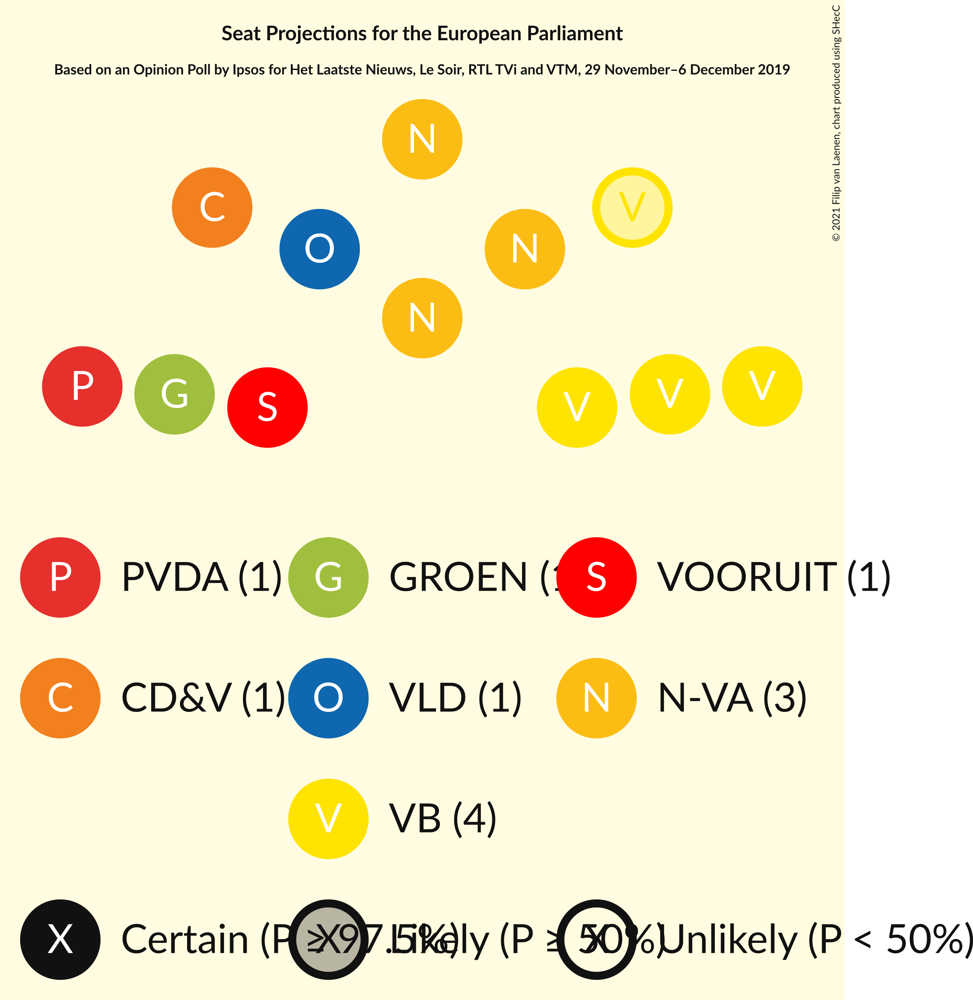
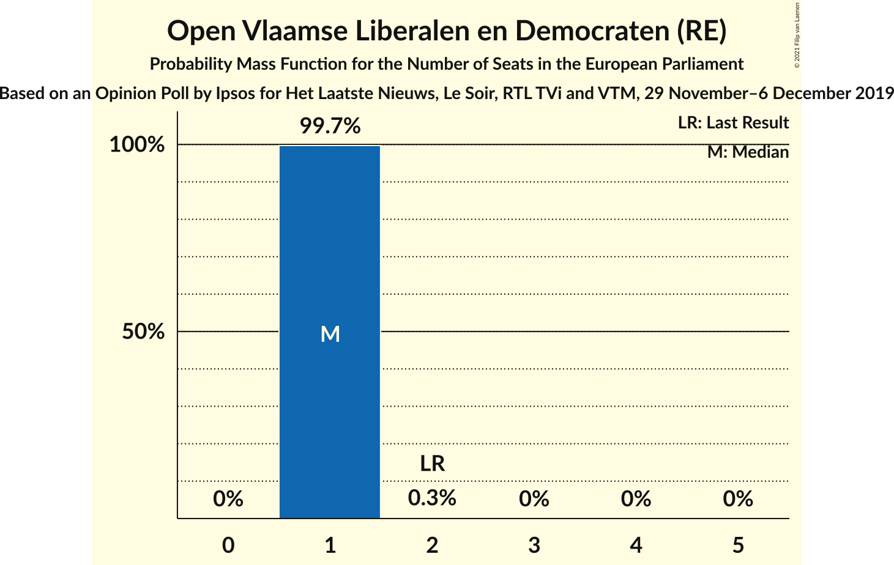
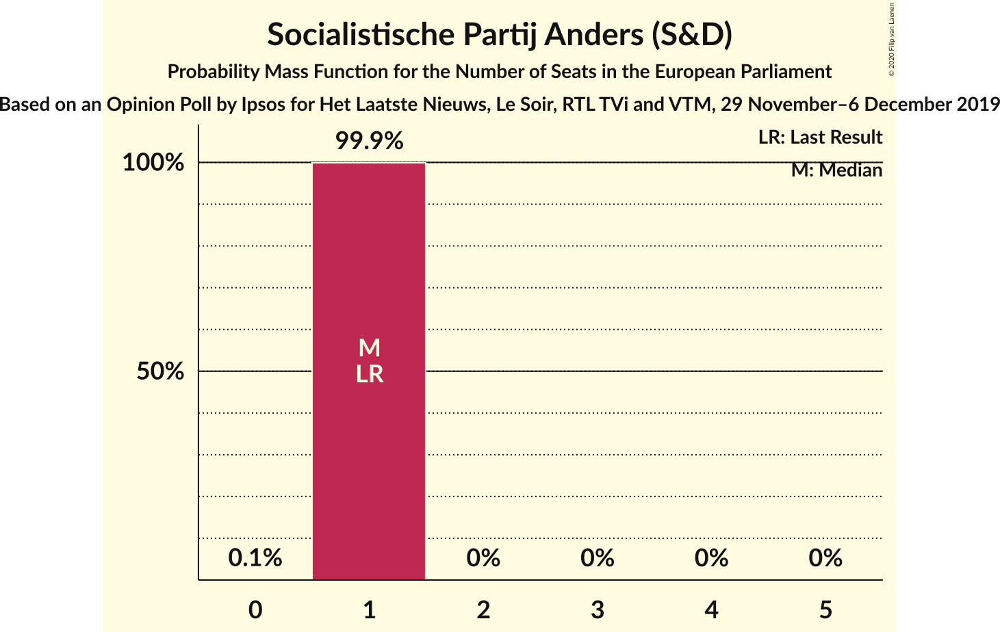
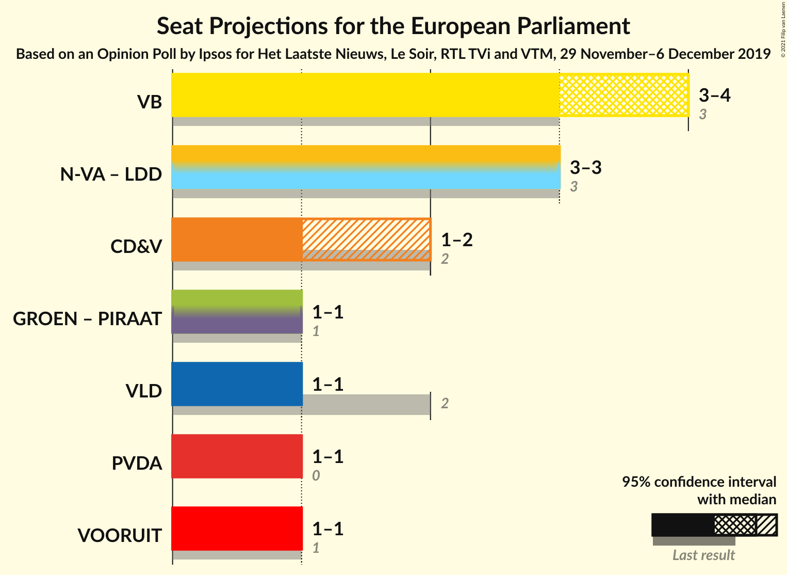
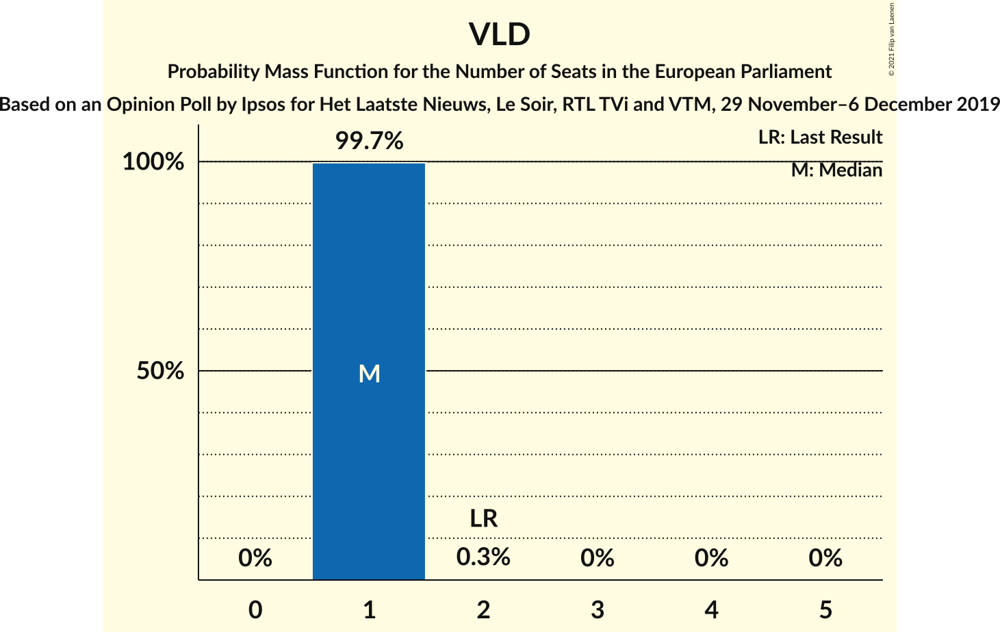
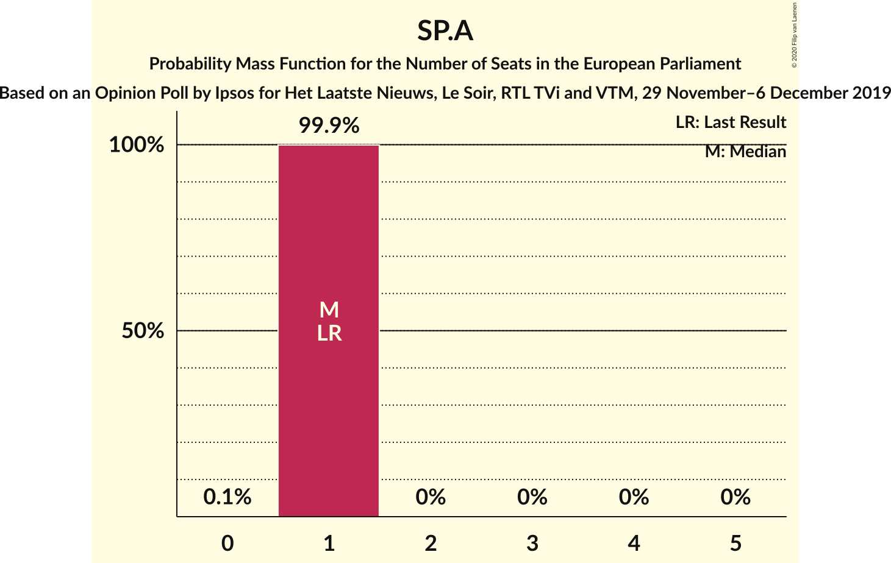

# Opinion Poll by Ipsos for Het Laatste Nieuws, Le Soir, RTL TVi and VTM, 29 November–6 December 2019

<a href="#voting-intentions">Voting Intentions</a> | <a href="#seats">Seats</a> | <a href="#coalitions">Coalitions</a> | <a href="#technical-information">Technical Information</a>

## Voting Intentions

### Confidence Intervals

| Party | Last Result | Poll Result | 80% Confidence Interval | 90% Confidence Interval | 95% Confidence Interval | 99% Confidence Interval |
|:-----:|:-----------:|:-----------:|:-----------------------:|:-----------------------:|:-----------------------:|:-----------------------:|
| Vlaams Belang (ID) | 19.1% | 27.3% | 25.6–29.2% |25.1–29.7% |24.6–30.2% |23.8–31.1% |
| Nieuw-Vlaamse Alliantie (ECR) | 22.4% | 22.1% | 20.5–23.9% |20.0–24.4% |19.6–24.8% |18.9–25.7% |
| Christen-Democratisch en Vlaams (EPP) | 14.5% | 11.4% | 10.2–12.8% |9.9–13.2% |9.6–13.5% |9.0–14.2% |
| Groen (Greens/EFA) | 12.4% | 10.7% | 9.5–12.1% |9.2–12.5% |8.9–12.8% |8.4–13.5% |
| Open Vlaamse Liberalen en Democraten (RE) | 16.0% | 9.9% | 8.8–11.2% |8.5–11.6% |8.2–11.9% |7.7–12.6% |
| Socialistische Partij Anders (S&D) | 10.2% | 8.9% | 7.8–10.2% |7.5–10.5% |7.3–10.9% |6.8–11.5% |
| Partij van de Arbeid van België (GUE/NGL) | 5.0% | 8.4% | 7.4–9.6% |7.1–10.0% |6.8–10.3% |6.4–10.9% |

*Note:* The poll result column reflects the actual value used in the calculations. Published results may vary slightly, and in addition be rounded to fewer digits.

## Seats

### Confidence Intervals

| Party | Last Result | Median | 80% Confidence Interval | 90% Confidence Interval | 95% Confidence Interval | 99% Confidence Interval |
|:-----:|:-----------:|:------:|:-----------------------:|:-----------------------:|:-----------------------:|:-----------------------:|
| <a href="#vlaams-belang-(id)">Vlaams Belang (ID)</a> | 3 | 4 | 4 |3–4 |3–4 |3–4 |
| <a href="#nieuw-vlaamse-alliantie-(ecr)">Nieuw-Vlaamse Alliantie (ECR)</a> | 3 | 3 | 3 |3 |3 |2–4 |
| <a href="#christen-democratisch-en-vlaams-(epp)">Christen-Democratisch en Vlaams (EPP)</a> | 2 | 1 | 1 |1–2 |1–2 |1–2 |
| <a href="#groen-(greens/efa)">Groen (Greens/EFA)</a> | 1 | 1 | 1 |1 |1 |1–2 |
| <a href="#open-vlaamse-liberalen-en-democraten-(re)">Open Vlaamse Liberalen en Democraten (RE)</a> | 2 | 1 | 1 |1 |1 |1 |
| <a href="#socialistische-partij-anders-(s&d)">Socialistische Partij Anders (S&D)</a> | 1 | 1 | 1 |1 |1 |1 |
| <a href="#partij-van-de-arbeid-van-belgië-(gue/ngl)">Partij van de Arbeid van België (GUE/NGL)</a> | 0 | 1 | 1 |1 |1 |1 |

### Vlaams Belang (ID)

*For a full overview of the results for this party, see the [Vlaams Belang (ID)](party-vlaamsbelangid.html) page.*

| Number of Seats | Probability | Accumulated | Special Marks |
|:---------------:|:-----------:|:-----------:|:-------------:|
| 3 | 7% | 100% | Last Result |
| 4 | 93% | 93% | Median |
| 5 | 0.1% | 0.1% |  |
| 6 | 0% | 0% |  |

### Nieuw-Vlaamse Alliantie (ECR)

*For a full overview of the results for this party, see the [Nieuw-Vlaamse Alliantie (ECR)](party-nieuw-vlaamsealliantieecr.html) page.*

| Number of Seats | Probability | Accumulated | Special Marks |
|:---------------:|:-----------:|:-----------:|:-------------:|
| 2 | 1.1% | 100% |  |
| 3 | 98% | 98.9% | Last Result, Median |
| 4 | 0.9% | 0.9% |  |
| 5 | 0% | 0% |  |

### Christen-Democratisch en Vlaams (EPP)

*For a full overview of the results for this party, see the [Christen-Democratisch en Vlaams (EPP)](party-christen-democratischenvlaamsepp.html) page.*

| Number of Seats | Probability | Accumulated | Special Marks |
|:---------------:|:-----------:|:-----------:|:-------------:|
| 1 | 94% | 100% | Median |
| 2 | 6% | 6% | Last Result |
| 3 | 0% | 0% |  |

### Groen (Greens/EFA)

*For a full overview of the results for this party, see the [Groen (Greens/EFA)](party-groengreensefa.html) page.*

| Number of Seats | Probability | Accumulated | Special Marks |
|:---------------:|:-----------:|:-----------:|:-------------:|
| 1 | 98% | 100% | Last Result, Median |
| 2 | 2% | 2% |  |
| 3 | 0% | 0% |  |

### Open Vlaamse Liberalen en Democraten (RE)

*For a full overview of the results for this party, see the [Open Vlaamse Liberalen en Democraten (RE)](party-openvlaamseliberalenendemocratenre.html) page.*

| Number of Seats | Probability | Accumulated | Special Marks |
|:---------------:|:-----------:|:-----------:|:-------------:|
| 1 | 99.7% | 100% | Median |
| 2 | 0.3% | 0.3% | Last Result |
| 3 | 0% | 0% |  |

### Socialistische Partij Anders (S&D)

*For a full overview of the results for this party, see the [Socialistische Partij Anders (S&D)](party-socialistischepartijanderssd.html) page.*

| Number of Seats | Probability | Accumulated | Special Marks |
|:---------------:|:-----------:|:-----------:|:-------------:|
| 0 | 0.1% | 100% |  |
| 1 | 99.9% | 99.9% | Last Result, Median |
| 2 | 0% | 0% |  |

### Partij van de Arbeid van België (GUE/NGL)

*For a full overview of the results for this party, see the [Partij van de Arbeid van België (GUE/NGL)](party-partijvandearbeidvanbelgiëguengl.html) page.*

| Number of Seats | Probability | Accumulated | Special Marks |
|:---------------:|:-----------:|:-----------:|:-------------:|
| 0 | 0.4% | 100% | Last Result |
| 1 | 99.6% | 99.6% | Median |
| 2 | 0% | 0% |  |

## Coalitions

### Confidence Intervals

| Coalition | Last Result | Median | Majority? | 80% Confidence Interval | 90% Confidence Interval | 95% Confidence Interval | 99% Confidence Interval |
|:---------:|:-----------:|:------:|:---------:|:-----------------------:|:-----------------------:|:-----------------------:|:-----------------------:|
| Vlaams Belang (ID) | 3 | 4 | 0% | 4 | 3–4 | 3–4 | 3–4 |
| Christen-Democratisch en Vlaams (EPP) | 2 | 1 | 0% | 1 | 1–2 | 1–2 | 1–2 |
| Open Vlaamse Liberalen en Democraten (RE) | 2 | 1 | 0% | 1 | 1 | 1 | 1 |
| Partij van de Arbeid van België (GUE/NGL) | 0 | 1 | 0% | 1 | 1 | 1 | 1 |
| Socialistische Partij Anders (S&D) | 1 | 1 | 0% | 1 | 1 | 1 | 1 |

### Vlaams Belang (ID)

| Number of Seats | Probability | Accumulated | Special Marks |
|:---------------:|:-----------:|:-----------:|:-------------:|
| 3 | 7% | 100% | Last Result |
| 4 | 93% | 93% | Median |
| 5 | 0.1% | 0.1% |  |
| 6 | 0% | 0% |  |

### Christen-Democratisch en Vlaams (EPP)

| Number of Seats | Probability | Accumulated | Special Marks |
|:---------------:|:-----------:|:-----------:|:-------------:|
| 1 | 94% | 100% | Median |
| 2 | 6% | 6% | Last Result |
| 3 | 0% | 0% |  |

### Open Vlaamse Liberalen en Democraten (RE)

| Number of Seats | Probability | Accumulated | Special Marks |
|:---------------:|:-----------:|:-----------:|:-------------:|
| 1 | 99.7% | 100% | Median |
| 2 | 0.3% | 0.3% | Last Result |
| 3 | 0% | 0% |  |

### Partij van de Arbeid van België (GUE/NGL)

| Number of Seats | Probability | Accumulated | Special Marks |
|:---------------:|:-----------:|:-----------:|:-------------:|
| 0 | 0.4% | 100% | Last Result |
| 1 | 99.6% | 99.6% | Median |
| 2 | 0% | 0% |  |

### Socialistische Partij Anders (S&D)

| Number of Seats | Probability | Accumulated | Special Marks |
|:---------------:|:-----------:|:-----------:|:-------------:|
| 0 | 0.1% | 100% |  |
| 1 | 99.9% | 99.9% | Last Result, Median |
| 2 | 0% | 0% |  |

## Technical Information

### Opinion Poll

+ **Polling firm:** Ipsos
+ **Commissioner(s):** Het Laatste Nieuws, Le Soir, RTL TVi and VTM
+ **Fieldwork period:** 29 November–6 December 2019

### Calculations

+ **Sample size:** 999
+ **Simulations done:** 1,048,576
+ **Error estimate:** 0.64%

