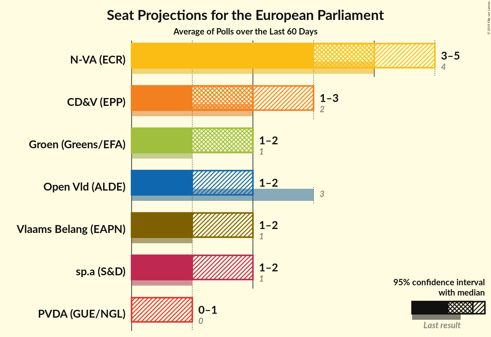
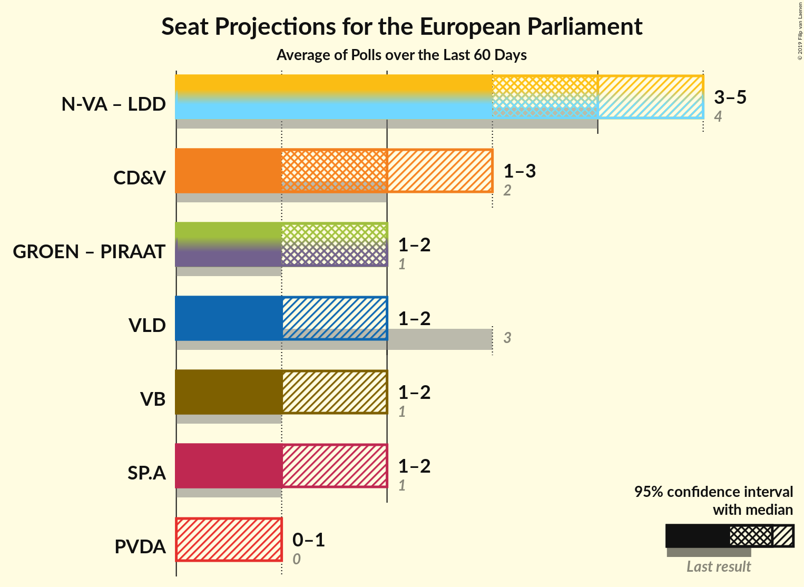

# Overview

The table below lists the most recent polls (less than 60 days old) registered and analyzed so far.

| Period     | Polling firm/Commissioner(s) | N-VA | VLD | CD&V | SP.A | GROEN | VB | PVDA | PIRAAT | LDD |
|:----------:|:----------------------------:|:--:|:--:|:--:|:--:|:--:|:--:|:--:|:--:|:--:|
| 25 May 2014 | General Election | 26.7%   4 | 20.4%   3 | 20.0%   2 | 13.2%   1 | 10.6%   1 | 6.8%   1 | 2.4%   0 | 0.0%   0 | 0.0%   0 |
| N/A | [Poll Average](average.html) | 25–31%   3–5 | 10–16%   1–2 | 13–19%   1–3 | 10–15%   1–2 | 10–17%   1–2 | 8–17%   1–2 | 4–7%   0–1 | N/A   N/A | N/A   N/A |
| [6–14 May 2019](2019-05-14-Ipsos.html) | Ipsos   Het Laatste Nieuws, Le Soir, RTL TVi and VTM | 25–31%   4–5 | 9–13%   1–2 | 15–20%   2–3 | 9–13%   1–2 | 10–14%   1–2 | 13–17%   2 | 4–6%   0 | N/A   N/A | N/A   N/A |
| [25 March–14 April 2019](2019-04-14-TNS.html) | TNS   De Standaard, La Libre Belgique, RTBf and VRT | 25–31%   3–4 | 12–17%   1–2 | 13–17%   1–2 | 11–15%   1–2 | 13–17%   1–2 | 8–11%   1 | 5–7%   0–1 | N/A   N/A | N/A   N/A |
| 25 May 2014 | General Election | 26.7%   4 | 20.4%   3 | 20.0%   2 | 13.2%   1 | 10.6%   1 | 6.8%   1 | 2.4%   0 | 0.0%   0 | 0.0%   0 |

Only polls for which at least the sample size has been published are included in the table above.

**Legend:**
+ **Top half of each row:** Voting intentions (95% confidence interval)
+ **Bottom half of each row:** Seat projections for the European Parliament (95% confidence interval)
+ **N-VA:** N-VA (ECR)
+ **VLD:** Open Vld (ALDE)
+ **CD&V:** CD&V (EPP)
+ **SP.A:** sp.a (S&D)
+ **GROEN:** Groen (Greens/EFA)
+ **VB:** Vlaams Belang (EAPN)
+ **PVDA:** PVDA (GUE/NGL)
+ **PIRAAT:** Piratenpartij (Greens/EFA)
+ **LDD:** Lijst Dedecker (ECR)
+ **N/A (single party):** Party not included the published results
+ **N/A (entire row):** Calculation for this opinion poll not started yet

