# Opinion Poll by Ipsos for Het Laatste Nieuws, Le Soir, RTL TVi and VTM, 4–9 March 2020

<a href="#voting-intentions">Voting Intentions</a> | <a href="#seats">Seats</a> | <a href="#coalitions">Coalitions</a> | <a href="#technical-information">Technical Information</a>

## Voting Intentions

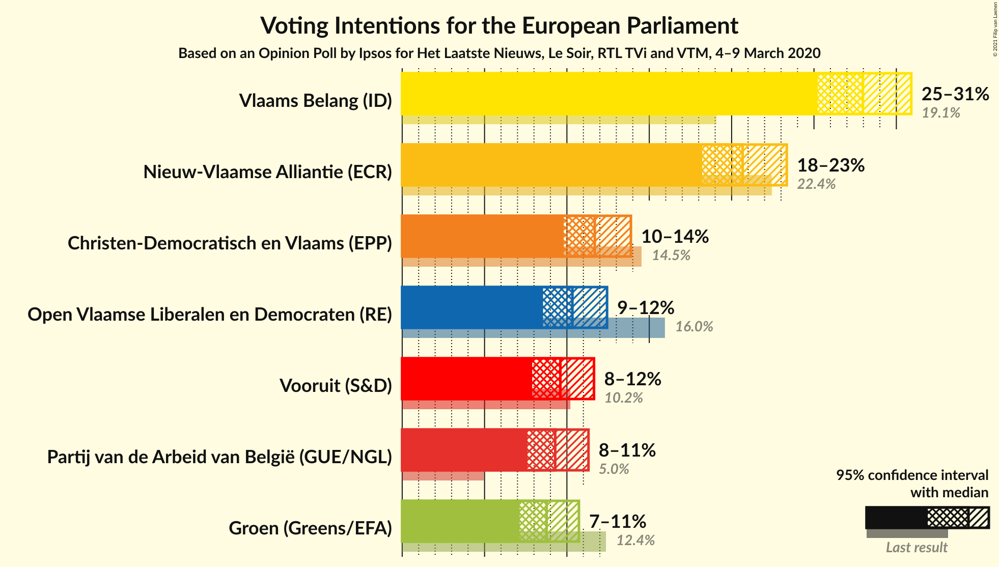

### Confidence Intervals

| Party | Last Result | Poll Result | 80% Confidence Interval | 90% Confidence Interval | 95% Confidence Interval | 99% Confidence Interval |
|:-----:|:-----------:|:-----------:|:-----------------------:|:-----------------------:|:-----------------------:|:-----------------------:|
| Vlaams Belang (ID) | 19.1% | 28.0% | 26.2–29.9% |25.7–30.4% |25.2–30.9% |24.4–31.8% |
| Nieuw-Vlaamse Alliantie (ECR) | 22.4% | 20.7% | 19.1–22.4% |18.6–22.9% |18.2–23.4% |17.5–24.2% |
| Christen-Democratisch en Vlaams (EPP) | 14.5% | 11.7% | 10.5–13.1% |10.1–13.5% |9.8–13.9% |9.2–14.6% |
| Open Vlaamse Liberalen en Democraten (RE) | 16.0% | 10.3% | 9.2–11.7% |8.8–12.1% |8.6–12.4% |8.0–13.1% |
| Vooruit (S&D) | 10.2% | 9.6% | 8.5–10.9% |8.2–11.3% |7.9–11.6% |7.4–12.3% |
| Partij van de Arbeid van België (GUE/NGL) | 5.0% | 9.3% | 8.2–10.6% |7.9–11.0% |7.6–11.3% |7.1–12.0% |
| Groen (Greens/EFA) | 12.4% | 8.8% | 7.7–10.1% |7.4–10.4% |7.1–10.7% |6.6–11.4% |

*Note:* The poll result column reflects the actual value used in the calculations. Published results may vary slightly, and in addition be rounded to fewer digits.

## Seats

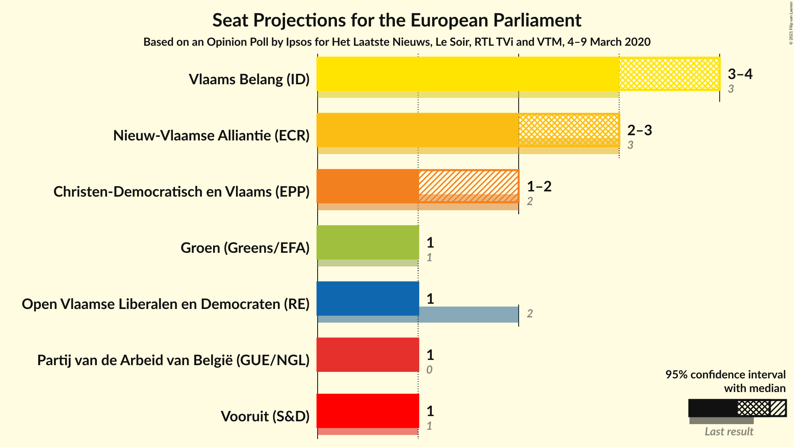

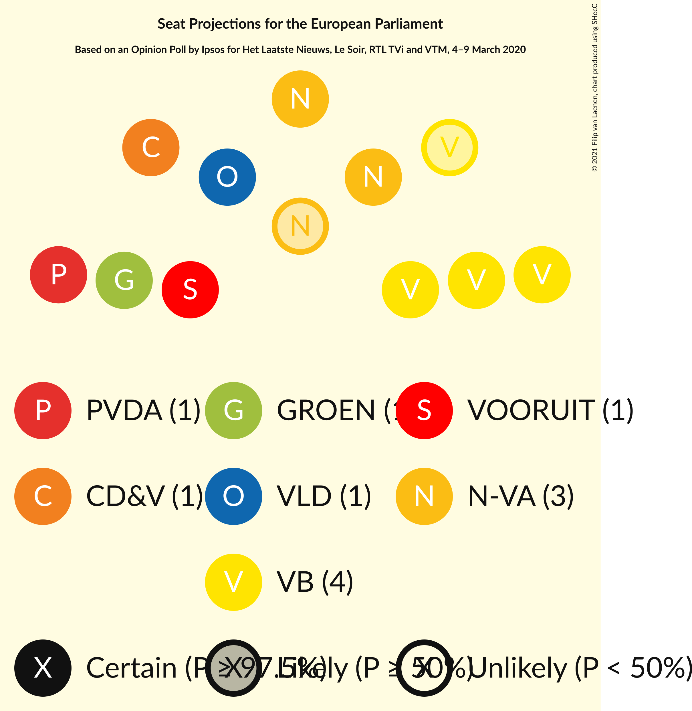

### Confidence Intervals

| Party | Last Result | Median | 80% Confidence Interval | 90% Confidence Interval | 95% Confidence Interval | 99% Confidence Interval |
|:-----:|:-----------:|:------:|:-----------------------:|:-----------------------:|:-----------------------:|:-----------------------:|
| <a href="#vlaams-belang-(id)">Vlaams Belang (ID)</a> | 3 | 4 | 4 |4 |3–4 |3–5 |
| <a href="#nieuw-vlaamse-alliantie-(ecr)">Nieuw-Vlaamse Alliantie (ECR)</a> | 3 | 3 | 3 |2–3 |2–3 |2–3 |
| <a href="#christen-democratisch-en-vlaams-(epp)">Christen-Democratisch en Vlaams (EPP)</a> | 2 | 1 | 1–2 |1–2 |1–2 |1–2 |
| <a href="#open-vlaamse-liberalen-en-democraten-(re)">Open Vlaamse Liberalen en Democraten (RE)</a> | 2 | 1 | 1 |1 |1 |1–2 |
| <a href="#vooruit-(s&d)">Vooruit (S&D)</a> | 1 | 1 | 1 |1 |1 |1 |
| <a href="#partij-van-de-arbeid-van-belgië-(gue/ngl)">Partij van de Arbeid van België (GUE/NGL)</a> | 0 | 1 | 1 |1 |1 |1 |
| <a href="#groen-(greens/efa)">Groen (Greens/EFA)</a> | 1 | 1 | 1 |1 |1 |1 |

### Vlaams Belang (ID)

*For a full overview of the results for this party, see the [Vlaams Belang (ID)](party-vlaamsbelangid.html) page.*

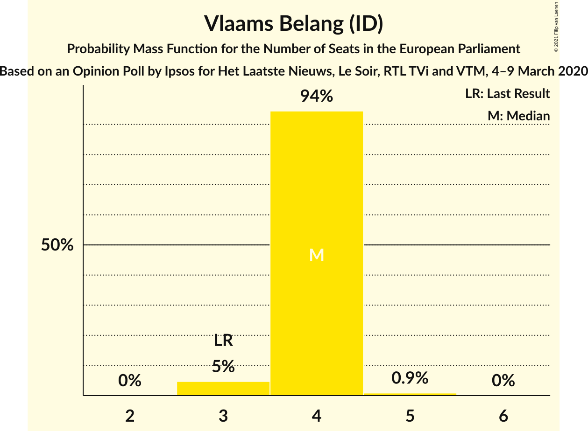

| Number of Seats | Probability | Accumulated | Special Marks |
|:---------------:|:-----------:|:-----------:|:-------------:|
| 3 | 5% | 100% | Last Result |
| 4 | 94% | 95% | Median |
| 5 | 0.9% | 0.9% |  |
| 6 | 0% | 0% |  |

### Nieuw-Vlaamse Alliantie (ECR)

*For a full overview of the results for this party, see the [Nieuw-Vlaamse Alliantie (ECR)](party-nieuw-vlaamsealliantieecr.html) page.*

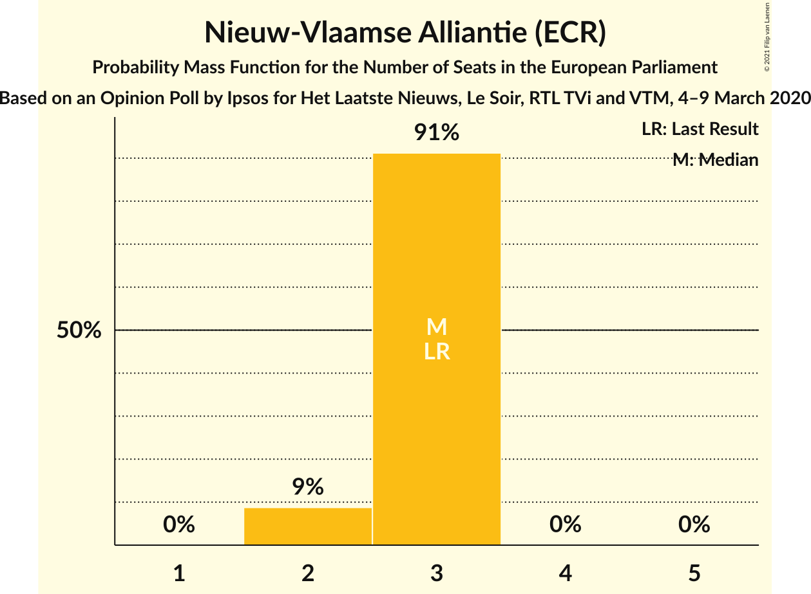

| Number of Seats | Probability | Accumulated | Special Marks |
|:---------------:|:-----------:|:-----------:|:-------------:|
| 2 | 9% | 100% |  |
| 3 | 91% | 91% | Last Result, Median |
| 4 | 0% | 0% |  |

### Christen-Democratisch en Vlaams (EPP)

*For a full overview of the results for this party, see the [Christen-Democratisch en Vlaams (EPP)](party-christen-democratischenvlaamsepp.html) page.*

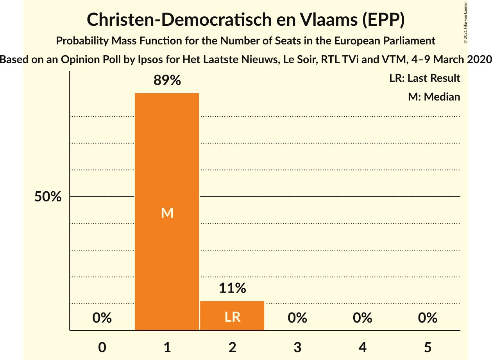

| Number of Seats | Probability | Accumulated | Special Marks |
|:---------------:|:-----------:|:-----------:|:-------------:|
| 1 | 89% | 100% | Median |
| 2 | 11% | 11% | Last Result |
| 3 | 0% | 0% |  |

### Open Vlaamse Liberalen en Democraten (RE)

*For a full overview of the results for this party, see the [Open Vlaamse Liberalen en Democraten (RE)](party-openvlaamseliberalenendemocratenre.html) page.*

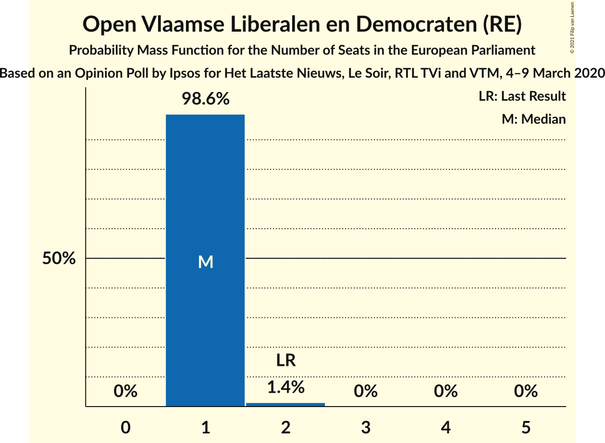

| Number of Seats | Probability | Accumulated | Special Marks |
|:---------------:|:-----------:|:-----------:|:-------------:|
| 1 | 98.6% | 100% | Median |
| 2 | 1.4% | 1.4% | Last Result |
| 3 | 0% | 0% |  |

### Vooruit (S&D)

*For a full overview of the results for this party, see the [Vooruit (S&D)](party-vooruitsd.html) page.*

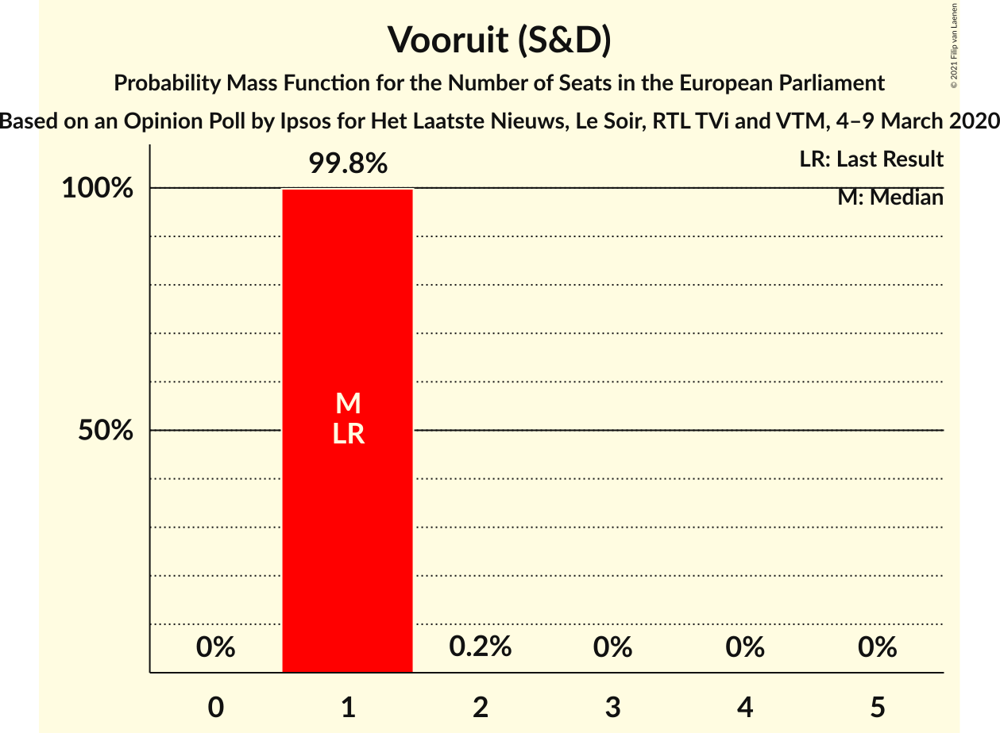

| Number of Seats | Probability | Accumulated | Special Marks |
|:---------------:|:-----------:|:-----------:|:-------------:|
| 1 | 99.8% | 100% | Last Result, Median |
| 2 | 0.2% | 0.2% |  |
| 3 | 0% | 0% |  |

### Partij van de Arbeid van België (GUE/NGL)

*For a full overview of the results for this party, see the [Partij van de Arbeid van België (GUE/NGL)](party-partijvandearbeidvanbelgiëguengl.html) page.*

| Number of Seats | Probability | Accumulated | Special Marks |
|:---------------:|:-----------:|:-----------:|:-------------:|
| 0 | 0% | 100% | Last Result |
| 1 | 99.9% | 100% | Median |
| 2 | 0.1% | 0.1% |  |
| 3 | 0% | 0% |  |

### Groen (Greens/EFA)

*For a full overview of the results for this party, see the [Groen (Greens/EFA)](party-groengreensefa.html) page.*

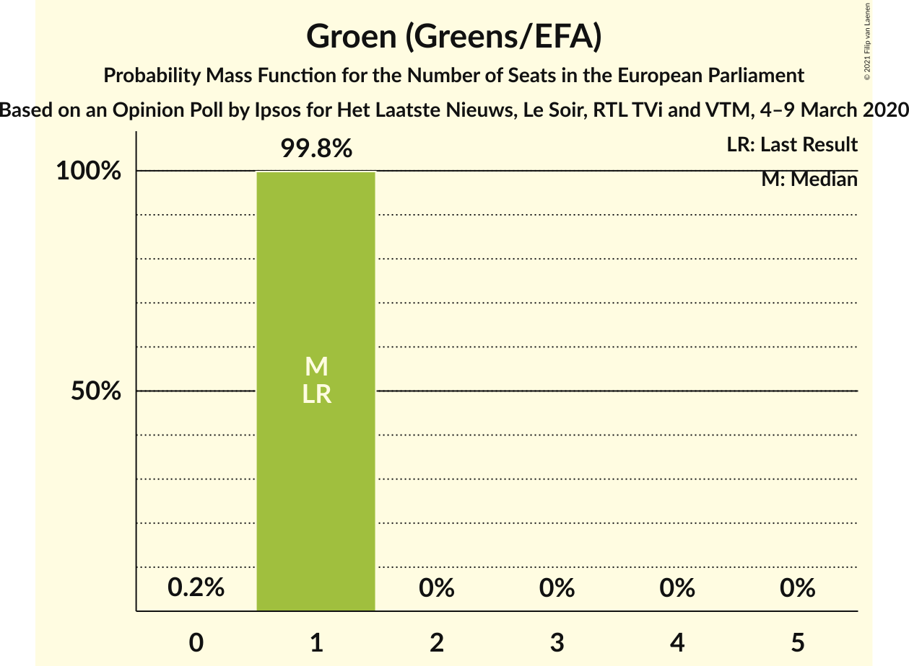

| Number of Seats | Probability | Accumulated | Special Marks |
|:---------------:|:-----------:|:-----------:|:-------------:|
| 0 | 0.2% | 100% |  |
| 1 | 99.8% | 99.8% | Last Result, Median |
| 2 | 0% | 0% |  |

## Coalitions

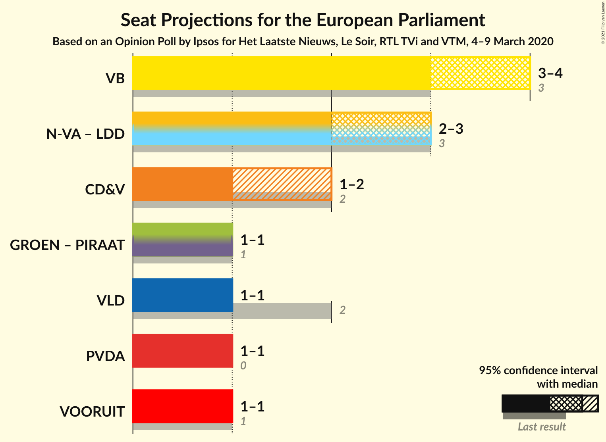

### Confidence Intervals

| Coalition | Last Result | Median | Majority? | 80% Confidence Interval | 90% Confidence Interval | 95% Confidence Interval | 99% Confidence Interval |
|:---------:|:-----------:|:------:|:---------:|:-----------------------:|:-----------------------:|:-----------------------:|:-----------------------:|
| Vlaams Belang (ID) | 3 | 4 | 0% | 4 | 4 | 3–4 | 3–5 |
| Christen-Democratisch en Vlaams (EPP) | 2 | 1 | 0% | 1–2 | 1–2 | 1–2 | 1–2 |
| Open Vlaamse Liberalen en Democraten (RE) | 2 | 1 | 0% | 1 | 1 | 1 | 1–2 |
| Partij van de Arbeid van België (GUE/NGL) | 0 | 1 | 0% | 1 | 1 | 1 | 1 |
| Vooruit (S&D) | 1 | 1 | 0% | 1 | 1 | 1 | 1 |

### Vlaams Belang (ID)

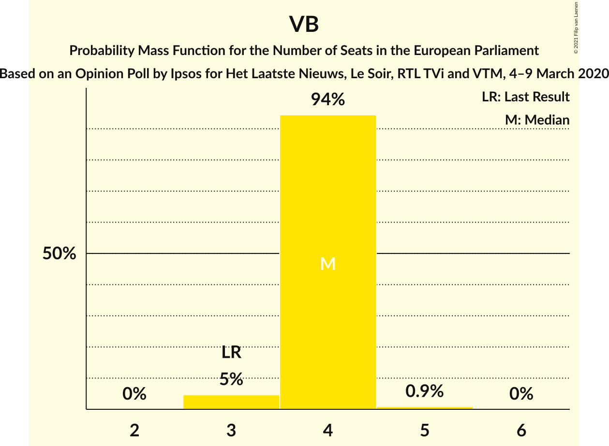

| Number of Seats | Probability | Accumulated | Special Marks |
|:---------------:|:-----------:|:-----------:|:-------------:|
| 3 | 5% | 100% | Last Result |
| 4 | 94% | 95% | Median |
| 5 | 0.9% | 0.9% |  |
| 6 | 0% | 0% |  |

### Christen-Democratisch en Vlaams (EPP)

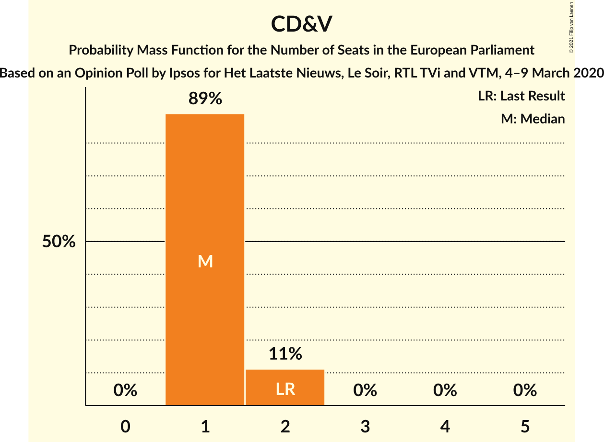

| Number of Seats | Probability | Accumulated | Special Marks |
|:---------------:|:-----------:|:-----------:|:-------------:|
| 1 | 89% | 100% | Median |
| 2 | 11% | 11% | Last Result |
| 3 | 0% | 0% |  |

### Open Vlaamse Liberalen en Democraten (RE)

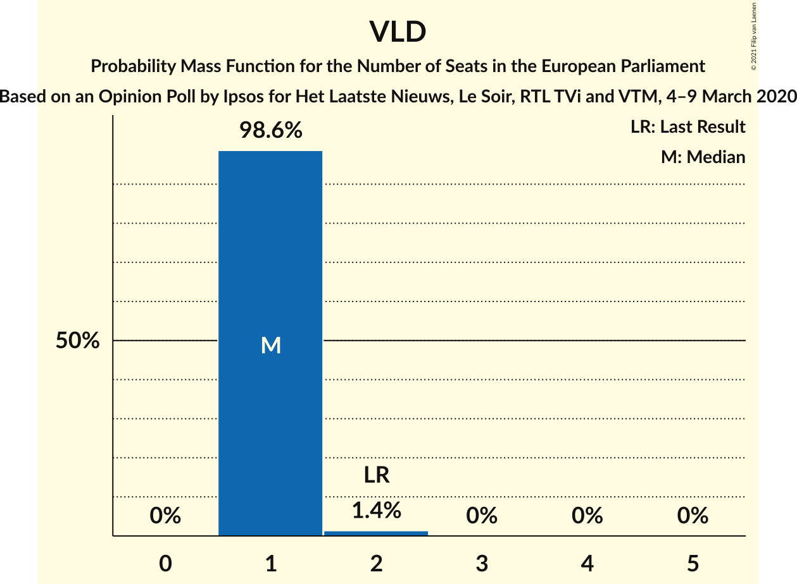

| Number of Seats | Probability | Accumulated | Special Marks |
|:---------------:|:-----------:|:-----------:|:-------------:|
| 1 | 98.6% | 100% | Median |
| 2 | 1.4% | 1.4% | Last Result |
| 3 | 0% | 0% |  |

### Partij van de Arbeid van België (GUE/NGL)

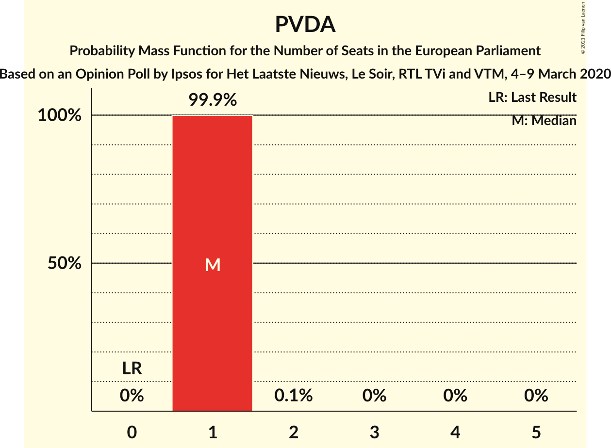

| Number of Seats | Probability | Accumulated | Special Marks |
|:---------------:|:-----------:|:-----------:|:-------------:|
| 0 | 0% | 100% | Last Result |
| 1 | 99.9% | 100% | Median |
| 2 | 0.1% | 0.1% |  |
| 3 | 0% | 0% |  |

### Vooruit (S&D)

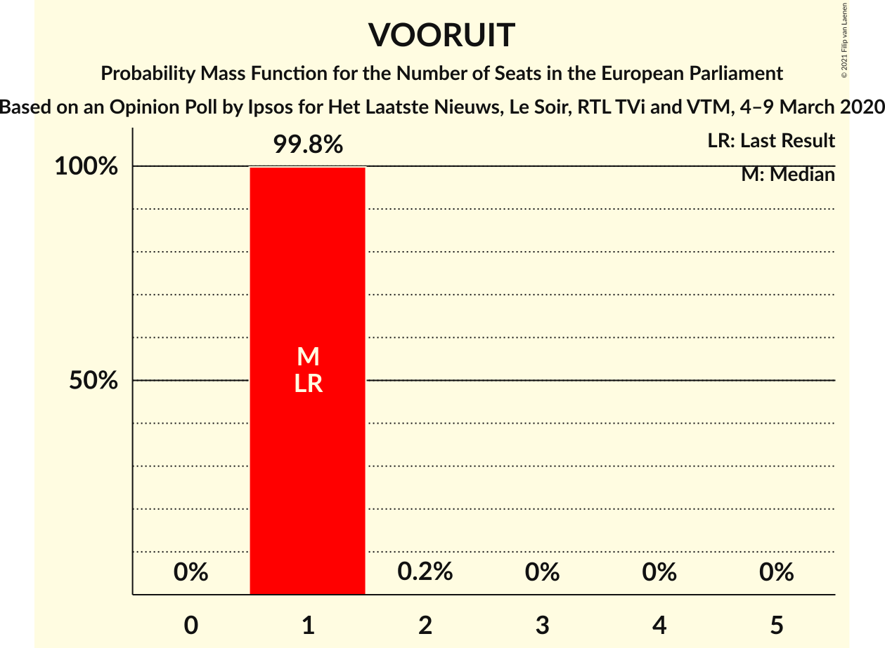

| Number of Seats | Probability | Accumulated | Special Marks |
|:---------------:|:-----------:|:-----------:|:-------------:|
| 1 | 99.8% | 100% | Last Result, Median |
| 2 | 0.2% | 0.2% |  |
| 3 | 0% | 0% |  |

## Technical Information

### Opinion Poll

+ **Polling firm:** Ipsos
+ **Commissioner(s):** Het Laatste Nieuws, Le Soir, RTL TVi and VTM
+ **Fieldwork period:** 4–9 March 2020

### Calculations

+ **Sample size:** 958
+ **Simulations done:** 1,048,576
+ **Error estimate:** 1.42%

