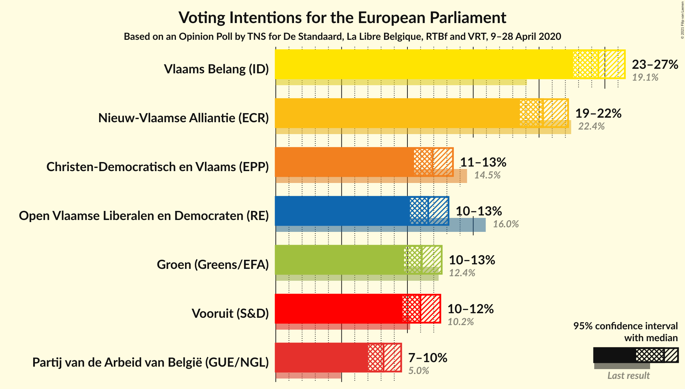
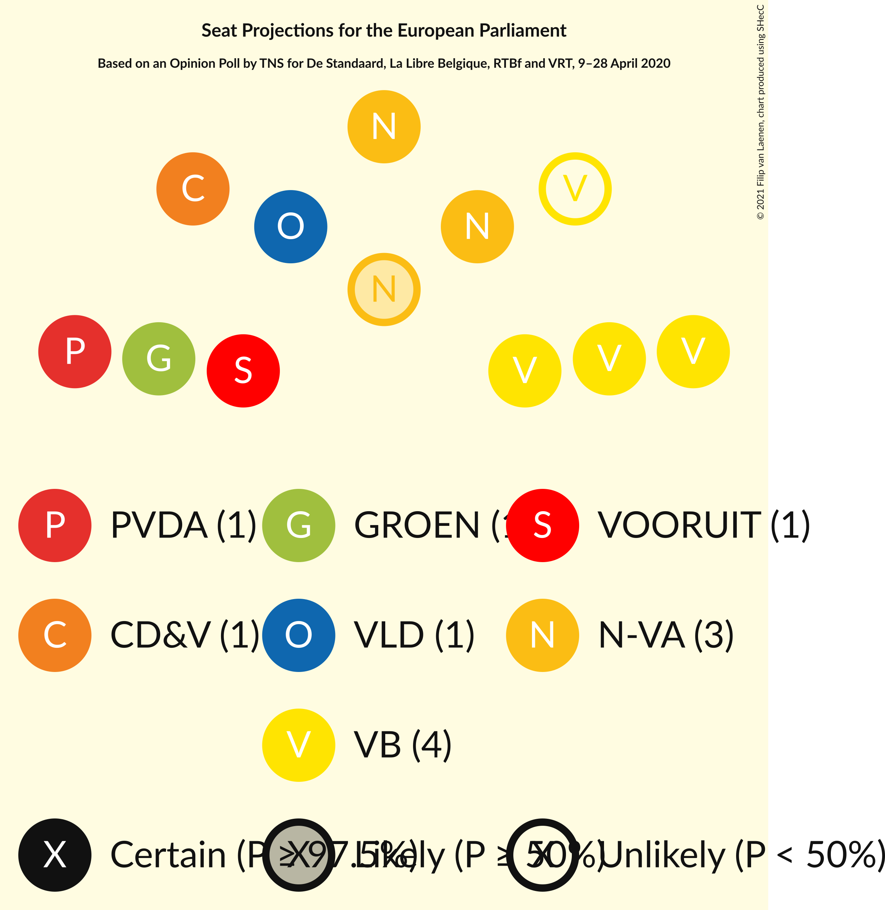
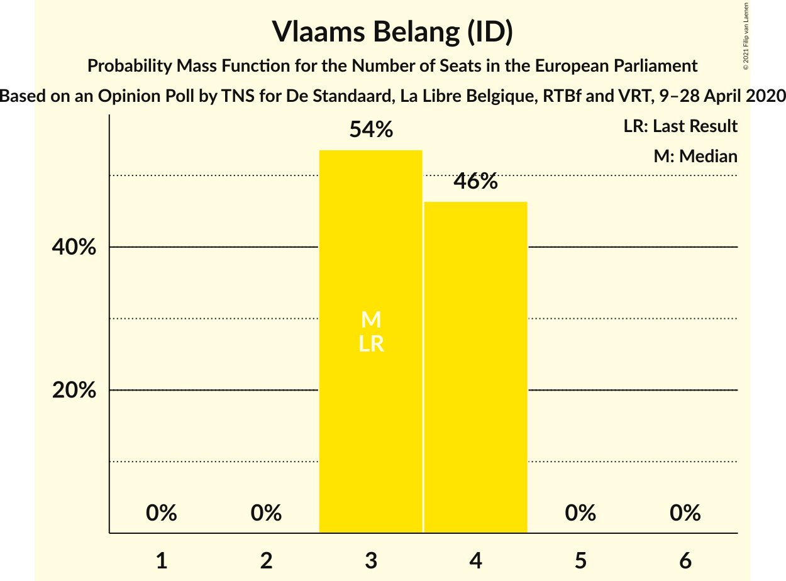
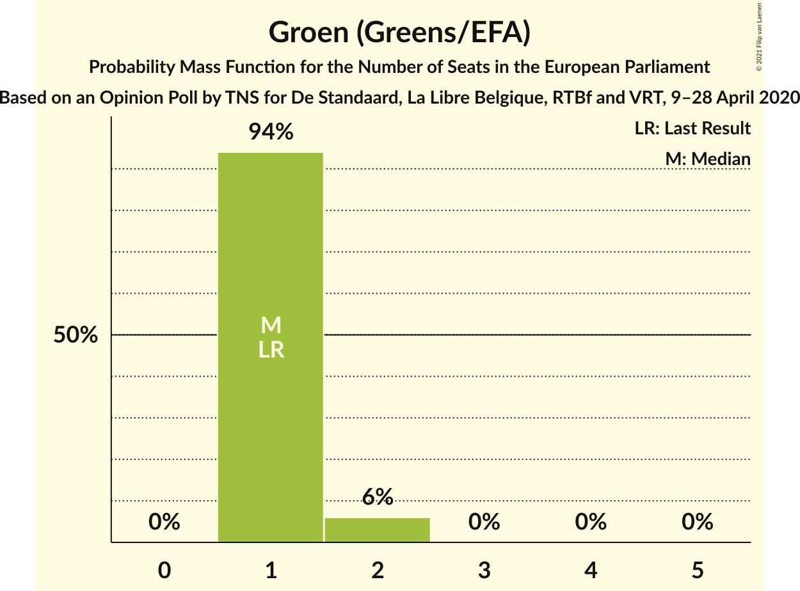
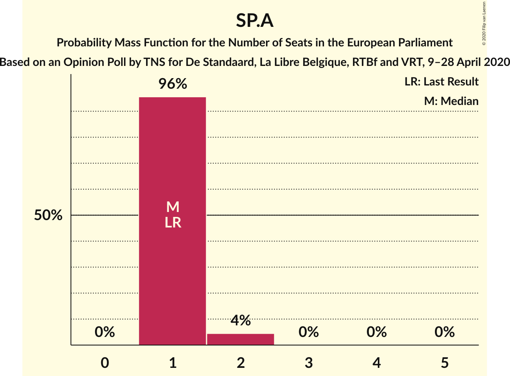

# Opinion Poll by TNS for De Standaard, La Libre Belgique, RTBf and VRT, 9–28 April 2020

<a href="#voting-intentions">Voting Intentions</a> | <a href="#seats">Seats</a> | <a href="#coalitions">Coalitions</a> | <a href="#technical-information">Technical Information</a>

## Voting Intentions

### Confidence Intervals

| Party | Last Result | Poll Result | 80% Confidence Interval | 90% Confidence Interval | 95% Confidence Interval | 99% Confidence Interval |
|:-----:|:-----------:|:-----------:|:-----------------------:|:-----------------------:|:-----------------------:|:-----------------------:|
| Vlaams Belang (ID) | 19.1% | 24.5% | 23.2–25.8% |22.9–26.2% |22.6–26.5% |22.0–27.2% |
| Nieuw-Vlaamse Alliantie (ECR) | 22.4% | 20.3% | 19.1–21.5% |18.8–21.9% |18.5–22.2% |18.0–22.8% |
| Christen-Democratisch en Vlaams (EPP) | 14.5% | 11.9% | 11.0–12.9% |10.7–13.2% |10.5–13.5% |10.1–14.0% |
| Open Vlaamse Liberalen en Democraten (RE) | 16.0% | 11.6% | 10.7–12.6% |10.4–12.9% |10.2–13.1% |9.8–13.6% |
| Groen (Greens/EFA) | 12.4% | 11.1% | 10.2–12.1% |10.0–12.4% |9.7–12.6% |9.3–13.1% |
| Socialistische Partij Anders (S&D) | 10.2% | 11.0% | 10.1–12.0% |9.8–12.3% |9.6–12.5% |9.2–13.0% |
| Partij van de Arbeid van België (GUE/NGL) | 5.0% | 8.2% | 7.4–9.1% |7.2–9.3% |7.0–9.5% |6.7–10.0% |

*Note:* The poll result column reflects the actual value used in the calculations. Published results may vary slightly, and in addition be rounded to fewer digits.

## Seats

### Confidence Intervals

| Party | Last Result | Median | 80% Confidence Interval | 90% Confidence Interval | 95% Confidence Interval | 99% Confidence Interval |
|:-----:|:-----------:|:------:|:-----------------------:|:-----------------------:|:-----------------------:|:-----------------------:|
| <a href="#vlaams-belang-(id)">Vlaams Belang (ID)</a> | 3 | 3 | 3–4 |3–4 |3–4 |3–4 |
| <a href="#nieuw-vlaamse-alliantie-(ecr)">Nieuw-Vlaamse Alliantie (ECR)</a> | 3 | 3 | 3 |3 |2–3 |2–3 |
| <a href="#christen-democratisch-en-vlaams-(epp)">Christen-Democratisch en Vlaams (EPP)</a> | 2 | 1 | 1–2 |1–2 |1–2 |1–2 |
| <a href="#open-vlaamse-liberalen-en-democraten-(re)">Open Vlaamse Liberalen en Democraten (RE)</a> | 2 | 1 | 1–2 |1–2 |1–2 |1–2 |
| <a href="#groen-(greens/efa)">Groen (Greens/EFA)</a> | 1 | 1 | 1 |1–2 |1–2 |1–2 |
| <a href="#socialistische-partij-anders-(s&d)">Socialistische Partij Anders (S&D)</a> | 1 | 1 | 1 |1 |1–2 |1–2 |
| <a href="#partij-van-de-arbeid-van-belgië-(gue/ngl)">Partij van de Arbeid van België (GUE/NGL)</a> | 0 | 1 | 1 |1 |1 |1 |

### Vlaams Belang (ID)

*For a full overview of the results for this party, see the [Vlaams Belang (ID)](party-vlaamsbelangid.html) page.*

| Number of Seats | Probability | Accumulated | Special Marks |
|:---------------:|:-----------:|:-----------:|:-------------:|
| 3 | 54% | 100% | Last Result, Median |
| 4 | 46% | 46% |  |
| 5 | 0% | 0% |  |

### Nieuw-Vlaamse Alliantie (ECR)

*For a full overview of the results for this party, see the [Nieuw-Vlaamse Alliantie (ECR)](party-nieuw-vlaamsealliantieecr.html) page.*

| Number of Seats | Probability | Accumulated | Special Marks |
|:---------------:|:-----------:|:-----------:|:-------------:|
| 2 | 4% | 100% |  |
| 3 | 96% | 96% | Last Result, Median |
| 4 | 0% | 0% |  |

### Christen-Democratisch en Vlaams (EPP)

*For a full overview of the results for this party, see the [Christen-Democratisch en Vlaams (EPP)](party-christen-democratischenvlaamsepp.html) page.*

| Number of Seats | Probability | Accumulated | Special Marks |
|:---------------:|:-----------:|:-----------:|:-------------:|
| 1 | 70% | 100% | Median |
| 2 | 30% | 30% | Last Result |
| 3 | 0% | 0% |  |

### Open Vlaamse Liberalen en Democraten (RE)

*For a full overview of the results for this party, see the [Open Vlaamse Liberalen en Democraten (RE)](party-openvlaamseliberalenendemocratenre.html) page.*

| Number of Seats | Probability | Accumulated | Special Marks |
|:---------------:|:-----------:|:-----------:|:-------------:|
| 1 | 84% | 100% | Median |
| 2 | 16% | 16% | Last Result |
| 3 | 0% | 0% |  |

### Groen (Greens/EFA)

*For a full overview of the results for this party, see the [Groen (Greens/EFA)](party-groengreensefa.html) page.*

| Number of Seats | Probability | Accumulated | Special Marks |
|:---------------:|:-----------:|:-----------:|:-------------:|
| 1 | 94% | 100% | Last Result, Median |
| 2 | 6% | 6% |  |
| 3 | 0% | 0% |  |

### Socialistische Partij Anders (S&D)

*For a full overview of the results for this party, see the [Socialistische Partij Anders (S&D)](party-socialistischepartijanderssd.html) page.*

| Number of Seats | Probability | Accumulated | Special Marks |
|:---------------:|:-----------:|:-----------:|:-------------:|
| 1 | 96% | 100% | Last Result, Median |
| 2 | 4% | 4% |  |
| 3 | 0% | 0% |  |

### Partij van de Arbeid van België (GUE/NGL)

*For a full overview of the results for this party, see the [Partij van de Arbeid van België (GUE/NGL)](party-partijvandearbeidvanbelgiëguengl.html) page.*

| Number of Seats | Probability | Accumulated | Special Marks |
|:---------------:|:-----------:|:-----------:|:-------------:|
| 0 | 0% | 100% | Last Result |
| 1 | 100% | 100% | Median |

## Coalitions

### Confidence Intervals

| Coalition | Last Result | Median | Majority? | 80% Confidence Interval | 90% Confidence Interval | 95% Confidence Interval | 99% Confidence Interval |
|:---------:|:-----------:|:------:|:---------:|:-----------------------:|:-----------------------:|:-----------------------:|:-----------------------:|
| Vlaams Belang (ID) | 3 | 3 | 0% | 3–4 | 3–4 | 3–4 | 3–4 |
| Christen-Democratisch en Vlaams (EPP) | 2 | 1 | 0% | 1–2 | 1–2 | 1–2 | 1–2 |
| Open Vlaamse Liberalen en Democraten (RE) | 2 | 1 | 0% | 1–2 | 1–2 | 1–2 | 1–2 |
| Socialistische Partij Anders (S&D) | 1 | 1 | 0% | 1 | 1 | 1–2 | 1–2 |
| Partij van de Arbeid van België (GUE/NGL) | 0 | 1 | 0% | 1 | 1 | 1 | 1 |

### Vlaams Belang (ID)

| Number of Seats | Probability | Accumulated | Special Marks |
|:---------------:|:-----------:|:-----------:|:-------------:|
| 3 | 54% | 100% | Last Result, Median |
| 4 | 46% | 46% |  |
| 5 | 0% | 0% |  |

### Christen-Democratisch en Vlaams (EPP)

| Number of Seats | Probability | Accumulated | Special Marks |
|:---------------:|:-----------:|:-----------:|:-------------:|
| 1 | 70% | 100% | Median |
| 2 | 30% | 30% | Last Result |
| 3 | 0% | 0% |  |

### Open Vlaamse Liberalen en Democraten (RE)

| Number of Seats | Probability | Accumulated | Special Marks |
|:---------------:|:-----------:|:-----------:|:-------------:|
| 1 | 84% | 100% | Median |
| 2 | 16% | 16% | Last Result |
| 3 | 0% | 0% |  |

### Socialistische Partij Anders (S&D)

| Number of Seats | Probability | Accumulated | Special Marks |
|:---------------:|:-----------:|:-----------:|:-------------:|
| 1 | 96% | 100% | Last Result, Median |
| 2 | 4% | 4% |  |
| 3 | 0% | 0% |  |

### Partij van de Arbeid van België (GUE/NGL)

| Number of Seats | Probability | Accumulated | Special Marks |
|:---------------:|:-----------:|:-----------:|:-------------:|
| 0 | 0% | 100% | Last Result |
| 1 | 100% | 100% | Median |

## Technical Information

### Opinion Poll

+ **Polling firm:** TNS
+ **Commissioner(s):** De Standaard, La Libre Belgique, RTBf and VRT
+ **Fieldwork period:** 9–28 April 2020

### Calculations

+ **Sample size:** 1857
+ **Simulations done:** 1,048,576
+ **Error estimate:** 0.59%

