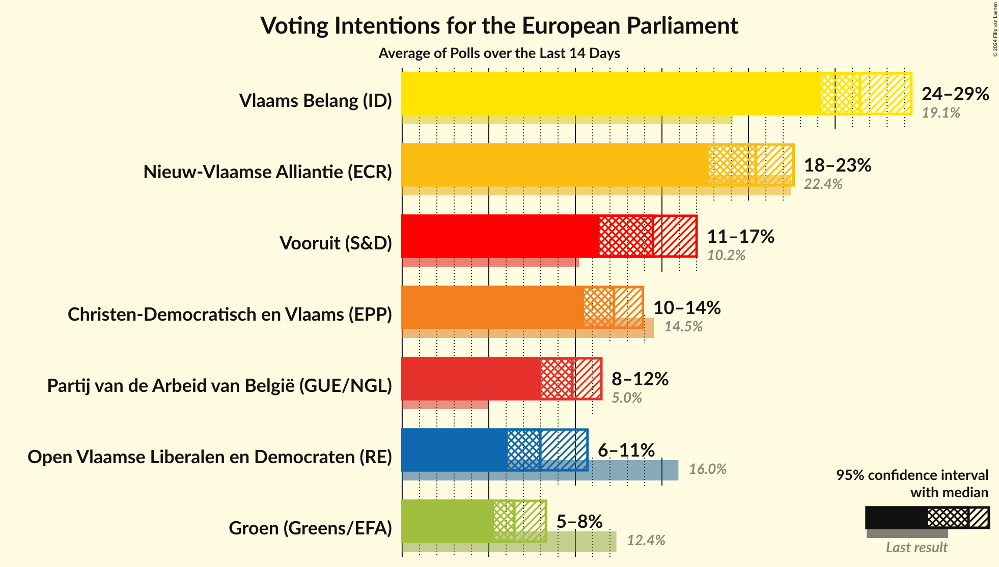
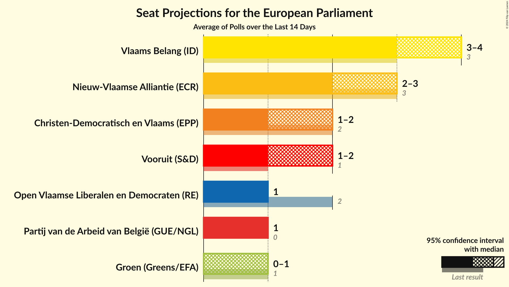
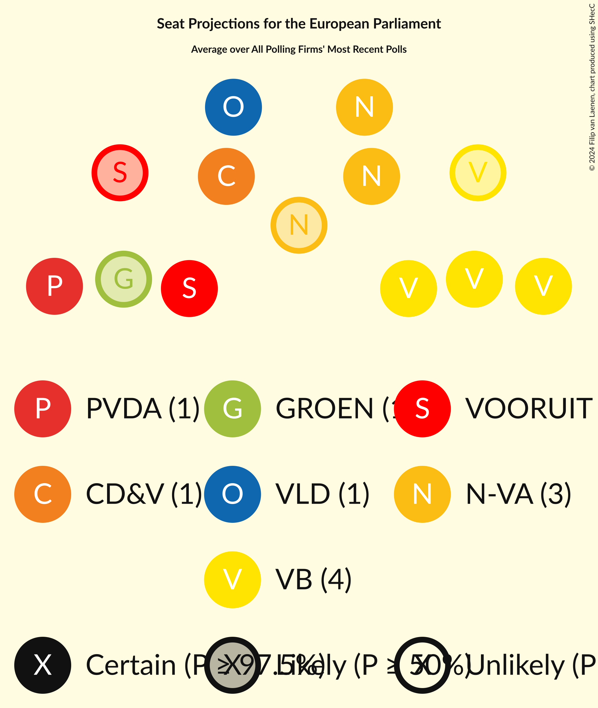
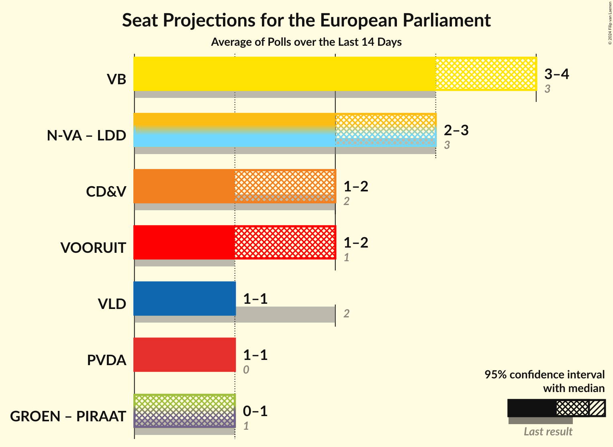

# Overview

The table below lists the most recent polls (less than 14 days old) registered and analyzed so far.

| Period     | Polling firm/Commissioner(s) | N-VA | VB | VLD | CD&V | GROEN | VOORUIT | PVDA | PIRAAT | LDD |
|:----------:|:----------------------------:|:--:|:--:|:--:|:--:|:--:|:--:|:--:|:--:|:--:|
| 26 May 2019 | General Election | 22.4%   3 | 19.1%   3 | 16.0%   2 | 14.5%   2 | 12.4%   1 | 10.2%   1 | 5.0%   0 | 0.0%   0 | 0.0%   0 |
| N/A | [Poll Average](average.html) | 18–23%   2–3 | 24–29%   3–4 | 6–11%   1 | 10–14%   1–2 | 5–8%   0–1 | 11–17%   1–2 | 8–12%   1 | N/A   N/A | N/A   N/A |
| [3–4 June 2024](2024-06-04-Ipsos.html) | Ipsos   Het Laatste Nieuws and VTM | 19–23%   3 | 24–28%   3–4 | 6–8%   0–1 | 11–14%   1–2 | 5–7%   0–1 | 14–17%   2 | 9–12%   1 | N/A   N/A | N/A   N/A |
| [28–31 May 2024](2024-05-31-Cluster17.html) | Cluster17   RTL TVi | 17–22%   2–3 | 25–30%   3–5 | 8–11%   1 | 10–14%   1–2 | 6–9%   0–1 | 11–15%   1–2 | 8–11%   1 | N/A   N/A | N/A   N/A |
| 26 May 2019 | General Election | 22.4%   3 | 19.1%   3 | 16.0%   2 | 14.5%   2 | 12.4%   1 | 10.2%   1 | 5.0%   0 | 0.0%   0 | 0.0%   0 |

Only polls for which at least the sample size has been published are included in the table above.

**Legend:**
+ **Top half of each row:** Voting intentions (95% confidence interval)
+ **Bottom half of each row:** Seat projections for the European Parliament (95% confidence interval)
+ **N-VA:** Nieuw-Vlaamse Alliantie (ECR)
+ **VB:** Vlaams Belang (ID)
+ **VLD:** Open Vlaamse Liberalen en Democraten (RE)
+ **CD&V:** Christen-Democratisch en Vlaams (EPP)
+ **GROEN:** Groen (Greens/EFA)
+ **VOORUIT:** Vooruit (S&D)
+ **PVDA:** Partij van de Arbeid van België (GUE/NGL)
+ **PIRAAT:** Piratenpartij (Greens/EFA)
+ **LDD:** Lijst Dedecker (ECR)
+ **N/A (single party):** Party not included the published results
+ **N/A (entire row):** Calculation for this opinion poll not started yet

