# Poll Average

<a href="#voting-intentions">Voting Intentions</a> | <a href="#seats">Seats</a> | <a href="#coalitions">Coalitions</a> | <a href="#technical-information">Technical Information</a>

## Summary

The table below lists the polls on which the average is based. They are the most recent polls (less than 90 days old) registered and analyzed so far.

| Period     | Polling firm/Commissioner(s) | N-VA | VLD | CD&V | SP.A | GROEN | VB | PVDA | PIRAAT | LDD |
|:----------:|:----------------------------:|:--:|:--:|:--:|:--:|:--:|:--:|:--:|:--:|:--:|
| 25 May 2014 | General Election | 26.7%   4 | 20.4%   3 | 20.0%   2 | 13.2%   1 | 10.6%   1 | 6.8%   1 | 2.4%   0 | 0.0%   0 | 0.0%   0 |
| N/A | Poll Average | 25–31%   3–4 | 11–20%   1–2 | 13–21%   2–3 | 8–13%   1–2 | 14–18%   2 | 6–13%   0–2 | 2–6%   0 | N/A   N/A | N/A   N/A |
| [5–11 February 2019](2019-02-11-Ipsos.html) | Ipsos   Het Laatste Nieuws, Le Soir, RTL TVi and VTM | 25–30%   3–5 | 11–15%   1–2 | 13–17%   2 | 9–13%   1–2 | 13–18%   2 | 9–13%   1–2 | 4–6%   0–1 | N/A   N/A | N/A   N/A |
| [19 November–8 December 2018](2018-12-08-TNS.html) | TNS   De Standaard, La Libre Belgique, RTBf and VRT | 26–31%   3–4 | 15–20%   2–3 | 16–21%   2–3 | 8–11%   1 | 14–18%   2 | 6–9%   0–1 | 2–4%   0 | N/A   N/A | N/A   N/A |
| 25 May 2014 | General Election | 26.7%   4 | 20.4%   3 | 20.0%   2 | 13.2%   1 | 10.6%   1 | 6.8%   1 | 2.4%   0 | 0.0%   0 | 0.0%   0 |

Only polls for which at least the sample size has been published are included in the table above.

**Legend:**
+ **Top half of each row:** Voting intentions (95% confidence interval)
+ **Bottom half of each row:** Seat projections for the European Parliament (95% confidence interval)
+ **N-VA:** N-VA (ECR)
+ **VLD:** Open Vld (ALDE)
+ **CD&V:** CD&V (EPP)
+ **SP.A:** sp.a (S&D)
+ **GROEN:** Groen (Greens/EFA)
+ **VB:** Vlaams Belang (ENF)
+ **PVDA:** PVDA (GUE/NGL)
+ **PIRAAT:** Piratenpartij (Greens/EFA)
+ **LDD:** Lijst Dedecker (ECR)
+ **N/A (single party):** Party not included the published results
+ **N/A (entire row):** Calculation for this opinion poll not started yet

## Voting Intentions

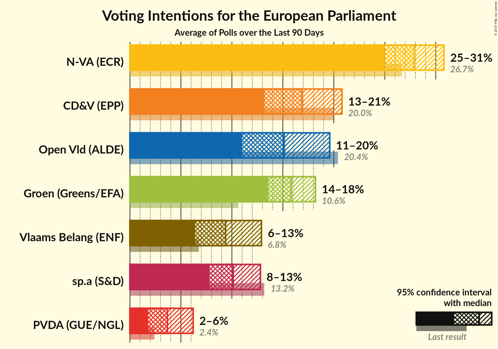

### Confidence Intervals

| Party | Last Result | Median | 80% Confidence Interval | 90% Confidence Interval | 95% Confidence Interval | 99% Confidence Interval |
|:-----:|:-----------:|:------:|:-----------------------:|:-----------------------:|:-----------------------:|:-----------------------:|
| <a href="#n-va-(ecr)">N-VA (ECR)</a> | 26.7% | 27.9% | 26.0–29.8% |25.5–30.4% | 25.0–30.8% | 24.2–31.8% |
| <a href="#open-vld-(alde)">Open Vld (ALDE)</a> | 20.4% | 15.1% | 11.8–18.6% |11.4–19.1% | 11.0–19.6% | 10.4–20.4% |
| <a href="#cd&v-(epp)">CD&V (EPP)</a> | 20.0% | 16.9% | 14.1–19.8% |13.6–20.3% | 13.2–20.8% | 12.5–21.7% |
| <a href="#sp.a-(s&d)">sp.a (S&D)</a> | 13.2% | 10.1% | 8.5–12.0% |8.1–12.4% | 7.8–12.8% | 7.3–13.5% |
| <a href="#groen-(greens/efa)">Groen (Greens/EFA)</a> | 10.6% | 15.8% | 14.4–17.4% |14.0–17.8% | 13.6–18.2% | 13.0–19.0% |
| <a href="#vlaams-belang-(enf)">Vlaams Belang (ENF)</a> | 6.8% | 9.4% | 7.0–12.0% |6.7–12.5% | 6.4–12.9% | 5.9–13.7% |
| <a href="#pvda-(gue/ngl)">PVDA (GUE/NGL)</a> | 2.4% | 3.7% | 2.2–5.6% |2.0–5.9% | 1.8–6.2% | 1.6–6.7% |
| <a href="#piratenpartij-(greens/efa)">Piratenpartij (Greens/EFA)</a> | 0.0% | N/A | N/A |N/A | N/A | N/A |
| <a href="#lijst-dedecker-(ecr)">Lijst Dedecker (ECR)</a> | 0.0% | N/A | N/A |N/A | N/A | N/A |

### N-VA (ECR)

*For a full overview of the results for this party, see the [N-VA (ECR)](party-n-vaecr.html) page.*

| Voting Intentions | Probability | Accumulated | Special Marks |
|:-----------------:|:-----------:|:-----------:|:-------------:|
| 21.5–22.5% | 0% | 100% |  |
| 22.5–23.5% | 0.1% | 100% |  |
| 23.5–24.5% | 0.9% | 99.9% |  |
| 24.5–25.5% | 4% | 99.0% |  |
| 25.5–26.5% | 13% | 95% |  |
| 26.5–27.5% | 23% | 82% | Last Result |
| 27.5–28.5% | 26% | 59% | Median |
| 28.5–29.5% | 20% | 33% |  |
| 29.5–30.5% | 10% | 13% |  |
| 30.5–31.5% | 3% | 4% |  |
| 31.5–32.5% | 0.6% | 0.7% |  |
| 32.5–33.5% | 0.1% | 0.1% |  |
| 33.5–34.5% | 0% | 0% |  |

### Open Vld (ALDE)

*For a full overview of the results for this party, see the [Open Vld (ALDE)](party-openvldalde.html) page.*

| Voting Intentions | Probability | Accumulated | Special Marks |
|:-----------------:|:-----------:|:-----------:|:-------------:|
| 8.5–9.5% | 0% | 100% |  |
| 9.5–10.5% | 0.8% | 100% |  |
| 10.5–11.5% | 6% | 99.2% |  |
| 11.5–12.5% | 15% | 93% |  |
| 12.5–13.5% | 17% | 78% |  |
| 13.5–14.5% | 9% | 61% |  |
| 14.5–15.5% | 4% | 52% | Median |
| 15.5–16.5% | 8% | 48% |  |
| 16.5–17.5% | 15% | 41% |  |
| 17.5–18.5% | 15% | 26% |  |
| 18.5–19.5% | 8% | 10% |  |
| 19.5–20.5% | 2% | 3% | Last Result |
| 20.5–21.5% | 0.4% | 0.4% |  |
| 21.5–22.5% | 0% | 0% |  |

### CD&V (EPP)

*For a full overview of the results for this party, see the [CD&V (EPP)](party-cdvepp.html) page.*

| Voting Intentions | Probability | Accumulated | Special Marks |
|:-----------------:|:-----------:|:-----------:|:-------------:|
| 10.5–11.5% | 0% | 100% |  |
| 11.5–12.5% | 0.5% | 100% |  |
| 12.5–13.5% | 4% | 99.4% |  |
| 13.5–14.5% | 13% | 95% |  |
| 14.5–15.5% | 17% | 83% |  |
| 15.5–16.5% | 13% | 66% |  |
| 16.5–17.5% | 10% | 53% | Median |
| 17.5–18.5% | 15% | 43% |  |
| 18.5–19.5% | 16% | 28% |  |
| 19.5–20.5% | 9% | 13% | Last Result |
| 20.5–21.5% | 3% | 4% |  |
| 21.5–22.5% | 0.5% | 0.6% |  |
| 22.5–23.5% | 0.1% | 0.1% |  |
| 23.5–24.5% | 0% | 0% |  |

### sp.a (S&D)

*For a full overview of the results for this party, see the [sp.a (S&D)](party-spasd.html) page.*

| Voting Intentions | Probability | Accumulated | Special Marks |
|:-----------------:|:-----------:|:-----------:|:-------------:|
| 5.5–6.5% | 0% | 100% |  |
| 6.5–7.5% | 1.2% | 100% |  |
| 7.5–8.5% | 10% | 98.8% |  |
| 8.5–9.5% | 24% | 88% |  |
| 9.5–10.5% | 25% | 65% | Median |
| 10.5–11.5% | 23% | 39% |  |
| 11.5–12.5% | 13% | 17% |  |
| 12.5–13.5% | 4% | 4% | Last Result |
| 13.5–14.5% | 0.5% | 0.5% |  |
| 14.5–15.5% | 0% | 0% |  |

### Groen (Greens/EFA)

*For a full overview of the results for this party, see the [Groen (Greens/EFA)](party-groengreensefa.html) page.*

| Voting Intentions | Probability | Accumulated | Special Marks |
|:-----------------:|:-----------:|:-----------:|:-------------:|
| 10.5–11.5% | 0% | 100% | Last Result |
| 11.5–12.5% | 0.1% | 100% |  |
| 12.5–13.5% | 2% | 99.9% |  |
| 13.5–14.5% | 11% | 98% |  |
| 14.5–15.5% | 27% | 87% |  |
| 15.5–16.5% | 33% | 59% | Median |
| 16.5–17.5% | 19% | 27% |  |
| 17.5–18.5% | 6% | 7% |  |
| 18.5–19.5% | 1.1% | 1.2% |  |
| 19.5–20.5% | 0.1% | 0.1% |  |
| 20.5–21.5% | 0% | 0% |  |

### Vlaams Belang (ENF)

*For a full overview of the results for this party, see the [Vlaams Belang (ENF)](party-vlaamsbelangenf.html) page.*

| Voting Intentions | Probability | Accumulated | Special Marks |
|:-----------------:|:-----------:|:-----------:|:-------------:|
| 3.5–4.5% | 0% | 100% |  |
| 4.5–5.5% | 0.1% | 100% |  |
| 5.5–6.5% | 4% | 99.9% |  |
| 6.5–7.5% | 18% | 96% | Last Result |
| 7.5–8.5% | 21% | 78% |  |
| 8.5–9.5% | 9% | 57% | Median |
| 9.5–10.5% | 11% | 49% |  |
| 10.5–11.5% | 19% | 37% |  |
| 11.5–12.5% | 13% | 18% |  |
| 12.5–13.5% | 4% | 5% |  |
| 13.5–14.5% | 0.6% | 0.6% |  |
| 14.5–15.5% | 0% | 0% |  |
| 15.5–16.5% | 0% | 0% |  |

### PVDA (GUE/NGL)

*For a full overview of the results for this party, see the [PVDA (GUE/NGL)](party-pvdaguengl.html) page.*

| Voting Intentions | Probability | Accumulated | Special Marks |
|:-----------------:|:-----------:|:-----------:|:-------------:|
| 0.0–0.5% | 0% | 100% |  |
| 0.5–1.5% | 0.4% | 100% |  |
| 1.5–2.5% | 24% | 99.6% | Last Result |
| 2.5–3.5% | 25% | 76% |  |
| 3.5–4.5% | 14% | 51% | Median |
| 4.5–5.5% | 26% | 37% |  |
| 5.5–6.5% | 10% | 11% |  |
| 6.5–7.5% | 0.9% | 0.9% |  |
| 7.5–8.5% | 0% | 0% |  |

## Seats

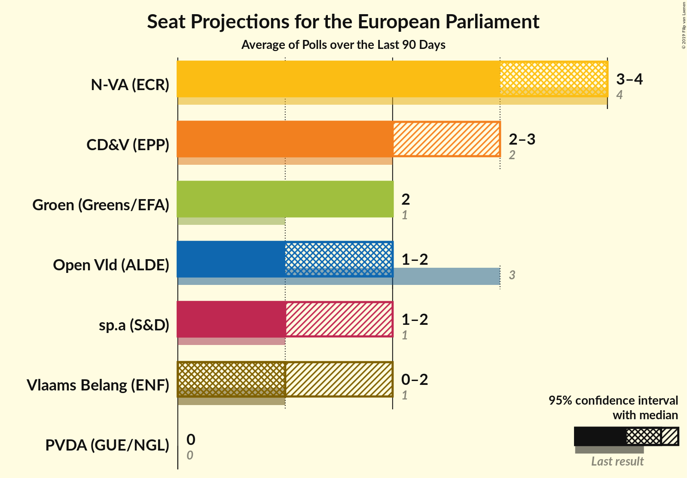

### Confidence Intervals

| Party | Last Result | Median | 80% Confidence Interval | 90% Confidence Interval | 95% Confidence Interval | 99% Confidence Interval |
|:-----:|:-----------:|:------:|:-----------------------:|:-----------------------:|:-----------------------:|:-----------------------:|
| <a href="#n-va-(ecr)">N-VA (ECR)</a> | 4 | 4 | 4 |3–4 | 3–4 | 3–5 |
| <a href="#open-vld-(alde)">Open Vld (ALDE)</a> | 3 | 2 | 1–2 |1–2 | 1–2 | 1–3 |
| <a href="#cd&v-(epp)">CD&V (EPP)</a> | 2 | 2 | 2 |2–3 | 2–3 | 2–3 |
| <a href="#sp.a-(s&d)">sp.a (S&D)</a> | 1 | 1 | 1 |1–2 | 1–2 | 1–2 |
| <a href="#groen-(greens/efa)">Groen (Greens/EFA)</a> | 1 | 2 | 2 |2 | 2 | 1–3 |
| <a href="#vlaams-belang-(enf)">Vlaams Belang (ENF)</a> | 1 | 1 | 1 |1–2 | 0–2 | 0–2 |
| <a href="#pvda-(gue/ngl)">PVDA (GUE/NGL)</a> | 0 | 0 | 0 |0 | 0 | 0–1 |
| <a href="#piratenpartij-(greens/efa)">Piratenpartij (Greens/EFA)</a> | 0 | N/A | N/A |N/A | N/A | N/A |
| <a href="#lijst-dedecker-(ecr)">Lijst Dedecker (ECR)</a> | 0 | N/A | N/A |N/A | N/A | N/A |

### N-VA (ECR)

*For a full overview of the results for this party, see the [N-VA (ECR)](party-n-vaecr.html) page.*

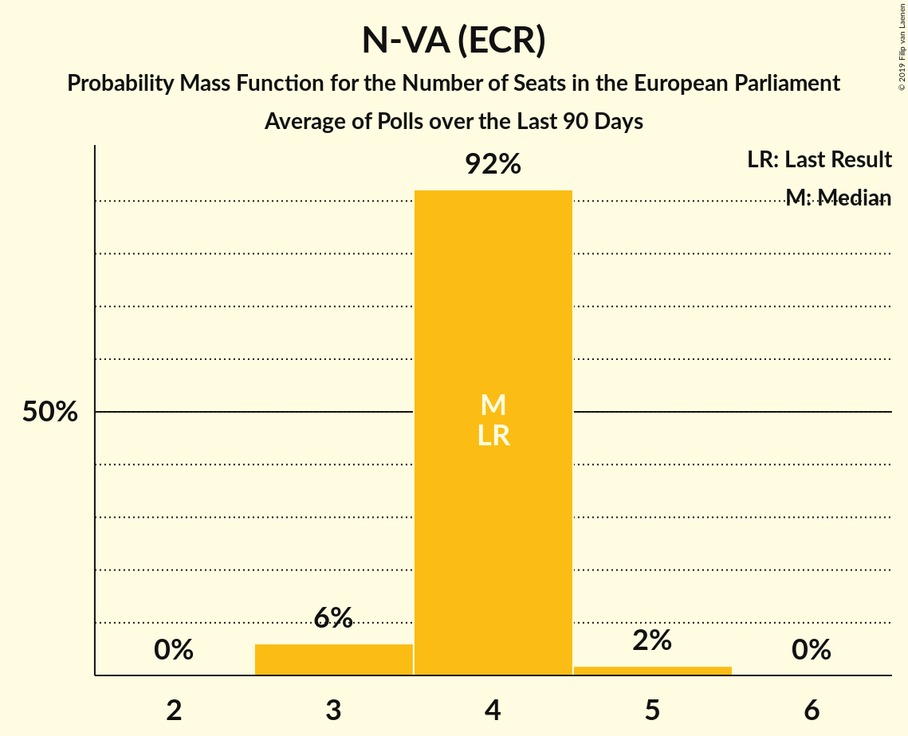

| Number of Seats | Probability | Accumulated | Special Marks |
|:---------------:|:-----------:|:-----------:|:-------------:|
| 3 | 6% | 100% |  |
| 4 | 92% | 94% | Last Result, Median |
| 5 | 2% | 2% |  |
| 6 | 0% | 0% |  |

### Open Vld (ALDE)

*For a full overview of the results for this party, see the [Open Vld (ALDE)](party-openvldalde.html) page.*

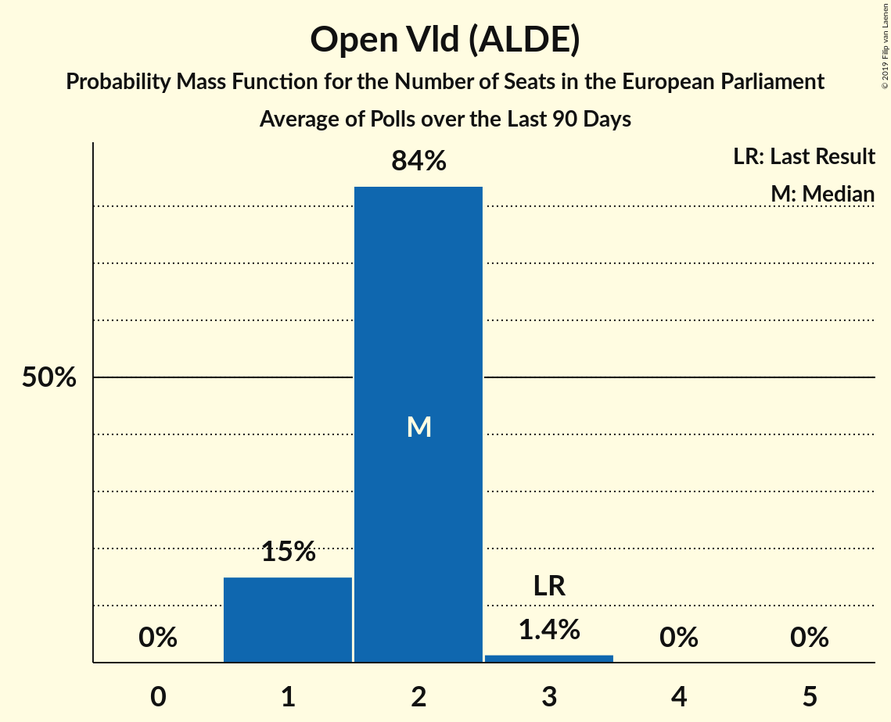

| Number of Seats | Probability | Accumulated | Special Marks |
|:---------------:|:-----------:|:-----------:|:-------------:|
| 1 | 15% | 100% |  |
| 2 | 84% | 85% | Median |
| 3 | 1.4% | 1.4% | Last Result |
| 4 | 0% | 0% |  |

### CD&V (EPP)

*For a full overview of the results for this party, see the [CD&V (EPP)](party-cdvepp.html) page.*

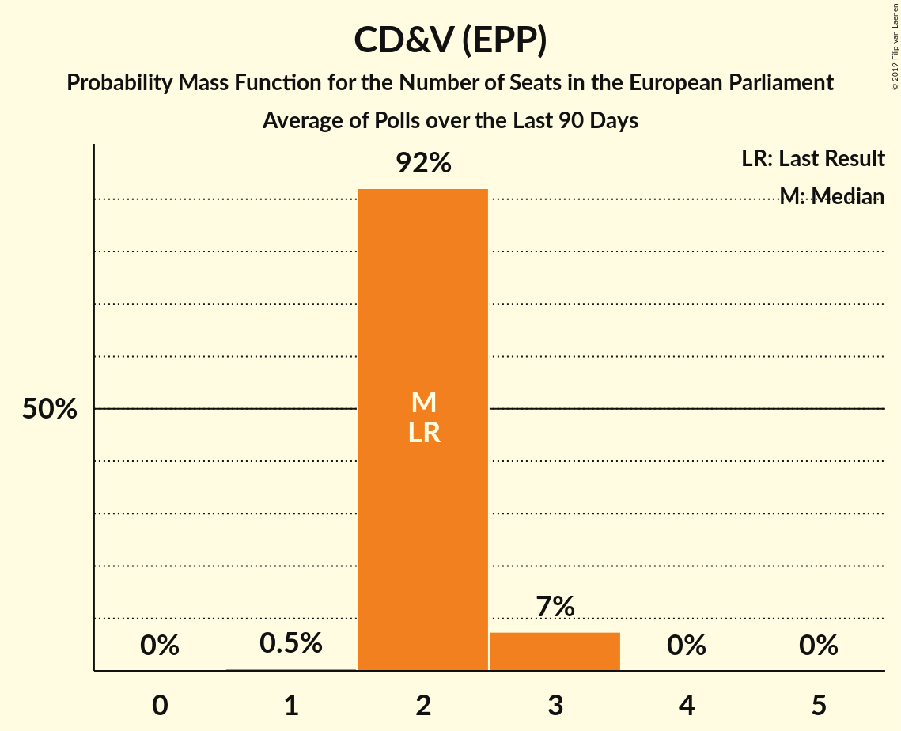

| Number of Seats | Probability | Accumulated | Special Marks |
|:---------------:|:-----------:|:-----------:|:-------------:|
| 1 | 0.5% | 100% |  |
| 2 | 92% | 99.5% | Last Result, Median |
| 3 | 7% | 7% |  |
| 4 | 0% | 0% |  |

### sp.a (S&D)

*For a full overview of the results for this party, see the [sp.a (S&D)](party-spasd.html) page.*

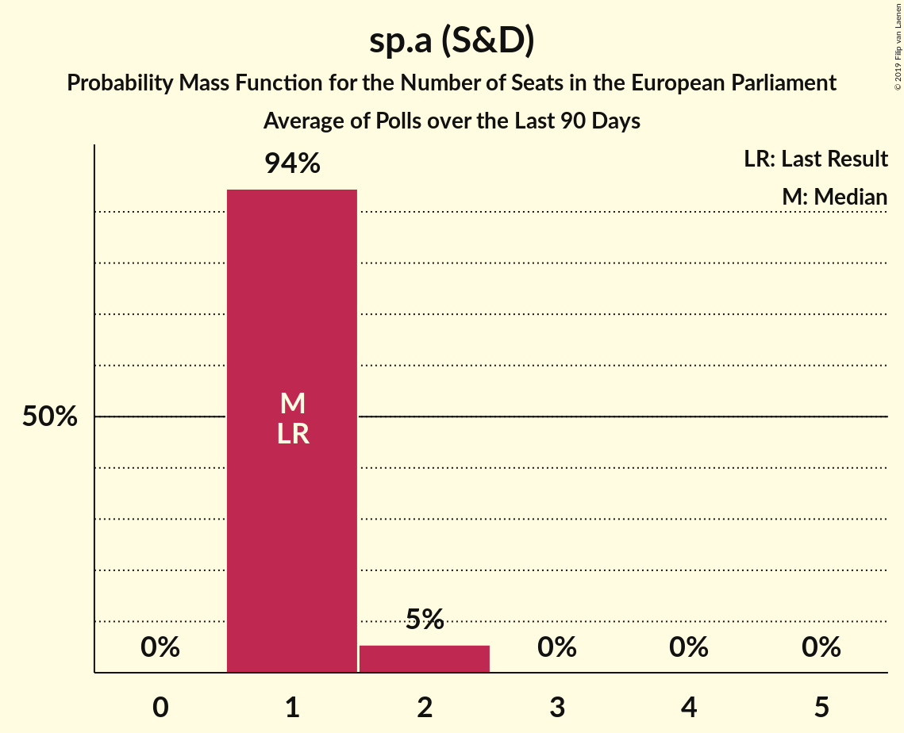

| Number of Seats | Probability | Accumulated | Special Marks |
|:---------------:|:-----------:|:-----------:|:-------------:|
| 1 | 94% | 100% | Last Result, Median |
| 2 | 5% | 5% |  |
| 3 | 0% | 0% |  |

### Groen (Greens/EFA)

*For a full overview of the results for this party, see the [Groen (Greens/EFA)](party-groengreensefa.html) page.*

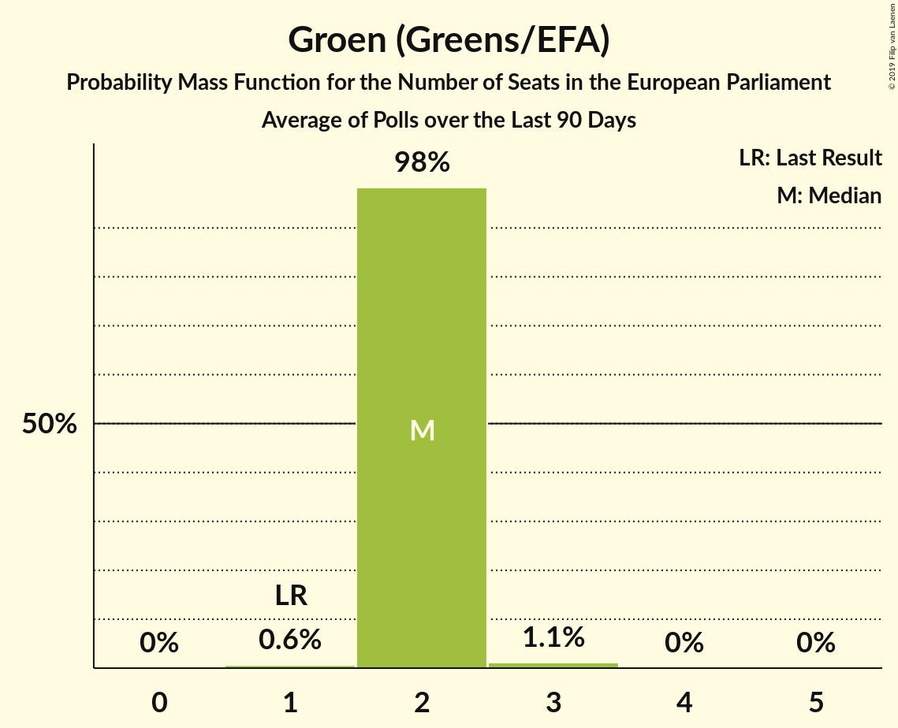

| Number of Seats | Probability | Accumulated | Special Marks |
|:---------------:|:-----------:|:-----------:|:-------------:|
| 1 | 0.6% | 100% | Last Result |
| 2 | 98% | 99.4% | Median |
| 3 | 1.1% | 1.1% |  |
| 4 | 0% | 0% |  |

### Vlaams Belang (ENF)

*For a full overview of the results for this party, see the [Vlaams Belang (ENF)](party-vlaamsbelangenf.html) page.*

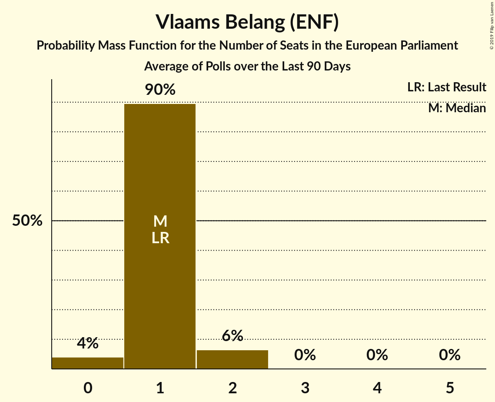

| Number of Seats | Probability | Accumulated | Special Marks |
|:---------------:|:-----------:|:-----------:|:-------------:|
| 0 | 4% | 100% |  |
| 1 | 90% | 96% | Last Result, Median |
| 2 | 6% | 6% |  |
| 3 | 0% | 0% |  |

### PVDA (GUE/NGL)

*For a full overview of the results for this party, see the [PVDA (GUE/NGL)](party-pvdaguengl.html) page.*

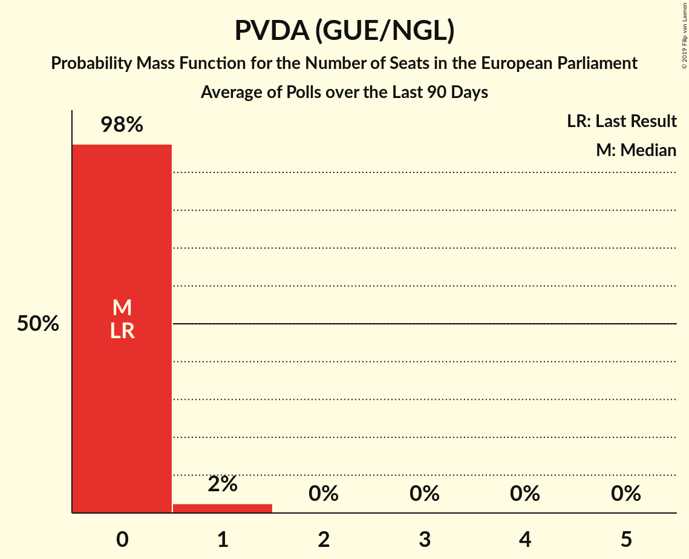

| Number of Seats | Probability | Accumulated | Special Marks |
|:---------------:|:-----------:|:-----------:|:-------------:|
| 0 | 98% | 100% | Last Result, Median |
| 1 | 2% | 2% |  |
| 2 | 0% | 0% |  |

## Coalitions

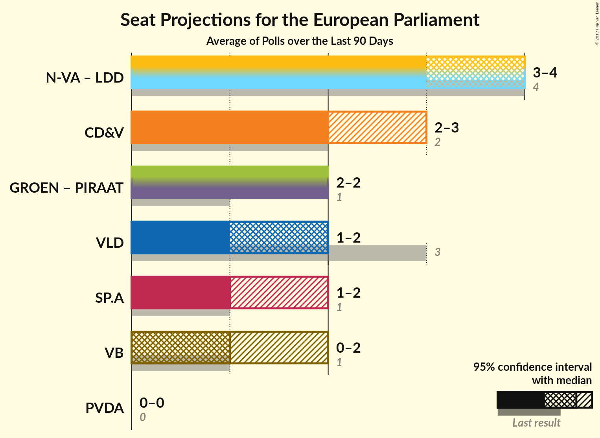

### Confidence Intervals

| Coalition | Last Result | Median | Majority? | 80% Confidence Interval | 90% Confidence Interval | 95% Confidence Interval | 99% Confidence Interval |
|:---------:|:-----------:|:------:|:---------:|:-----------------------:|:-----------------------:|:-----------------------:|:-----------------------:|
| N-VA (ECR) – Lijst Dedecker (ECR) | 4 | 4 | 0% | 4 | 3–4 | 3–4 | 3–5 |
| CD&V (EPP) | 2 | 2 | 0% | 2 | 2–3 | 2–3 | 2–3 |
| Groen (Greens/EFA) – Piratenpartij (Greens/EFA) | 1 | 2 | 0% | 2 | 2 | 2 | 1–3 |
| Open Vld (ALDE) | 3 | 2 | 0% | 1–2 | 1–2 | 1–2 | 1–3 |
| sp.a (S&D) | 1 | 1 | 0% | 1 | 1–2 | 1–2 | 1–2 |
| Vlaams Belang (ENF) | 1 | 1 | 0% | 1 | 1–2 | 0–2 | 0–2 |
| PVDA (GUE/NGL) | 0 | 0 | 0% | 0 | 0 | 0 | 0–1 |

### N-VA (ECR) – Lijst Dedecker (ECR)

| Number of Seats | Probability | Accumulated | Special Marks |
|:---------------:|:-----------:|:-----------:|:-------------:|
| 3 | 6% | 100% |  |
| 4 | 92% | 94% | Last Result, Median |
| 5 | 2% | 2% |  |
| 6 | 0% | 0% |  |

### CD&V (EPP)

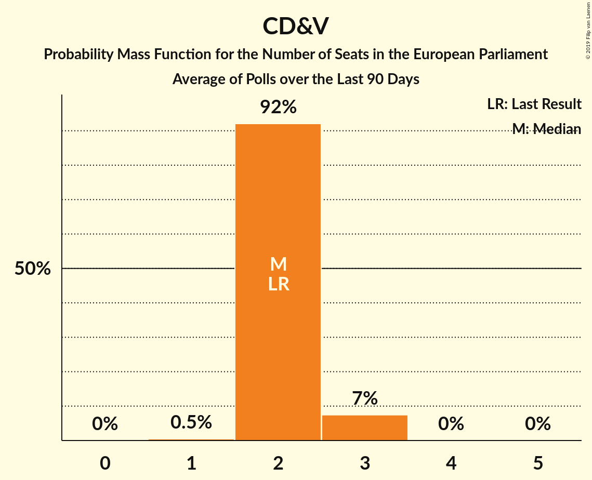

| Number of Seats | Probability | Accumulated | Special Marks |
|:---------------:|:-----------:|:-----------:|:-------------:|
| 1 | 0.5% | 100% |  |
| 2 | 92% | 99.5% | Last Result, Median |
| 3 | 7% | 7% |  |
| 4 | 0% | 0% |  |

### Groen (Greens/EFA) – Piratenpartij (Greens/EFA)

| Number of Seats | Probability | Accumulated | Special Marks |
|:---------------:|:-----------:|:-----------:|:-------------:|
| 1 | 0.6% | 100% | Last Result |
| 2 | 98% | 99.4% | Median |
| 3 | 1.1% | 1.1% |  |
| 4 | 0% | 0% |  |

### Open Vld (ALDE)

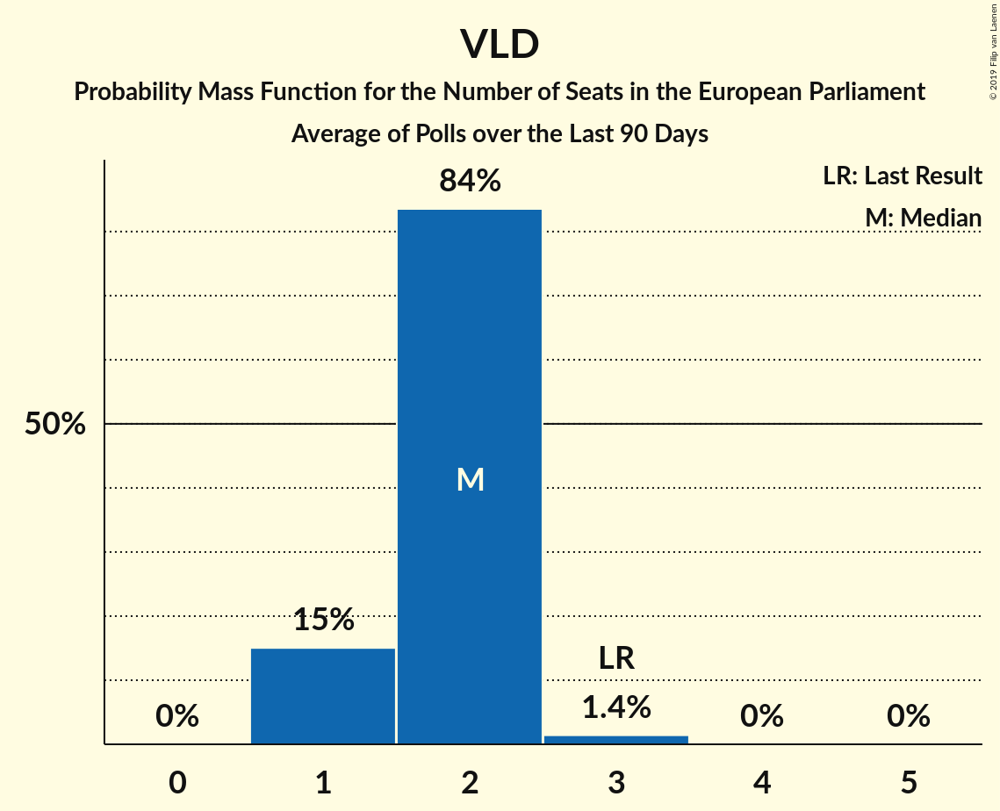

| Number of Seats | Probability | Accumulated | Special Marks |
|:---------------:|:-----------:|:-----------:|:-------------:|
| 1 | 15% | 100% |  |
| 2 | 84% | 85% | Median |
| 3 | 1.4% | 1.4% | Last Result |
| 4 | 0% | 0% |  |

### sp.a (S&D)

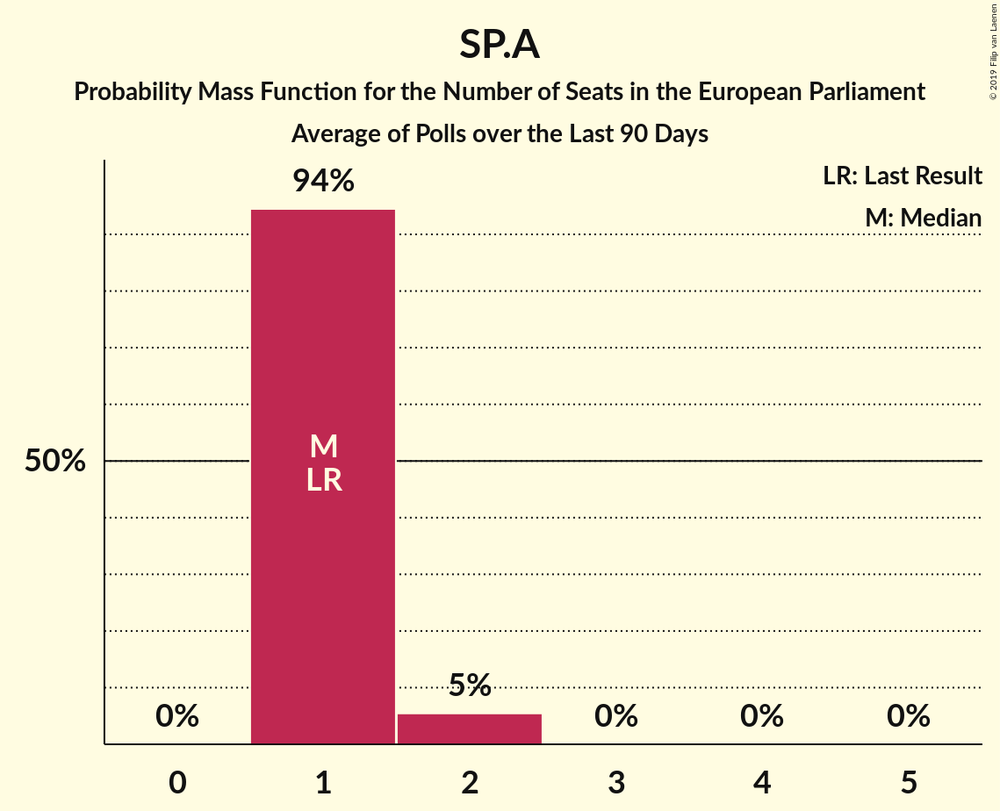

| Number of Seats | Probability | Accumulated | Special Marks |
|:---------------:|:-----------:|:-----------:|:-------------:|
| 1 | 94% | 100% | Last Result, Median |
| 2 | 5% | 5% |  |
| 3 | 0% | 0% |  |

### Vlaams Belang (ENF)

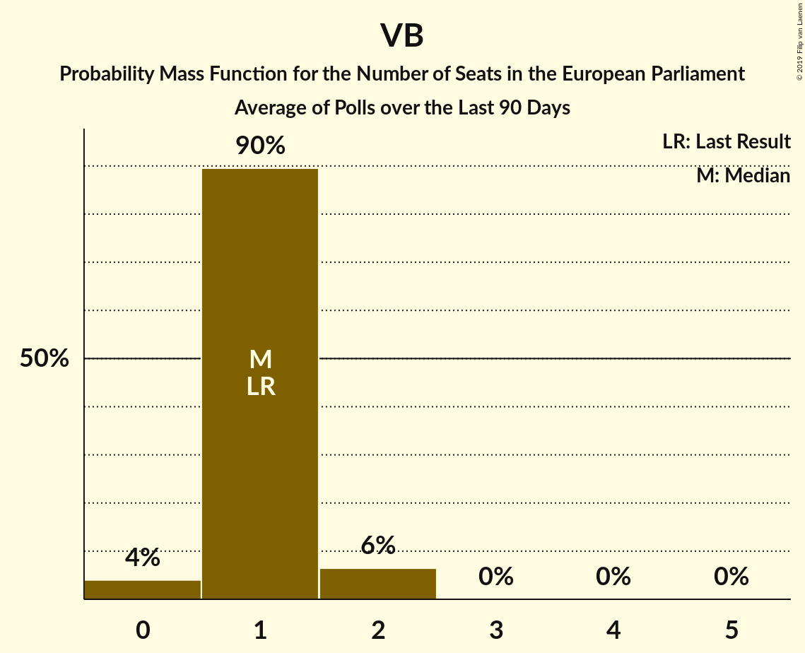

| Number of Seats | Probability | Accumulated | Special Marks |
|:---------------:|:-----------:|:-----------:|:-------------:|
| 0 | 4% | 100% |  |
| 1 | 90% | 96% | Last Result, Median |
| 2 | 6% | 6% |  |
| 3 | 0% | 0% |  |

### PVDA (GUE/NGL)

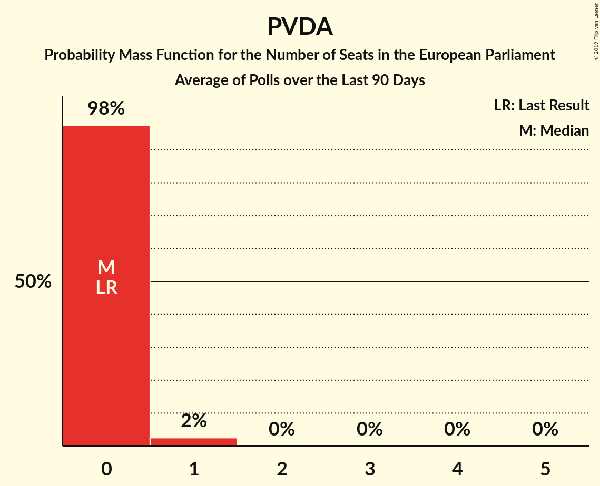

| Number of Seats | Probability | Accumulated | Special Marks |
|:---------------:|:-----------:|:-----------:|:-------------:|
| 0 | 98% | 100% | Last Result, Median |
| 1 | 2% | 2% |  |
| 2 | 0% | 0% |  |

## Technical Information

+ **Number of polls included in this average:** 2
+ **Lowest number of simulations done in a poll included in this average:** 1,048,576
+ **Total number of simulations done in the polls included in this average:** 2,097,152
+ **Error estimate:** 1.78%
