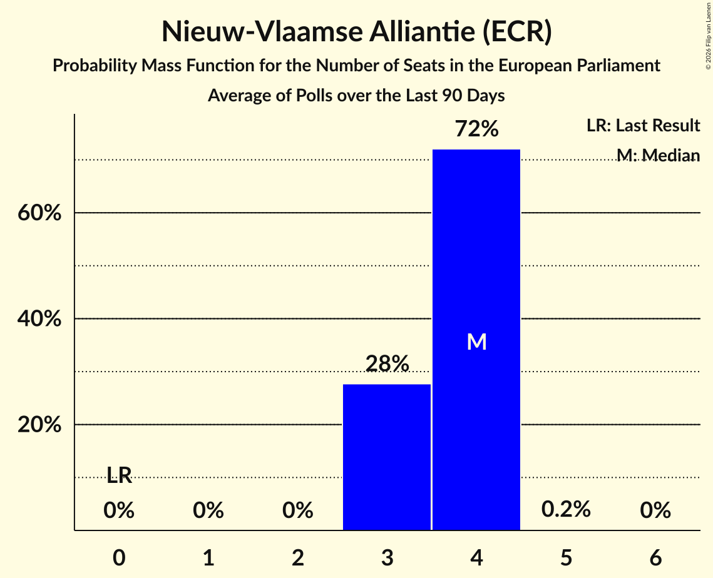

# Nieuw-Vlaamse Alliantie (ECR)

<a href="#voting-intentions">Voting Intentions</a> | <a href="#seats">Seats</a>

## Voting Intentions

Last result: **22.4%** (General Election of 26 May 2019)

### Confidence Intervals

| Period     | Polling firm/Commissioner(s) | Median | 80% Confidence Interval | 90% Confidence Interval | 95% Confidence Interval | 99% Confidence Interval |
|:----------:|:----------------:|:-----------:|:-----------------------:|:-----------------------:|:-----------------------:|:-----------------------:|
| N/A | [Poll Average](average.html) | 21.5% | 19.2–23.8% | 18.6–24.5% | 18.1–25.2% | 17.1–26.4% |
| [16–29 January 2023](2023-01-29-Kantar.html) | Kantar   La Libre Belgique | 21.4% | 19.2–23.9% | 18.6–24.6% | 18.1–25.2% | 17.1–26.4% |
| [21–29 November 2022](2022-11-29-Ipsos.html) | Ipsos   Het Laatste Nieuws, Le Soir, RTL TVi and VTM | 22.0% | 20.4–23.7% | 19.9–24.2% | 19.5–24.7% | 18.8–25.5% |
| [7–13 September 2022](2022-09-13-Ipsos.html) | Ipsos   Het Laatste Nieuws, Le Soir, RTL TVi and VTM | 21.5% | 19.9–23.2% | 19.4–23.7% | 19.1–24.2% | 18.3–25.0% |
| [6–14 June 2022](2022-06-14-Ipsos.html) | Ipsos   Het Laatste Nieuws, Le Soir, RTL TVi and VTM | 24.9% | 23.2–26.7% | 22.7–27.2% | 22.3–27.7% | 21.5–28.5% |
| [14–31 March 2022](2022-03-31-TNS.html) | TNS   De Standaard and VRT | 22.4% | 21.2–23.6% | 20.9–23.9% | 20.6–24.2% | 20.1–24.8% |
| [15–22 March 2022](2022-03-22-Ipsos.html) | Ipsos   Het Laatste Nieuws, Le Soir, RTL TVi and VTM | 23.4% | 21.8–25.2% | 21.3–25.7% | 20.9–26.2% | 20.1–27.0% |
| [1–8 December 2021](2021-12-08-Ipsos.html) | Ipsos   Het Laatste Nieuws, Le Soir, RTL TVi and VTM | 21.6% | 20.0–23.3% | 19.5–23.8% | 19.1–24.2% | 18.4–25.1% |
| [7–14 September 2021](2021-09-14-Ipsos.html) | Ipsos   Het Laatste Nieuws, Le Soir, RTL TVi and VTM | 21.2% | 19.6–22.9% | 19.2–23.4% | 18.8–23.9% | 18.0–24.7% |
| [25 May–1 June 2021](2021-06-01-Ipsos.html) | Ipsos   Het Laatste Nieuws, Le Soir, RTL TVi and VTM | 21.8% | 20.1–23.5% | 19.7–24.0% | 19.3–24.4% | 18.6–25.3% |
| [29 March–19 April 2021](2021-04-19-TNS.html) | TNS   De Standaard and VRT | 21.5% | 20.4–22.8% | 20.0–23.1% | 19.8–23.5% | 19.2–24.1% |
| [4–9 March 2021](2021-03-09-Ipsos.html) | Ipsos   Het Laatste Nieuws, Le Soir, RTL TVi and VTM | 20.0% | 18.4–21.7% | 18.0–22.1% | 17.6–22.6% | 16.9–23.4% |
| [2–8 December 2020](2020-12-08-Ipsos.html) | Ipsos   Het Laatste Nieuws, Le Soir, RTL TVi and VTM | 19.9% | 18.3–21.6% | 17.9–22.0% | 17.5–22.5% | 16.8–23.3% |
| [2–8 October 2020](2020-10-08-Ipsos.html) | Ipsos   Het Laatste Nieuws, Le Soir, RTL TVi and VTM | 22.2% | 20.6–23.9% | 20.1–24.4% | 19.7–24.9% | 18.9–25.7% |
| [28 August–1 September 2020](2020-09-01-Dedicated.html) | Dedicated   Soirmag | 23.2% | 21.1–25.6% | 20.5–26.2% | 20.0–26.8% | 19.1–27.9% |
| [10–15 June 2020](2020-06-15-Ipsos.html) | Ipsos   Het Laatste Nieuws, Le Soir, RTL TVi and VTM | 20.0% | 18.4–21.7% | 17.9–22.2% | 17.6–22.6% | 16.8–23.5% |
| [9–28 April 2020](2020-04-28-TNS.html) | TNS   De Standaard, La Libre Belgique, RTBf and VRT | 20.3% | 19.1–21.5% | 18.8–21.9% | 18.5–22.2% | 18.0–22.8% |
| [4–9 March 2020](2020-03-09-Ipsos.html) | Ipsos   Het Laatste Nieuws, Le Soir, RTL TVi and VTM | 20.7% | 19.1–22.4% | 18.6–22.9% | 18.2–23.4% | 17.5–24.2% |
| [29 November–6 December 2019](2019-12-06-Ipsos.html) | Ipsos   Het Laatste Nieuws, Le Soir, RTL TVi and VTM | 22.1% | 20.5–23.9% | 20.0–24.4% | 19.6–24.8% | 18.9–25.7% |
| [2–10 September 2019](2019-09-10-Ipsos.html) | Ipsos   Het Laatste Nieuws, Le Soir, RTL TVi and VTM | 22.7% | 21.1–24.5% | 20.6–25.0% | 20.2–25.4% | 19.4–26.3% |

### Probability Mass Function

The following table shows the probability mass function per percentage block of voting intentions for the [poll average](average.html) for Nieuw-Vlaamse Alliantie (ECR).

| Voting Intentions | Probability | Accumulated | Special Marks |
|:-----------------:|:-----------:|:-----------:|:-------------:|
| 14.5–15.5% | 0% | 100% |  |
| 15.5–16.5% | 0.2% | 100% |  |
| 16.5–17.5% | 0.9% | 99.8% |  |
| 17.5–18.5% | 4% | 98.9% |  |
| 18.5–19.5% | 9% | 95% |  |
| 19.5–20.5% | 16% | 86% |  |
| 20.5–21.5% | 22% | 70% | Median |
| 21.5–22.5% | 21% | 48% | Last Result |
| 22.5–23.5% | 15% | 28% |  |
| 23.5–24.5% | 8% | 13% |  |
| 24.5–25.5% | 3% | 5% |  |
| 25.5–26.5% | 1.2% | 2% |  |
| 26.5–27.5% | 0.3% | 0.4% |  |
| 27.5–28.5% | 0.1% | 0.1% |  |
| 28.5–29.5% | 0% | 0% |  |

## Seats

Last result: **3** seats (General Election of 26 May 2019)

### Confidence Intervals

| Period     | Polling firm/Commissioner(s) | Median | 80% Confidence Interval | 90% Confidence Interval | 95% Confidence Interval | 99% Confidence Interval |
|:----------:|:----------------:|:------:|:-----------------------:|:-----------------------:|:-----------------------:|:-----------------------:|
| N/A | [Poll Average](average.html) | 3 | 3 | 2–3 | 2–4 | 2–4 |
| [16–29 January 2023](2023-01-29-Kantar.html) | Kantar   La Libre Belgique | 3 | 3 | 2–3 | 2–4 | 2–4 |
| [21–29 November 2022](2022-11-29-Ipsos.html) | Ipsos   Het Laatste Nieuws, Le Soir, RTL TVi and VTM | 3 | 3 | 2–3 | 2–3 | 2–3 |
| [7–13 September 2022](2022-09-13-Ipsos.html) | Ipsos   Het Laatste Nieuws, Le Soir, RTL TVi and VTM | 3 | 3 | 3 | 3 | 2–3 |
| [6–14 June 2022](2022-06-14-Ipsos.html) | Ipsos   Het Laatste Nieuws, Le Soir, RTL TVi and VTM | 3 | 3 | 3–4 | 3–4 | 3–4 |
| [14–31 March 2022](2022-03-31-TNS.html) | TNS   De Standaard and VRT | 3 | 3 | 3 | 3 | 3 |
| [15–22 March 2022](2022-03-22-Ipsos.html) | Ipsos   Het Laatste Nieuws, Le Soir, RTL TVi and VTM | 3 | 3 | 3 | 3–4 | 3–4 |
| [1–8 December 2021](2021-12-08-Ipsos.html) | Ipsos   Het Laatste Nieuws, Le Soir, RTL TVi and VTM | 3 | 3 | 3 | 2–3 | 2–3 |
| [7–14 September 2021](2021-09-14-Ipsos.html) | Ipsos   Het Laatste Nieuws, Le Soir, RTL TVi and VTM | 3 | 3 | 2–3 | 2–3 | 2–4 |
| [25 May–1 June 2021](2021-06-01-Ipsos.html) | Ipsos   Het Laatste Nieuws, Le Soir, RTL TVi and VTM | 3 | 3 | 3 | 2–3 | 2–4 |
| [29 March–19 April 2021](2021-04-19-TNS.html) | TNS   De Standaard and VRT | 3 | 3 | 3 | 3 | 3 |
| [4–9 March 2021](2021-03-09-Ipsos.html) | Ipsos   Het Laatste Nieuws, Le Soir, RTL TVi and VTM | 3 | 2–3 | 2–3 | 2–3 | 2–3 |
| [2–8 December 2020](2020-12-08-Ipsos.html) | Ipsos   Het Laatste Nieuws, Le Soir, RTL TVi and VTM | 3 | 2–3 | 2–3 | 2–3 | 2–3 |
| [2–8 October 2020](2020-10-08-Ipsos.html) | Ipsos   Het Laatste Nieuws, Le Soir, RTL TVi and VTM | 3 | 3 | 3 | 3 | 2–4 |
| [28 August–1 September 2020](2020-09-01-Dedicated.html) | Dedicated   Soirmag | 3 | 3 | 3–4 | 2–4 | 2–4 |
| [10–15 June 2020](2020-06-15-Ipsos.html) | Ipsos   Het Laatste Nieuws, Le Soir, RTL TVi and VTM | 3 | 2–3 | 2–3 | 2–3 | 2–3 |
| [9–28 April 2020](2020-04-28-TNS.html) | TNS   De Standaard, La Libre Belgique, RTBf and VRT | 3 | 3 | 3 | 2–3 | 2–3 |
| [4–9 March 2020](2020-03-09-Ipsos.html) | Ipsos   Het Laatste Nieuws, Le Soir, RTL TVi and VTM | 3 | 3 | 2–3 | 2–3 | 2–3 |
| [29 November–6 December 2019](2019-12-06-Ipsos.html) | Ipsos   Het Laatste Nieuws, Le Soir, RTL TVi and VTM | 3 | 3 | 3 | 3 | 2–4 |
| [2–10 September 2019](2019-09-10-Ipsos.html) | Ipsos   Het Laatste Nieuws, Le Soir, RTL TVi and VTM | 3 | 3 | 3–4 | 3–4 | 3–4 |

### Probability Mass Function

The following table shows the probability mass function per seat for the [poll average](average.html) for Nieuw-Vlaamse Alliantie (ECR).

| Number of Seats | Probability | Accumulated | Special Marks |
|:---------------:|:-----------:|:-----------:|:-------------:|
| 2 | 10% | 100% |  |
| 3 | 87% | 90% | Last Result, Median |
| 4 | 4% | 4% |  |
| 5 | 0% | 0% |  |

