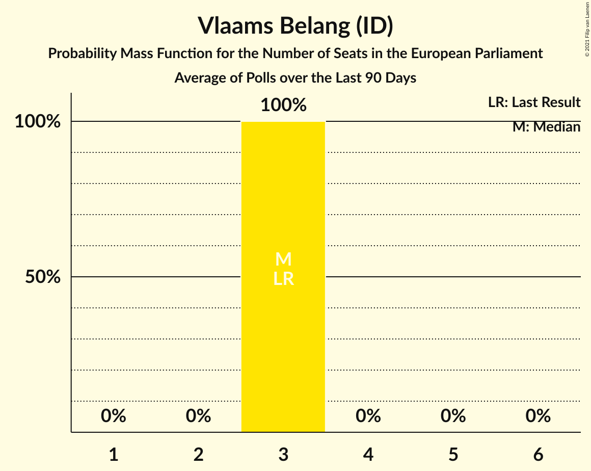

# Vlaams Belang (ID)

<a href="#voting-intentions">Voting Intentions</a> | <a href="#seats">Seats</a>

## Voting Intentions

Last result: **19.1%** (General Election of 26 May 2019)

### Confidence Intervals

| Period     | Polling firm/Commissioner(s) | Median | 80% Confidence Interval | 90% Confidence Interval | 95% Confidence Interval | 99% Confidence Interval |
|:----------:|:----------------:|:-----------:|:-----------------------:|:-----------------------:|:-----------------------:|:-----------------------:|
| N/A | [Poll Average](average.html) | 23.5% | 21.6–25.5% | 21.0–26.1% | 20.6–26.6% | 19.7–27.6% |
| [23 February–5 March 2024](2024-03-05-Ipsos.html) | Ipsos   Euronews | 23.5% | 21.6–25.5% | 21.0–26.1% | 20.6–26.6% | 19.7–27.6% |
| [9–22 January 2024](2024-01-22-iVOX.html) | iVOX   Vlaams & Neutraal Ziekenfonds | 26.6% | 25.4–27.9% | 25.0–28.3% | 24.7–28.6% | 24.1–29.2% |
| [8–22 January 2024](2024-01-22-KantarandUniversiteitAntwerpen.html) | Kantar and Universiteit Antwerpen   De Standaard and VRT | 27.8% | 26.5–29.2% | 26.1–29.6% | 25.8–29.9% | 25.2–30.6% |
| [4–11 December 2023](2023-12-11-Ipsos.html) | Ipsos   Het Laatste Nieuws, Le Soir, RTL TVi and VTM | 25.1% | 23.4–26.9% | 22.9–27.4% | 22.5–27.9% | 21.7–28.8% |
| [23–28 November 2023](2023-11-28-iVOX.html) | iVOX   Gazet van Antwerpen | 26.5% | 24.8–28.3% | 24.3–28.9% | 23.9–29.3% | 23.0–30.2% |
| [10 September–9 October 2023](2023-10-09-Kantar.html) | Kantar   La Libre Belgique and RTBf | 23.3% | 21.2–25.7% | 20.5–26.4% | 20.0–27.0% | 19.0–28.2% |
| [18–25 September 2023](2023-09-25-Ipsos.html) | Ipsos   Het Laatste Nieuws, Le Soir, RTL TVi and VTM | 25.8% | 24.1–27.6% | 23.6–28.2% | 23.2–28.6% | 22.4–29.5% |
| [29 May–6 June 2023](2023-06-06-Ipsos.html) | Ipsos   Het Laatste Nieuws, Le Soir, RTL TVi and VTM | 22.7% | 21.1–24.5% | 20.6–25.0% | 20.2–25.4% | 19.4–26.3% |
| [20–27 March 2023](2023-03-27-Ipsos.html) | Ipsos   Het Laatste Nieuws, Le Soir, RTL TVi and VTM | 25.0% | 23.3–26.8% | 22.8–27.3% | 22.4–27.8% | 21.6–28.7% |
| [13–23 March 2023](2023-03-23-TNSandUniversiteitAntwerpen.html) | TNS and Universiteit Antwerpen   De Standaard and VRT | 24.6% | N/A | N/A | N/A | N/A |
| [16–29 January 2023](2023-01-29-Kantar.html) | Kantar   La Libre Belgique and RTBf | 24.7% | 22.4–27.3% | 21.7–28.0% | 21.2–28.6% | 20.1–29.9% |
| [21–29 November 2022](2022-11-29-Ipsos.html) | Ipsos   Het Laatste Nieuws, Le Soir, RTL TVi and VTM | 25.5% | 23.8–27.3% | 23.3–27.8% | 22.9–28.3% | 22.1–29.2% |
| [7–13 September 2022](2022-09-13-Ipsos.html) | Ipsos   Het Laatste Nieuws, Le Soir, RTL TVi and VTM | 21.6% | 20.0–23.4% | 19.5–23.8% | 19.2–24.3% | 18.4–25.1% |
| [6–14 June 2022](2022-06-14-Ipsos.html) | Ipsos   Het Laatste Nieuws, Le Soir, RTL TVi and VTM | 22.6% | 21.0–24.4% | 20.5–24.9% | 20.1–25.3% | 19.4–26.2% |
| [14–31 March 2022](2022-03-31-TNSandUniversiteitAntwerpen.html) | TNS and Universiteit Antwerpen   De Standaard and VRT | 22.9% | N/A | N/A | N/A | N/A |
| [15–22 March 2022](2022-03-22-Ipsos.html) | Ipsos   Het Laatste Nieuws, Le Soir, RTL TVi and VTM | 22.2% | 20.6–24.0% | 20.2–24.5% | 19.8–24.9% | 19.0–25.8% |
| [1–8 December 2021](2021-12-08-Ipsos.html) | Ipsos   Het Laatste Nieuws, Le Soir, RTL TVi and VTM | 24.5% | 22.8–26.3% | 22.3–26.8% | 21.9–27.3% | 21.1–28.2% |
| [7–14 September 2021](2021-09-14-Ipsos.html) | Ipsos   Het Laatste Nieuws, Le Soir, RTL TVi and VTM | 23.6% | 21.9–25.4% | 21.5–25.9% | 21.1–26.3% | 20.3–27.2% |
| [25 May–1 June 2021](2021-06-01-Ipsos.html) | Ipsos   Het Laatste Nieuws, Le Soir, RTL TVi and VTM | 26.1% | 24.4–28.0% | 23.9–28.5% | 23.5–29.0% | 22.7–29.9% |
| [29 March–19 April 2021](2021-04-19-TNSandUniversiteitAntwerpen.html) | TNS and Universiteit Antwerpen   De Standaard and VRT | 24.7% | N/A | N/A | N/A | N/A |
| [4–9 March 2021](2021-03-09-Ipsos.html) | Ipsos   Het Laatste Nieuws, Le Soir, RTL TVi and VTM | 23.6% | 21.9–25.3% | 21.4–25.8% | 21.0–26.3% | 20.3–27.2% |
| [2–8 December 2020](2020-12-08-Ipsos.html) | Ipsos   Het Laatste Nieuws, Le Soir, RTL TVi and VTM | 26.3% | 24.6–28.2% | 24.1–28.7% | 23.7–29.1% | 22.9–30.0% |
| [2–8 October 2020](2020-10-08-Ipsos.html) | Ipsos   Het Laatste Nieuws, Le Soir, RTL TVi and VTM | 27.1% | 25.3–28.9% | 24.8–29.5% | 24.4–29.9% | 23.6–30.8% |
| [28 August–1 September 2020](2020-09-01-Dedicated.html) | Dedicated   Soirmag | 26.9% | 24.7–29.3% | 24.1–30.0% | 23.5–30.6% | 22.5–31.8% |
| [10–15 June 2020](2020-06-15-Ipsos.html) | Ipsos   Het Laatste Nieuws, Le Soir, RTL TVi and VTM | 27.7% | 25.8–29.6% | 25.3–30.1% | 24.9–30.6% | 24.1–31.5% |
| [9–28 April 2020](2020-04-28-TNSandUniversiteitAntwerpen.html) | TNS and Universiteit Antwerpen   De Standaard, La Libre Belgique, RTBf and VRT | 24.5% | N/A | N/A | N/A | N/A |
| [4–9 March 2020](2020-03-09-Ipsos.html) | Ipsos   Het Laatste Nieuws, Le Soir, RTL TVi and VTM | 28.0% | 26.2–29.9% | 25.7–30.4% | 25.2–30.9% | 24.4–31.8% |
| [29 November–6 December 2019](2019-12-06-Ipsos.html) | Ipsos   Het Laatste Nieuws, Le Soir, RTL TVi and VTM | 27.3% | 25.6–29.2% | 25.1–29.7% | 24.6–30.2% | 23.8–31.1% |
| [2–10 September 2019](2019-09-10-Ipsos.html) | Ipsos   Het Laatste Nieuws, Le Soir, RTL TVi and VTM | 24.9% | 23.2–26.7% | 22.7–27.2% | 22.3–27.7% | 21.5–28.6% |

### Probability Mass Function

The following table shows the probability mass function per percentage block of voting intentions for the [poll average](average.html) for Vlaams Belang (ID).

| Voting Intentions | Probability | Accumulated | Special Marks |
|:-----------------:|:-----------:|:-----------:|:-------------:|
| 17.5–18.5% | 0% | 100% |  |
| 18.5–19.5% | 0.3% | 100% | Last Result |
| 19.5–20.5% | 2% | 99.6% |  |
| 20.5–21.5% | 7% | 98% |  |
| 21.5–22.5% | 17% | 90% |  |
| 22.5–23.5% | 24% | 73% |  |
| 23.5–24.5% | 24% | 49% | Median |
| 24.5–25.5% | 15% | 25% |  |
| 25.5–26.5% | 7% | 10% |  |
| 26.5–27.5% | 2% | 3% |  |
| 27.5–28.5% | 0.5% | 0.6% |  |
| 28.5–29.5% | 0.1% | 0.1% |  |
| 29.5–30.5% | 0% | 0% |  |

## Seats

Last result: **3** seats (General Election of 26 May 2019)

### Confidence Intervals

| Period     | Polling firm/Commissioner(s) | Median | 80% Confidence Interval | 90% Confidence Interval | 95% Confidence Interval | 99% Confidence Interval |
|:----------:|:----------------:|:------:|:-----------------------:|:-----------------------:|:-----------------------:|:-----------------------:|
| N/A | [Poll Average](average.html) | 3 | 3–4 | 3–4 | 3–4 | 3–4 |
| [23 February–5 March 2024](2024-03-05-Ipsos.html) | Ipsos   Euronews | 3 | 3–4 | 3–4 | 3–4 | 3–4 |
| [9–22 January 2024](2024-01-22-iVOX.html) | iVOX   Vlaams & Neutraal Ziekenfonds | 4 | 4 | 3–4 | 3–4 | 3–4 |
| [8–22 January 2024](2024-01-22-KantarandUniversiteitAntwerpen.html) | Kantar and Universiteit Antwerpen   De Standaard and VRT | 4 | 4 | 4 | 4 | 4–5 |
| [4–11 December 2023](2023-12-11-Ipsos.html) | Ipsos   Het Laatste Nieuws, Le Soir, RTL TVi and VTM | 4 | 3–4 | 3–4 | 3–4 | 3–4 |
| [23–28 November 2023](2023-11-28-iVOX.html) | iVOX   Gazet van Antwerpen | 4 | 4 | 3–4 | 3–4 | 3–5 |
| [10 September–9 October 2023](2023-10-09-Kantar.html) | Kantar   La Libre Belgique and RTBf | 3 | 3–4 | 3–4 | 3–4 | 3–4 |
| [18–25 September 2023](2023-09-25-Ipsos.html) | Ipsos   Het Laatste Nieuws, Le Soir, RTL TVi and VTM | 4 | 3–4 | 3–4 | 3–4 | 3–5 |
| [29 May–6 June 2023](2023-06-06-Ipsos.html) | Ipsos   Het Laatste Nieuws, Le Soir, RTL TVi and VTM | 3 | 3–4 | 3–4 | 3–4 | 3–4 |
| [20–27 March 2023](2023-03-27-Ipsos.html) | Ipsos   Het Laatste Nieuws, Le Soir, RTL TVi and VTM | 3 | 3–4 | 3–4 | 3–4 | 3–4 |
| [13–23 March 2023](2023-03-23-TNSandUniversiteitAntwerpen.html) | TNS and Universiteit Antwerpen   De Standaard and VRT |  |  |  |  |  |
| [16–29 January 2023](2023-01-29-Kantar.html) | Kantar   La Libre Belgique and RTBf | 3 | 3–4 | 3–4 | 3–4 | 3–4 |
| [21–29 November 2022](2022-11-29-Ipsos.html) | Ipsos   Het Laatste Nieuws, Le Soir, RTL TVi and VTM | 3 | 3–4 | 3–4 | 3–4 | 3–4 |
| [7–13 September 2022](2022-09-13-Ipsos.html) | Ipsos   Het Laatste Nieuws, Le Soir, RTL TVi and VTM | 3 | 3 | 3 | 3 | 2–3 |
| [6–14 June 2022](2022-06-14-Ipsos.html) | Ipsos   Het Laatste Nieuws, Le Soir, RTL TVi and VTM | 3 | 3 | 3 | 3 | 2–4 |
| [14–31 March 2022](2022-03-31-TNSandUniversiteitAntwerpen.html) | TNS and Universiteit Antwerpen   De Standaard and VRT |  |  |  |  |  |
| [15–22 March 2022](2022-03-22-Ipsos.html) | Ipsos   Het Laatste Nieuws, Le Soir, RTL TVi and VTM | 3 | 3 | 3 | 3 | 2–4 |
| [1–8 December 2021](2021-12-08-Ipsos.html) | Ipsos   Het Laatste Nieuws, Le Soir, RTL TVi and VTM | 3 | 3–4 | 3–4 | 3–4 | 3–4 |
| [7–14 September 2021](2021-09-14-Ipsos.html) | Ipsos   Het Laatste Nieuws, Le Soir, RTL TVi and VTM | 3 | 3–4 | 3–4 | 3–4 | 3–4 |
| [25 May–1 June 2021](2021-06-01-Ipsos.html) | Ipsos   Het Laatste Nieuws, Le Soir, RTL TVi and VTM | 4 | 3–4 | 3–4 | 3–4 | 3–4 |
| [29 March–19 April 2021](2021-04-19-TNSandUniversiteitAntwerpen.html) | TNS and Universiteit Antwerpen   De Standaard and VRT |  |  |  |  |  |
| [4–9 March 2021](2021-03-09-Ipsos.html) | Ipsos   Het Laatste Nieuws, Le Soir, RTL TVi and VTM | 3 | 3 | 3–4 | 3–4 | 2–4 |
| [2–8 December 2020](2020-12-08-Ipsos.html) | Ipsos   Het Laatste Nieuws, Le Soir, RTL TVi and VTM | 4 | 3–4 | 3–4 | 3–4 | 3–4 |
| [2–8 October 2020](2020-10-08-Ipsos.html) | Ipsos   Het Laatste Nieuws, Le Soir, RTL TVi and VTM | 4 | 3–4 | 3–4 | 3–4 | 3–4 |
| [28 August–1 September 2020](2020-09-01-Dedicated.html) | Dedicated   Soirmag | 4 | 3–4 | 3–4 | 3–4 | 3–4 |
| [10–15 June 2020](2020-06-15-Ipsos.html) | Ipsos   Het Laatste Nieuws, Le Soir, RTL TVi and VTM | 4 | 3–4 | 3–4 | 3–4 | 3–5 |
| [9–28 April 2020](2020-04-28-TNSandUniversiteitAntwerpen.html) | TNS and Universiteit Antwerpen   De Standaard, La Libre Belgique, RTBf and VRT |  |  |  |  |  |
| [4–9 March 2020](2020-03-09-Ipsos.html) | Ipsos   Het Laatste Nieuws, Le Soir, RTL TVi and VTM | 4 | 4 | 4 | 3–4 | 3–5 |
| [29 November–6 December 2019](2019-12-06-Ipsos.html) | Ipsos   Het Laatste Nieuws, Le Soir, RTL TVi and VTM | 4 | 4 | 3–4 | 3–4 | 3–4 |
| [2–10 September 2019](2019-09-10-Ipsos.html) | Ipsos   Het Laatste Nieuws, Le Soir, RTL TVi and VTM | 3 | 3–4 | 3–4 | 3–4 | 3–4 |

### Probability Mass Function

The following table shows the probability mass function per seat for the [poll average](average.html) for Vlaams Belang (ID).

| Number of Seats | Probability | Accumulated | Special Marks |
|:---------------:|:-----------:|:-----------:|:-------------:|
| 2 | 0.1% | 100% |  |
| 3 | 67% | 99.9% | Last Result, Median |
| 4 | 33% | 33% |  |
| 5 | 0% | 0% |  |

